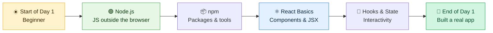
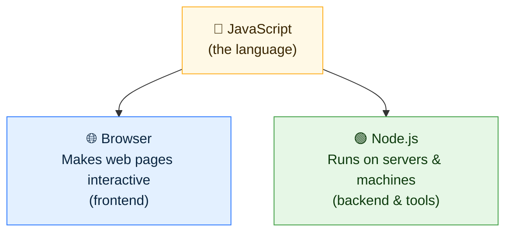
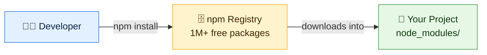
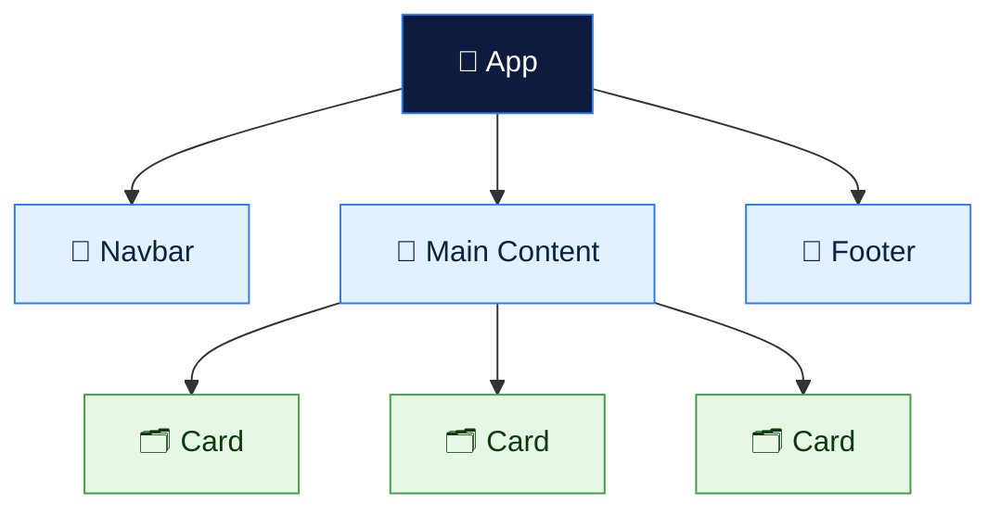
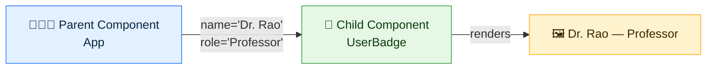
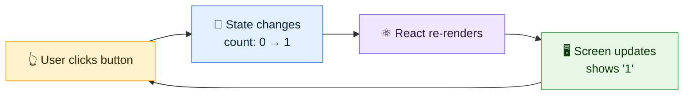
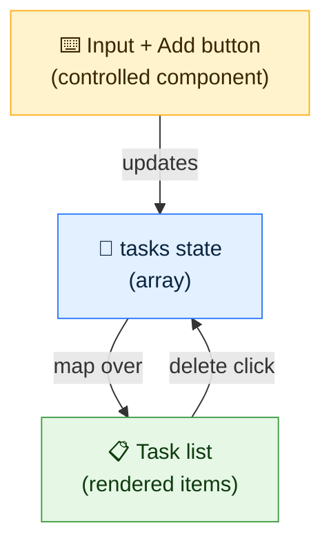
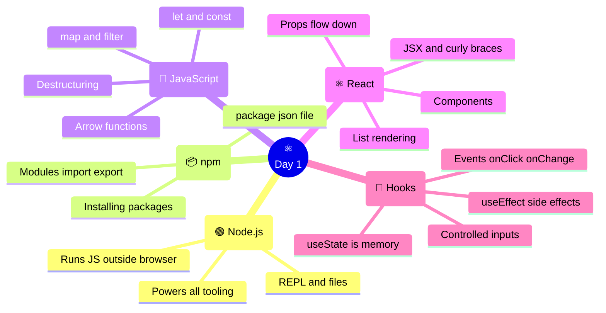

<div align="center">

# 🚀 Full Stack Development — Day 1

## Node.js & React.js — A Hands-On Foundation

**A CodeLucky Faculty Development Programme · Study Companion**

*Build-first · Beginner-friendly · 100% Hands-On*

</div>

---

> 📌 **How to use this document**
> This is a shared study companion for Day 1. Every concept is followed by a tiny, runnable example. The best way to learn is to **type each snippet yourself** and watch it run — reading alone will not build the skill. Keep a terminal and a code editor open beside this guide and follow along, block by block.

---

## 🗺️ What Day 1 Covers

Day 1 builds the two pillars that everything else in full stack development rests on:

1. **Node.js** — how JavaScript runs *outside* the browser, powering servers and tools.
2. **React.js** — how modern, interactive user interfaces are built from small, reusable pieces.

By the end of the day, the goal is a working mental model of both, plus a small app built from scratch.



### ⏱️ Suggested 6-Hour Flow

| Segment | Duration | Focus |
|---|---|---|
| **Part 1** | 60 min | Setup, what is Node.js, running JavaScript |
| **Part 2** | 60 min | JavaScript essentials for full stack |
| **Part 3** | 45 min | npm, modules & packages |
| ☕ **Break** | 15 min | — |
| **Part 4** | 75 min | React fundamentals: components, JSX, props |
| **Part 5** | 60 min | State, events & hooks |
| **Part 6** | 45 min | Build a mini app + wrap-up |

---

# 🟢 PART 1 — Meet Node.js

## 🤔 What Is Node.js?

**Node.js is a way to run JavaScript on a computer directly — not inside a web browser.**

For years, JavaScript could only run inside browsers (Chrome, Firefox, etc.) to make web pages interactive. Node.js changed that: it took the engine that runs JavaScript in Chrome (called **V8**) and let it run *anywhere* — on laptops, on servers, in the cloud.

> 💡 **Analogy:** Think of JavaScript as a language, and the browser as one city where that language is spoken. Node.js opens up a whole new country — the *server side* — where the same language now works too. Learn JavaScript once, use it everywhere.



### ✨ Why Node.js Matters for Full Stack

- 🔁 **One language everywhere** — write both frontend and backend in JavaScript.
- ⚡ **Fast & lightweight** — great for real-time apps (chats, live updates).
- 📦 **Huge ecosystem** — over a million free packages via npm (more on that soon).
- 🛠️ **Powers the tools** — React, Next.js, and most modern tooling *run on* Node.js.

> 📢 **Key fact:** Even when building a React frontend, Node.js is running behind the scenes to power the development tools. So Node.js is unavoidable — and foundational.

---

## 🧰 Setup Check

Before running anything, confirm Node.js is installed. Open a terminal and type:

```bash
node -v
```

This should print a version number, for example:

```
v20.11.0
```

Also check **npm** (Node's package manager, installed automatically with Node):

```bash
npm -v
```

Example output:

```
10.2.4
```

> ✅ If both print version numbers, the setup is ready. If not, install the **LTS** version from [nodejs.org](https://nodejs.org).

---

## ▶️ Running JavaScript with Node

There are two ways to run JavaScript with Node.js.

### Way 1 — The Interactive Shell (REPL) 🧪

Type `node` alone in the terminal and press Enter. This opens an interactive playground:

```bash
node
```

Now type JavaScript directly:

```js
> 2 + 3
5
> "Hello".toUpperCase()
'HELLO'
> console.log("Node is running!")
Node is running!
```

> 💡 **REPL** stands for Read–Evaluate–Print–Loop. It reads what is typed, runs it, prints the result, and waits for more. Press `Ctrl + C` twice (or type `.exit`) to leave.

### Way 2 — Running a File 📄

This is how real programs work. Create a file called `hello.js`:

```js
// hello.js
console.log("Hello from Node.js! 🚀");
```

Run it from the terminal:

```bash
node hello.js
```

Output:

```
Hello from Node.js! 🚀
```

> 🎯 **That's the core loop of all development:** write code in a file → run it → see the result → improve it. Everything today builds on this.

---

# 📜 PART 2 — JavaScript Essentials for Full Stack

React and Node both *are* JavaScript, so a solid grip on a few core building blocks makes everything else click. Below is the minimum toolkit — each with a tiny example to run.

## 📦 Variables — Storing Information

Variables are labelled boxes that hold values. Modern JavaScript uses `let` and `const`.

```js
let age = 25;          // can change later
const name = "Priya";  // cannot be reassigned

age = 26;              // ✅ allowed
// name = "Riya";      // ❌ error — const cannot change

console.log(name, "is", age, "years old");
// Priya is 26 years old
```

> 🧭 **Rule of thumb:** Use `const` by default. Only use `let` when the value genuinely needs to change. Avoid the older `var`.

## 🔤 Data Types — The Kinds of Values

| Type | Example | Meaning |
|---|---|---|
| **String** | `"hello"` | Text |
| **Number** | `42`, `3.14` | Numbers |
| **Boolean** | `true`, `false` | Yes/no values |
| **Array** | `[1, 2, 3]` | Ordered list |
| **Object** | `{ name: "Sam" }` | Labelled collection |
| **Null / Undefined** | `null`, `undefined` | "Nothing" values |

```js
const isActive = true;              // Boolean
const scores = [90, 85, 78];        // Array
const user = { name: "Sam", age: 30 }; // Object

console.log(scores[0]);   // 90  (arrays start at index 0)
console.log(user.name);   // Sam (dot access on objects)
```

## ⚙️ Functions — Reusable Blocks of Logic

A function is a named recipe: give it inputs, it returns an output.

```js
// Traditional function
function greet(name) {
  return "Hello, " + name + "!";
}

console.log(greet("Aarav")); // Hello, Aarav!
```

### 🏹 Arrow Functions (the modern style)

React uses arrow functions everywhere, so they're worth knowing:

```js
const greet = (name) => {
  return `Hello, ${name}!`;   // backticks allow ${ } templates
};

// Short form for single-expression functions:
const add = (a, b) => a + b;

console.log(greet("Aarav")); // Hello, Aarav!
console.log(add(4, 6));      // 10
```

> 💡 **Template literals:** The backtick syntax `` `Hello, ${name}!` `` lets values be dropped straight into text with `${ }`. Cleaner than joining with `+`.

## 🔁 Working with Arrays — map & filter

These two array methods appear constantly in React. Learn them well.

```js
const numbers = [1, 2, 3, 4, 5];

// map → transform every item, returns a NEW array
const doubled = numbers.map((n) => n * 2);
console.log(doubled); // [2, 4, 6, 8, 10]

// filter → keep only items that pass a test
const evens = numbers.filter((n) => n % 2 === 0);
console.log(evens);   // [2, 4]
```

> 🎯 **Why this matters:** In React, a list of data (say, users) is turned into a list of on-screen elements using `.map()`. This is one of the most-used patterns in the whole framework.

## 🧩 Destructuring — Unpacking Values

A shortcut to pull values out of objects and arrays. React relies on this heavily.

```js
const user = { name: "Meera", role: "Professor" };

// Instead of user.name and user.role:
const { name, role } = user;
console.log(name); // Meera
console.log(role); // Professor
```

## ⏳ Async & Await — Handling Things That Take Time

Fetching data from a server takes time. `async`/`await` lets code *wait* for a result without freezing.

```js
async function loadData() {
  console.log("Fetching...");
  // await pauses here until the data arrives
  const response = await fetch("https://api.example.com/data");
  const data = await response.json();
  console.log("Got it!", data);
}
```

> 💡 Don't worry about mastering this yet — just recognise the shape. `async` marks a function that waits; `await` marks the line to wait on. This returns in the backend sessions.

---

# 📦 PART 3 — npm, Modules & Packages

## 🤔 What Is npm?

**npm (Node Package Manager)** is a giant free library of pre-written code, plus the tool to install it. Instead of writing everything from scratch, ready-made "packages" can be pulled in.

> 💡 **Analogy:** npm is like an app store for code. Need a feature? There's almost certainly a package for it — download and use it.



## 🏗️ Starting a Project

Every Node project begins with one command that creates a `package.json` file — the project's ID card:

```bash
npm init -y
```

This creates `package.json`:

```json
{
  "name": "my-project",
  "version": "1.0.0",
  "main": "index.js",
  "scripts": {
    "test": "echo \"Error: no test specified\" && exit 1"
  }
}
```

> 📄 **`package.json`** records the project's name, version, and — importantly — the list of packages it depends on. The `-y` flag just says "yes to all defaults".

## ⬇️ Installing a Package

Try installing a small, friendly package that adds colour to terminal text:

```bash
npm install chalk
```

Two things happen:
1. 📁 A `node_modules/` folder appears — this holds the downloaded package code.
2. 📝 `package.json` updates with the new dependency.

> ⚠️ **Never edit `node_modules/` by hand, and never share it.** It can be regenerated any time with `npm install`. This is why it's excluded from version control.

## 🔗 Modules — Splitting Code into Files

Real projects split code across many files ("modules") and connect them with `import`/`export`.

**File 1 — `math.js`** (exports functionality):

```js
// math.js
export function add(a, b) {
  return a + b;
}

export function multiply(a, b) {
  return a * b;
}
```

**File 2 — `app.js`** (imports and uses it):

```js
// app.js
import { add, multiply } from "./math.js";

console.log(add(2, 3));       // 5
console.log(multiply(4, 5));  // 20
```

> 🧩 **The big idea:** Small, focused files that each do one job, connected by imports. This exact pattern scales from a 2-file demo to a 2,000-file application — and it's how React apps are organised.

---

<div align="center">

### ✅ Node.js Checkpoint

Node.js runs JavaScript outside the browser · npm installs packages · modules split code into files.
**These three ideas power every tool used for the rest of the workshop.**

</div>

---

# ⚛️ PART 4 — React Fundamentals

## 🤔 What Is React?

**React is a JavaScript library for building user interfaces out of small, reusable pieces called _components_.**

Instead of writing one giant HTML file, a React app is assembled from little building blocks — a button, a card, a navbar — each defined once and reused everywhere.

> 💡 **Analogy:** React components are like LEGO bricks 🧱. Each brick is small and self-contained. Snap them together in different ways to build anything — and reuse the same brick as many times as needed.



### ✨ Why React?

- ♻️ **Reusable components** — build once, use everywhere.
- 🔄 **Automatic updates** — change the data, and the screen updates itself.
- 🧩 **Component thinking** — break big problems into small, manageable pieces.
- 🌍 **Industry standard** — used by Meta, Netflix, Airbnb, and countless others.

> 📢 **Key fact:** React powers **Next.js** (covered later in the workshop). Understanding React is the prerequisite for everything on the frontend from here on.

---

## 🏗️ Creating a React App

The modern, fast way to start a React project is with **Vite** (pronounced "veet") — a lightning-quick build tool. Run this in the terminal:

```bash
npm create vite@latest my-first-app
```

When prompted:
- Select a framework → **React**
- Select a variant → **JavaScript**

Then start it up:

```bash
cd my-first-app
npm install      # download React and its dependencies
npm run dev      # start the development server
```

The terminal shows a local address, usually:

```
  ➜  Local:   http://localhost:5173/
```

Open that link in a browser — a live React app is now running. 🎉

> ⚡ **Live reload:** With `npm run dev` running, any code change saves and updates the browser instantly. No manual refresh needed. Keep it running all day.

### 📁 Key Files in the Project

```
my-first-app/
├── 📄 index.html         ← the single HTML page
├── 📁 src/
│   ├── 📄 main.jsx        ← entry point (starts React)
│   ├── 📄 App.jsx         ← the main component (edit this!)
│   └── 📄 App.css         ← styles
└── 📄 package.json        ← project & dependencies
```

> 🎯 **Where the work happens:** For most of today, `src/App.jsx` is the file being edited. Start there.

---

## 🧱 Your First Component

A **component** is a JavaScript function that returns something that looks like HTML. Replace the contents of `src/App.jsx` with this:

```jsx
function App() {
  return (
    <div>
      <h1>Hello, React! ⚛️</h1>
      <p>My first component is working.</p>
    </div>
  );
}

export default App;
```

Save the file — the browser updates instantly to show the heading.

> 🔑 **Three things to notice:**
> 1. A component is just a **function** — here, `App`.
> 2. It **returns** markup that looks like HTML (this is JSX — explained next).
> 3. It's **exported** so other files can use it.

---

## 📝 JSX — HTML Inside JavaScript

That HTML-looking syntax inside the function is called **JSX**. It lets HTML and JavaScript live together. It looks like HTML but has a few important differences.

```jsx
function Welcome() {
  const userName = "Professor Rao";
  const year = 2025;

  return (
    <div>
      <h1>Welcome, {userName}! 👋</h1>
      <p>The year is {year}.</p>
      <p>Next year will be {year + 1}.</p>
    </div>
  );
}
```

> 💡 **The magic of `{ }`:** Curly braces drop live JavaScript into the markup. Anything inside `{ }` is evaluated — variables, math, function calls. This is how dynamic content appears on screen.

### ⚠️ JSX Rules to Remember

| Rule | ❌ Wrong | ✅ Right |
|---|---|---|
| One parent element | Two side-by-side tags | Wrap in one `<div>` or `<>…</>` |
| `class` → `className` | `<div class="box">` | `<div className="box">` |
| Close every tag | `` `<br>` | `` `<br />` |
| camelCase events | `onclick` | `onClick` |

```jsx
// ✅ Correct: single parent, className, self-closed tags
function Card() {
  return (
    <div className="card">
      
      <h2>Title</h2>
    </div>
  );
}
```

> 🧩 **Fragments:** When wrapping elements but an extra `<div>` isn't wanted, use an empty tag `<> … </>` — called a Fragment. It groups elements without adding anything to the page.

---

## 🎁 Props — Passing Data Into Components

**Props** (short for "properties") let data be passed *into* a component, so the same component can display different content. This is what makes components reusable.

```jsx
// A reusable Greeting component that accepts a "name" prop
function Greeting(props) {
  return <h2>Hello, {props.name}! 👋</h2>;
}

// Using it with different props:
function App() {
  return (
    <div>
      <Greeting name="Aarav" />
      <Greeting name="Priya" />
      <Greeting name="Meera" />
    </div>
  );
}

export default App;
```

This renders three different greetings from **one** component. 🎉

### 🎯 Cleaner Props with Destructuring

Most React code destructures props directly (remember destructuring from Part 2):

```jsx
// Pull "name" and "role" straight out of props
function UserBadge({ name, role }) {
  return (
    <div className="badge">
      <strong>{name}</strong>
      <span> — {role}</span>
    </div>
  );
}

function App() {
  return (
    <div>
      <UserBadge name="Dr. Rao" role="Professor" />
      <UserBadge name="Ms. Kaur" role="Assistant Professor" />
    </div>
  );
}
```



> 🔑 **Props flow one way — downward.** A parent passes data down to a child. The child receives it but cannot change it. This predictable, one-directional flow keeps apps easy to reason about.

---

## 📋 Rendering Lists

Real apps display lists — of users, products, tasks. This is where the `.map()` method from Part 2 becomes essential.

```jsx
function FacultyList() {
  const faculty = ["Dr. Rao", "Ms. Kaur", "Mr. Singh", "Dr. Patel"];

  return (
    <ul>
      {faculty.map((name) => (
        <li key={name}>👩‍🏫 {name}</li>
      ))}
    </ul>
  );
}
```

This turns an array of 4 names into 4 list items on screen.

> ⚠️ **The `key` prop:** Each item in a mapped list needs a unique `key`. React uses it to track items efficiently when the list changes. Without it, React shows a warning. Use something unique — an id is ideal; a name works for simple demos.

### 📦 Mapping Over Objects

More realistically, lists hold objects:

```jsx
function ProductList() {
  const products = [
    { id: 1, name: "Laptop", price: 55000 },
    { id: 2, name: "Mouse", price: 500 },
    { id: 3, name: "Keyboard", price: 1500 },
  ];

  return (
    <div>
      {products.map((product) => (
        <div key={product.id} className="product">
          <h3>{product.name}</h3>
          <p>₹{product.price}</p>
        </div>
      ))}
    </div>
  );
}
```

> 🎯 **This is the single most common pattern in React:** take an array of data → `.map()` it into an array of components → display them. Master this and half of React clicks into place.

---

# 🎣 PART 5 — State, Events & Hooks

So far components have been static — they display data but don't respond to interaction. **State** brings them to life.

## 🤔 What Is State?

**State is a component's memory — data that can change over time and, when it changes, updates the screen automatically.**

> 💡 **Analogy:** State is like a scoreboard 🏏. When the score changes, the scoreboard updates for everyone to see. In React, when state changes, the UI redraws itself automatically — no manual DOM updates needed.



## 🪝 The useState Hook

**Hooks** are special functions that add powers to components. The most important is `useState`, which adds memory. It must be imported first.

```jsx
import { useState } from "react";

function Counter() {
  // useState returns two things:
  //   count    → the current value
  //   setCount → the function to change it
  const [count, setCount] = useState(0); // 0 is the starting value

  return (
    <div>
      <h2>Count: {count}</h2>
      <button onClick={() => setCount(count + 1)}>
        ➕ Increase
      </button>
    </div>
  );
}

export default Counter;
```

Clicking the button increases the number on screen. 🎉

> 🔑 **Anatomy of useState:**
> - `const [count, setCount] = useState(0)` — reads as: "create a state called `count` starting at `0`, with `setCount` to change it."
> - **Always change state through the setter** (`setCount`), never by direct assignment like `count = 5`. The setter is what tells React to re-render.

## 👆 Handling Events

React handles user actions (clicks, typing, submitting) with event handlers — functions that run in response.

```jsx
import { useState } from "react";

function ClickDemo() {
  const [message, setMessage] = useState("Nothing clicked yet");

  const handleClick = () => {
    setMessage("Button was clicked! 🎉");
  };

  return (
    <div>
      <p>{message}</p>
      <button onClick={handleClick}>Click me</button>
    </div>
  );
}
```

> 💡 **Note:** `onClick={handleClick}` passes the function — no parentheses. Writing `onClick={handleClick()}` would *call* it immediately on render, which is a common beginner bug.

## ⌨️ Handling Input — Controlled Components

A key pattern: connecting an input box to state so React always knows its current value.

```jsx
import { useState } from "react";

function NameForm() {
  const [name, setName] = useState("");

  return (
    <div>
      <input
        type="text"
        value={name}
        onChange={(e) => setName(e.target.value)}
        placeholder="Type your name"
      />
      <p>Hello, {name || "stranger"}! 👋</p>
    </div>
  );
}
```

As typing happens, the greeting updates live.

> 🔑 **How it works:** `value={name}` ties the input to state. `onChange` updates the state on every keystroke via `e.target.value` (the text currently in the box). This two-way link is called a **controlled component** — the foundation of all React forms.

## 🔁 The useEffect Hook (a first look)

`useEffect` runs code in response to the component appearing or data changing — for example, fetching data when a page loads.

```jsx
import { useState, useEffect } from "react";

function Clock() {
  const [time, setTime] = useState(new Date().toLocaleTimeString());

  useEffect(() => {
    // This runs after the component appears
    const timer = setInterval(() => {
      setTime(new Date().toLocaleTimeString());
    }, 1000);

    // Cleanup: stop the timer when component disappears
    return () => clearInterval(timer);
  }, []); // empty [] = run once on mount

  return <h2>🕐 {time}</h2>;
}
```

> 💡 Don't worry about mastering `useEffect` today — recognise its purpose: **running side effects** like fetching data or setting timers. It becomes central when connecting to the backend later in the workshop.

---

<div align="center">

### ✅ React Checkpoint

Components are reusable functions returning JSX · Props pass data down · State is memory that updates the UI · Hooks (`useState`, `useEffect`) add powers.

</div>

---

# 🛠️ PART 6 — Build It: A Mini Task Tracker

Time to combine everything into one small, complete app. This **Task Tracker** uses components, props, state, events, controlled inputs, and list rendering — the whole day in one build.

## 🎯 What It Does

- ➕ Type a task and add it to a list
- 📋 Display all tasks
- ✅ Delete a task when done



## 📄 The Full Code

Replace `src/App.jsx` with this complete, working app:

```jsx
import { useState } from "react";

function App() {
  // State 1: the list of tasks (starts empty)
  const [tasks, setTasks] = useState([]);

  // State 2: the text currently in the input box
  const [text, setText] = useState("");

  // Add a new task
  const addTask = () => {
    if (text.trim() === "") return;        // ignore empty input
    const newTask = { id: Date.now(), title: text };
    setTasks([...tasks, newTask]);         // add to the list
    setText("");                           // clear the input
  };

  // Delete a task by its id
  const deleteTask = (id) => {
    setTasks(tasks.filter((task) => task.id !== id));
  };

  return (
    <div style={{ maxWidth: 400, margin: "40px auto", fontFamily: "sans-serif" }}>
      <h1>📋 Task Tracker</h1>

      {/* Input + Add button */}
      <div style={{ display: "flex", gap: 8 }}>
        <input
          type="text"
          value={text}
          onChange={(e) => setText(e.target.value)}
          placeholder="What needs doing?"
          style={{ flex: 1, padding: 8 }}
        />
        <button onClick={addTask}>➕ Add</button>
      </div>

      {/* The list of tasks */}
      <ul style={{ marginTop: 20, padding: 0, listStyle: "none" }}>
        {tasks.map((task) => (
          <li
            key={task.id}
            style={{
              display: "flex",
              justifyContent: "space-between",
              padding: 10,
              marginBottom: 6,
              background: "#f5f7fb",
              borderRadius: 6,
            }}
          >
            <span>{task.title}</span>
            <button onClick={() => deleteTask(task.id)}>❌</button>
          </li>
        ))}
      </ul>

      {/* A friendly message when empty */}
      {tasks.length === 0 && <p>No tasks yet — add one above! 🎉</p>}
    </div>
  );
}

export default App;
```

## 🔍 How Every Concept Shows Up Here

| Concept from today | Where it appears in the app |
|---|---|
| 🧱 **Component** | The whole `App` function |
| 📝 **JSX** | Everything returned inside `return ( … )` |
| 🧠 **State** | `tasks` and `text` via `useState` |
| ⌨️ **Controlled input** | `value={text}` + `onChange` |
| 👆 **Events** | `onClick={addTask}`, `onClick={deleteTask}` |
| 📋 **List rendering** | `tasks.map(...)` with a `key` |
| 🔑 **Immutable updates** | `[...tasks, newTask]` and `.filter()` |

> 🎯 **This is a real, working application** — the same patterns scale up to the full-stack project built across the rest of the workshop. Only the size grows; the ideas stay identical.

### 🧪 Try These Small Extensions

Once it works, experiment (this is where real learning happens):

- 🔢 Show a task count: `<p>Total tasks: {tasks.length}</p>`
- 🎨 Change the empty-state emoji or colours
- ⏎ Add a task on pressing Enter: add `onKeyDown={(e) => e.key === "Enter" && addTask()}` to the input

---

# 🧭 Day 1 — The Complete Picture



## 📌 The Big Takeaways

1. 🟢 **Node.js** lets JavaScript run everywhere — and quietly powers every modern frontend tool.
2. 📦 **npm** brings in ready-made packages so wheels aren't reinvented.
3. ⚛️ **React** builds UIs from small, reusable components that return JSX.
4. 🎁 **Props** flow data down; 🧠 **State** stores changing data and auto-updates the screen.
5. 🎣 **Hooks** (`useState`, `useEffect`) unlock interactivity and effects.
6. 🛠️ These exact patterns scale directly into the full-stack app built across the coming days.

## ➡️ What Comes Next in the Workshop

Today built the frontend foundation. From here, the workshop connects it to real backends and takes it to production:

- 🔗 **Backend APIs** — serving real data to this React frontend
- 🗄️ **Databases** — storing and retrieving that data
- 🔐 **Authentication** — logins, protected pages
- 🚀 **Deployment** — putting the finished app live on the internet

> 🎓 **Everything from here builds on Day 1.** Components, props, state, and the data patterns practised today are the vocabulary of the entire rest of the programme.

---

## 📚 Quick Reference Card

```jsx
// ── COMPONENT ──────────────────────
function Name({ prop }) {        // receives props
  return <div>{prop}</div>;      // returns JSX
}

// ── STATE ──────────────────────────
const [value, setValue] = useState(initial);
setValue(newValue);              // triggers re-render

// ── EVENTS ─────────────────────────
<button onClick={handleClick}>Go</button>
<input value={text} onChange={(e) => setText(e.target.value)} />

// ── LISTS ──────────────────────────
{items.map((item) => (
  <li key={item.id}>{item.name}</li>
))}

// ── IMMUTABLE UPDATES ──────────────
setItems([...items, newItem]);            // add
setItems(items.filter((i) => i.id !== id)); // remove
```

### 🖥️ Essential Commands

```bash
node -v                        # check Node version
npm init -y                    # start a project
npm install <package>          # add a package
npm create vite@latest <name>  # new React app
npm run dev                    # start dev server
```

---

<div align="center">

## 🎉 End of Day 1

**Two pillars in place: Node.js and React.js.**

*The foundation is set — everything ahead builds on what was practised today.*

---

🌐 **codelucky.com** · A CodeLucky Faculty Development Programme

</div>
