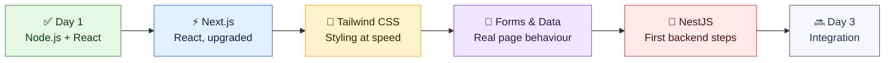
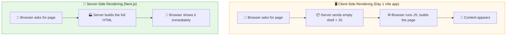
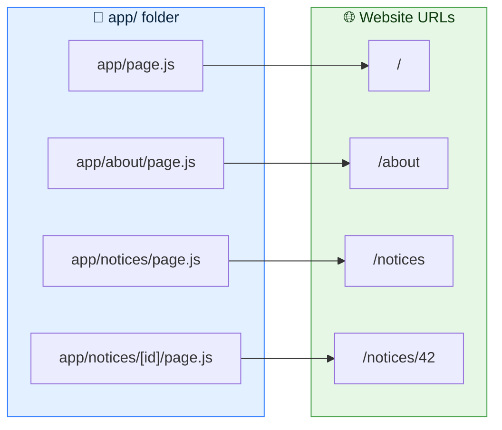
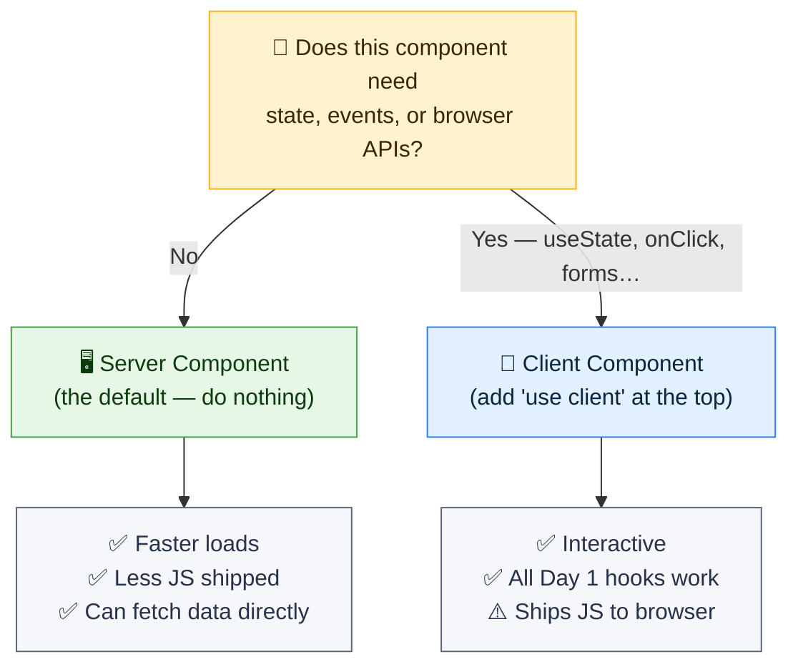
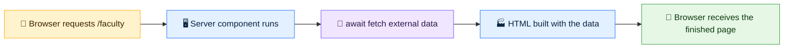
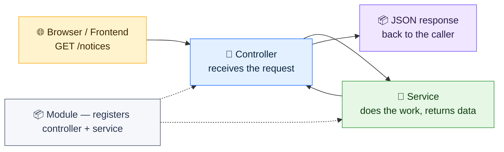
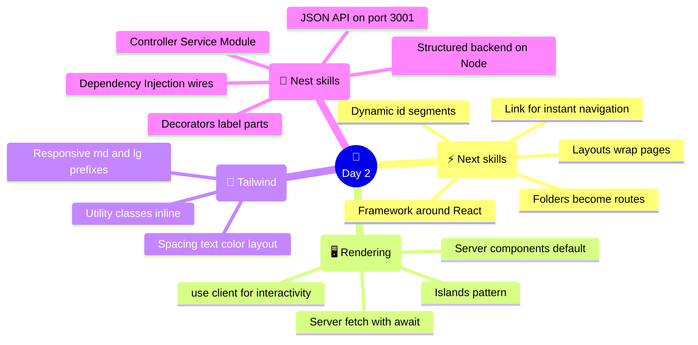

# 🚀 Day 2 — Next.js & First Steps into NestJS

### CodeLucky Faculty Development Programme · Full Stack Web Development

> **📍 Where this day fits:** Day 1 built the two foundations — **Node.js** (JavaScript everywhere) and **React** (UIs from components). Day 2 levels up on both fronts: **Next.js** turns React knowledge into real, multi-page, production-style websites, and by the end of the day, **NestJS** makes its first appearance on the backend.

---

## 🗺️ Today's Journey



### ⏱️ Suggested 6-Hour Flow

| Part | Topic | Time |
|---|---|---|
| 1 | 🤔 From React to Next.js — why a framework | 45 min |
| 2 | 🗂️ Pages, routing & layouts (App Router) | 60 min |
| 3 | 🖥️ Server vs Client Components | 45 min |
| 4 | 🎨 Styling with Tailwind CSS | 45 min |
| 5 | 📝 Forms & fetching data | 60 min |
| 6 | 🪺 Meet NestJS — the backend begins | 75 min |
| — | 🧭 Recap & wrap-up | 30 min |

> 🧠 **Format reminder:** 100% hands-on. Every code block is meant to be typed and run. The day produces **two separate running apps** — a Next.js site and a NestJS API — deliberately kept apart. Day 3 is where they meet, and that moment lands harder when both halves are understood on their own first.

---

# ⚡ PART 1 — From React to Next.js

## 🤔 What Is Next.js?

**Next.js is a framework built on top of React.** React provides the components; Next.js provides everything *around* them that a real website needs — pages, routing, data loading, performance, and production builds.

> 💡 **Analogy:** React is a powerful engine 🏎️. Next.js is the complete car built around that engine — steering, wheels, lights, seatbelts. The engine is essential, but nobody drives to work on a bare engine.

### 🧩 What React alone doesn't answer

Day 1's React app lived on a single page. Real websites immediately raise questions React doesn't answer by itself:

- 🗂️ How do multiple pages work? (`/`, `/about`, `/contact`)
- 🔗 How does navigation between them work without full reloads?
- 🚀 How does the site load fast and rank on Google?
- 📦 How is it built and shipped to production?

**Next.js answers all of these out of the box.** That's why it's one of the most used frameworks in the industry today — powering sites for Netflix, TikTok, Nike, and countless startups.

> 📢 **Key fact:** Everything from Day 1 transfers directly. Components, JSX, props, `useState`, `.map()` with keys — Next.js uses all of it, unchanged. Next.js *adds*; it doesn't replace.

---

## 🌐 One Big Idea First: Where Does Rendering Happen?

A React app from Day 1 (Vite) renders **in the browser** — the server sends a nearly-empty page plus JavaScript, and the browser builds the screen. This is **Client-Side Rendering (CSR)**.

Next.js can render pages **on the server** — the browser receives ready-made HTML instantly. This is **Server-Side Rendering (SSR)**.



**Why it matters:** server-rendered pages appear faster and are fully readable by search engines. This single idea explains most of what makes Next.js special — and it returns in Part 3 as *Server vs Client Components*.

---

## 🏗️ Creating a Next.js App

One command scaffolds a complete project:

```bash
npx create-next-app@latest my-next-app
```

The setup asks a few questions. For today:

| Prompt | Choice |
|---|---|
| TypeScript? | **No** (JavaScript, matching Day 1) |
| ESLint? | Yes |
| Tailwind CSS? | **Yes** ← used in Part 4 |
| `src/` directory? | No |
| App Router? | **Yes** ← the modern standard |
| Turbopack? | Yes |
| Import alias? | No |

Then start it:

```bash
cd my-next-app
npm run dev
```

Open **http://localhost:3000** — a running Next.js site appears. 🎉

> ⚡ Same live-reload workflow as Day 1: keep `npm run dev` running, save a file, watch the browser update instantly.

### 📁 Key Files in the Project

```
my-next-app/
├── 📁 app/
│   ├── 📄 page.js         ← the homepage ("/")  ★ edit this
│   ├── 📄 layout.js       ← wraps every page (shared shell)
│   └── 📄 globals.css     ← global styles (Tailwind lives here)
├── 📁 public/             ← images & static files
├── 📄 package.json        ← project & dependencies
└── 📄 next.config.mjs     ← Next.js settings
```

> 🎯 **Where the work happens:** the `app/` folder. In the App Router, **the folder structure *is* the website structure** — the next part shows exactly how.

### 🧪 First Edit

Replace everything in `app/page.js` with:

```jsx
export default function Home() {
  return (
    <main style={{ padding: 40 }}>
      <h1>🏠 Welcome to Next.js!</h1>
      <p>This page is a React component — rendered by the server.</p>
    </main>
  );
}
```

Save — the browser shows the new homepage. Familiar territory: it's just a component, exactly like Day 1.

---

# 🗂️ PART 2 — Pages, Routing & Layouts

## 🛣️ File-Based Routing — Folders Become URLs

In Next.js, **creating a page means creating a folder with a `page.js` inside it**. No route configuration, no libraries — the file system is the router.



### ✋ Hands-On: An About Page

Create the file `app/about/page.js`:

```jsx
export default function AboutPage() {
  return (
    <main style={{ padding: 40 }}>
      <h1>ℹ️ About This Site</h1>
      <p>Built during the CodeLucky FDP — Day 2.</p>
    </main>
  );
}
```

Visit **http://localhost:3000/about** — the new page is live. That's the entire process: **folder + `page.js` = a page**.

> 🔑 **Rule to remember:** the file must be named exactly `page.js`. The folder name decides the URL; the file name tells Next.js "this folder is a page."

---

## 🔗 Navigating with `<Link>`

Regular `<a>` tags reload the whole site. Next.js provides `<Link>` for instant, app-like navigation:

```jsx
import Link from "next/link";

export default function Home() {
  return (
    <main style={{ padding: 40 }}>
      <h1>🏠 Home</h1>
      <p>
        <Link href="/about">Go to the About page →</Link>
      </p>
    </main>
  );
}
```

Clicking it switches pages **instantly** — no white flash, no full reload.

> 💡 `<Link>` looks and behaves like `<a>` in the markup, but under the hood Next.js swaps only what changed. This is what makes Next.js sites feel like apps.

---

## 🧥 Layouts — The Shared Shell

`app/layout.js` wraps **every** page. Anything placed there — a navbar, a footer — appears on all pages automatically.

```jsx
// app/layout.js
import Link from "next/link";
import "./globals.css";

export const metadata = {
  title: "FDP Notice Board",
  description: "Built at the CodeLucky FDP",
};

export default function RootLayout({ children }) {
  return (
    <html lang="en">
      <body>
        <nav style={{ padding: 16, borderBottom: "1px solid #ddd" }}>
          <Link href="/">🏠 Home</Link>{"  ·  "}
          <Link href="/about">ℹ️ About</Link>{"  ·  "}
          <Link href="/notices">📋 Notices</Link>
        </nav>

        {children}   {/* ← the current page renders here */}

        <footer style={{ padding: 16, borderTop: "1px solid #ddd" }}>
          <small>CodeLucky FDP · Day 2</small>
        </footer>
      </body>
    </html>
  );
}
```

> 🔑 **`children` is the magic prop** — it's whatever page is currently being viewed. The layout stays; only `children` changes. (Props from Day 1, doing heavy lifting already.)

---

## 🎫 Dynamic Routes — One Page, Many URLs

A notice board has many notices — `/notices/1`, `/notices/2`, `/notices/42`. Writing a folder for each is impossible. **Square brackets create a dynamic segment:**

```
app/
└── notices/
    ├── page.js          ← /notices        (the list)
    └── [id]/
        └── page.js      ← /notices/ANYTHING  (one notice)
```

First, the list page — `app/notices/page.js`:

```jsx
import Link from "next/link";

export default function NoticesPage() {
  const notices = [
    { id: 1, title: "Mid-term exam schedule released" },
    { id: 2, title: "Hackathon registrations open" },
    { id: 3, title: "Library timings updated" },
  ];

  return (
    <main style={{ padding: 40 }}>
      <h1>📋 Notices</h1>
      <ul>
        {notices.map((n) => (
          <li key={n.id}>
            <Link href={`/notices/${n.id}`}>{n.title}</Link>
          </li>
        ))}
      </ul>
    </main>
  );
}
```

*(Spot the Day 1 patterns: an array, `.map()`, a `key`, template literals.)*

Then the detail page — `app/notices/[id]/page.js`:

```jsx
export default async function NoticeDetail({ params }) {
  const { id } = await params;   // the value from the URL

  return (
    <main style={{ padding: 40 }}>
      <h1>📄 Notice #{id}</h1>
      <p>Details for notice {id} will load here.</p>
    </main>
  );
}
```

Visit `/notices/1`, `/notices/2`, `/notices/99` — the same file serves them all, receiving the URL value through `params`.

> ⚠️ **Note the `async` and `await params`:** in current Next.js, `params` arrives as a promise in server components, so the component is declared `async` and the value awaited. It's two extra words for a lot of power.

---

<div align="center">

### ✅ Routing Checkpoint

Folder + `page.js` = a page · `<Link>` = instant navigation · `layout.js` = shared shell · `[brackets]` = dynamic URLs

</div>

---

# 🖥️ PART 3 — Server Components vs Client Components

This is the most important *concept* of the Next.js day — and the one that most distinguishes modern Next.js from plain React.

## 🧠 The Split

In the App Router, **every component is a Server Component by default** — it runs on the server, sends finished HTML, and ships no JavaScript for itself to the browser. Fast and light.

But server components **can't be interactive** — no `useState`, no `onClick`. For interactivity, a component opts in to running in the browser with one line at the top: `"use client"`.



> 💡 **Analogy:** a restaurant 🍽️. The **kitchen (server)** prepares the dish — customers never see it, and it does the heavy work. The **table (client)** is where interaction happens — cutting, mixing, seasoning to taste. Most of the meal is kitchen work; only the interactive finishing happens at the table.

## ✋ Hands-On: A Client Component

This counter needs `useState` and `onClick`, so it declares `"use client"`. Create `app/components/Counter.js`:

```jsx
"use client";

import { useState } from "react";

export default function Counter() {
  const [count, setCount] = useState(0);

  return (
    <button onClick={() => setCount(count + 1)}>
      👍 Liked {count} times
    </button>
  );
}
```

Use it inside any page (which itself stays a server component):

```jsx
// app/page.js  — still a Server Component
import Counter from "./components/Counter";

export default function Home() {
  return (
    <main style={{ padding: 40 }}>
      <h1>🏠 Welcome to Next.js!</h1>
      <Counter />   {/* an interactive island on a server page */}
    </main>
  );
}
```

> 🎯 **The pattern that emerges:** pages are server components; small interactive pieces (buttons, forms, counters) are client components dropped into them. The industry calls these *islands of interactivity* — mostly-server pages with client sprinkles.

### ⚠️ The Two Errors Everyone Hits Once

| Symptom | Cause | Fix |
|---|---|---|
| `useState is not defined` / hooks error on a page | Using hooks in a server component | Add `"use client"` at the very top of that file |
| Event handlers don't fire | `onClick` in a server component | Same — `"use client"` |

Hitting these errors is a rite of passage — the fix is always the same one line.

---

<div align="center">

### ✅ Components Checkpoint

Server by default (fast, no JS) · `"use client"` opts into interactivity · Pages = server, interactive islands = client

</div>

---

# 🎨 PART 4 — Styling with Tailwind CSS

## 🤔 What Is Tailwind?

**Tailwind CSS styles elements with small, single-purpose class names written directly in the markup** — no separate CSS files, no inventing class names.

```jsx
// Traditional CSS:  write a class in a .css file, name it, import it, use it
<h1 className="hero-title">Hello</h1>

// Tailwind:  compose the style right here
<h1 className="text-4xl font-bold text-blue-900">Hello</h1>
```

> 💡 **Analogy:** traditional CSS is tailoring a custom outfit 🧵 for every element — measure, cut, sew, name it, store it. Tailwind is a wardrobe of ready-made pieces 👕 — grab `text-4xl`, `font-bold`, `p-4`, and the element is dressed in seconds.

Tailwind was enabled during `create-next-app`, so it already works — no setup needed.

## 🧰 The Starter Vocabulary

A small set of class families covers most daily styling:

| Family | Examples | Effect |
|---|---|---|
| **Text size** | `text-sm` `text-xl` `text-4xl` | Font size |
| **Weight & color** | `font-bold` `text-gray-600` `text-blue-900` | Emphasis & color |
| **Spacing** | `p-4` (padding) `m-2` (margin) `gap-4` | Space inside / outside / between |
| **Background** | `bg-white` `bg-blue-50` `bg-gray-900` | Background color |
| **Borders** | `border` `rounded-lg` `shadow` | Frame, corners, elevation |
| **Layout** | `flex` `grid` `items-center` `justify-between` | Arrangement |
| **Width** | `w-full` `max-w-2xl` `mx-auto` | Sizing & centering |

## ✋ Hands-On: A Styled Notice Card

Update `app/notices/page.js` to use Tailwind classes:

```jsx
import Link from "next/link";

export default function NoticesPage() {
  const notices = [
    { id: 1, title: "Mid-term exam schedule released", tag: "Exams" },
    { id: 2, title: "Hackathon registrations open", tag: "Events" },
    { id: 3, title: "Library timings updated", tag: "Campus" },
  ];

  return (
    <main className="max-w-2xl mx-auto p-8">
      <h1 className="text-3xl font-bold text-blue-950 mb-6">📋 Notices</h1>

      <div className="flex flex-col gap-4">
        {notices.map((n) => (
          <Link
            key={n.id}
            href={`/notices/${n.id}`}
            className="block p-4 bg-white border rounded-lg shadow-sm hover:shadow-md"
          >
            <span className="text-xs font-semibold text-teal-600 uppercase">
              {n.tag}
            </span>
            <h2 className="text-lg font-semibold text-gray-800">{n.title}</h2>
          </Link>
        ))}
      </div>
    </main>
  );
}
```

Save and look — a clean, card-based list with hover shadows, written without touching a CSS file.

### 📱 Responsive in One Prefix

Tailwind handles screen sizes with prefixes: a bare class applies everywhere; `md:` applies from tablets up; `lg:` from desktops up.

```jsx
{/* 1 column on phones → 2 on tablets → 3 on desktops */}
<div className="grid grid-cols-1 md:grid-cols-2 lg:grid-cols-3 gap-4">
  ...cards...
</div>
```

> 🎯 **Mobile-first thinking:** style for the phone by default, then add `md:` / `lg:` upgrades for bigger screens. One line of prefixes replaces entire media-query blocks.

> 📢 **Key fact:** Tailwind's biggest classroom advantage is **speed of iteration** — style, save, see. There's a full reference at `tailwindcss.com/docs`, and the editor autocompletes class names.

---

# 📝 PART 5 — Forms & Fetching Data

Two everyday jobs of any real page: **collecting input** and **showing data from elsewhere**. Both use Day 1 skills in their new Next.js home.

## ⌨️ Forms — Day 1 Controlled Inputs, New Address

Forms are interactive → client component. Create `app/components/FeedbackForm.js`:

```jsx
"use client";

import { useState } from "react";

export default function FeedbackForm() {
  const [name, setName] = useState("");
  const [message, setMessage] = useState("");
  const [submitted, setSubmitted] = useState(false);

  const handleSubmit = () => {
    if (name.trim() === "" || message.trim() === "") return;
    setSubmitted(true);   // in Day 3, this will POST to the NestJS API
  };

  if (submitted) {
    return (
      <p className="p-4 bg-green-50 text-green-800 rounded-lg">
        ✅ Thanks, {name}! Feedback recorded.
      </p>
    );
  }

  return (
    <div className="flex flex-col gap-3 max-w-md">
      <input
        className="border rounded-lg p-2"
        value={name}
        onChange={(e) => setName(e.target.value)}
        placeholder="Name"
      />
      <textarea
        className="border rounded-lg p-2"
        value={message}
        onChange={(e) => setMessage(e.target.value)}
        placeholder="Feedback"
      />
      <button
        onClick={handleSubmit}
        className="bg-blue-900 text-white rounded-lg p-2 font-semibold"
      >
        📨 Submit
      </button>
    </div>
  );
}
```

Drop it into the About page:

```jsx
// app/about/page.js
import FeedbackForm from "../components/FeedbackForm";

export default function AboutPage() {
  return (
    <main className="max-w-2xl mx-auto p-8">
      <h1 className="text-3xl font-bold text-blue-950 mb-6">ℹ️ About</h1>
      <FeedbackForm />
    </main>
  );
}
```

> 🔑 **Everything here is Day 1 knowledge** — `useState`, `value` + `onChange`, an event handler — just wearing Tailwind clothes inside a Next.js page. The `handleSubmit` is intentionally a stub: wiring it to a real backend is exactly what Day 3 delivers.

### 🛡️ A Word on Validation

The `if (name.trim() === "") return;` line is validation in its smallest form — refuse bad input. Real apps layer more: required fields, length limits, email formats, and (critically) **the backend validates again** — because the browser can be bypassed. That backend half arrives with NestJS validation pipes later in the workshop.

---

## 📡 Fetching Data — The Server Component Superpower

Here's where server components shine: **they can fetch data directly, with a plain `await`, before the page is sent.** No hooks, no loading spinners, no `useEffect`.

Create `app/faculty/page.js` (using a free practice API):

```jsx
export default async function FacultyPage() {
  // Runs on the SERVER — before the browser sees anything
  const res = await fetch("https://jsonplaceholder.typicode.com/users");
  const users = await res.json();

  return (
    <main className="max-w-2xl mx-auto p-8">
      <h1 className="text-3xl font-bold text-blue-950 mb-6">👩‍🏫 Faculty Directory</h1>

      <div className="flex flex-col gap-3">
        {users.map((u) => (
          <div key={u.id} className="p-4 bg-white border rounded-lg">
            <h2 className="font-semibold text-gray-800">{u.name}</h2>
            <p className="text-sm text-gray-500">{u.email}</p>
          </div>
        ))}
      </div>
    </main>
  );
}
```

Visit `/faculty` — a full directory, fetched and rendered on the server, delivered as finished HTML.



> 💡 **Compare with Day 1's `useEffect` mention:** in plain React, fetching means `useEffect` + loading states + re-renders. In a Next.js server component it's two lines — `fetch`, `json()` — because the work happens before the page ships. (Client-side fetching still exists for after-load updates; `useEffect` returns in Day 3 for exactly that.)

> 🎯 **Foreshadow:** today the data comes from a public practice API. Tomorrow's Part 6 builds *our own* API — and on Day 3, this exact `fetch` line points at it. Same pattern, own backend.

---

<div align="center">

### ✅ Next.js Checkpoint

Framework around React · folders = routes · layouts wrap pages · server components fetch, client components interact · Tailwind styles inline

</div>

---

# 🪺 PART 6 — Meet NestJS: The Backend Begins

The frontend can now display anything — but its data is either hard-coded or borrowed from public APIs. Time to start building the **other half**: a backend of our own.

## 🤔 What Is NestJS?

**NestJS is a framework for building the server side — the APIs that frontends talk to.** It runs on Node.js (Day 1's foundation, paying off again) and brings structure: instead of one giant server file, code is organised into clean, predictable pieces.

> 💡 **Analogy:** Next.js is the restaurant's dining area 🍽️ — beautiful, welcoming, where guests interact. NestJS is the kitchen 👨‍🍳 — organised stations, clear roles, where orders are actually fulfilled. Day 3 connects the waiter between them.

### 🧩 Why NestJS (and not a bare Node server)?

- 🏗️ **Structure by default** — every project follows the same layout, so any developer (or student) can navigate any NestJS codebase.
- 🧪 **Built for real apps** — validation, authentication, database tools are first-class citizens, not bolt-ons.
- 🅰️ **Familiar shape** — its architecture famously mirrors Angular's, and its component thinking rhymes with React's. Skills transfer.
- 🏢 **Industry adoption** — used by Adidas, Decathlon, Capgemini and thousands of production teams.

> 📢 **Key fact:** NestJS projects use **TypeScript** — JavaScript with type labels (`name: string`). Today it can be read as JavaScript with a few extra annotations; the labels are explained as they appear, and they become second nature during Days 3–4.

---

## 🏗️ Creating a NestJS App

Two commands — install the Nest CLI once, then scaffold:

```bash
npm install -g @nestjs/cli
nest new my-api
```

When asked for a package manager, choose **npm**. Then:

```bash
cd my-api
npm run start:dev
```

> ⚠️ **Port clash alert:** Next.js is already using port 3000. Open `src/main.ts` and change one number so both apps can run side-by-side:

```ts
// src/main.ts
import { NestFactory } from '@nestjs/core';
import { AppModule } from './app.module';

async function bootstrap() {
  const app = await NestFactory.create(AppModule);
  await app.listen(3001);   // ← was 3000; now the API lives on 3001
}
bootstrap();
```

Visit **http://localhost:3001** — the reply is a plain, humble:

```
Hello World!
```

That's not a webpage — it's an **API response**. The backend is alive. 🎉

---

## 🧱 The Three Building Blocks

Open the `src/` folder — three files carry the whole idea of NestJS:

```
src/
├── 📄 main.ts             ← starts the server (just edited)
├── 📄 app.module.ts       ← the MODULE — bundles things together
├── 📄 app.controller.ts   ← the CONTROLLER — receives requests
└── 📄 app.service.ts      ← the SERVICE — does the actual work
```



| Piece | Job | Analogy |
|---|---|---|
| 🚪 **Controller** | Receives requests, decides who handles them | The reception desk |
| 🧠 **Service** | Contains the actual logic and data work | The specialist doing the job |
| 📦 **Module** | Groups related controllers + services | The department they belong to |

> 🔑 **The separation matters:** controllers stay thin (traffic direction only); services hold the brains. This split is what keeps big backends readable — and it's the pattern every NestJS feature follows.

---

## ✋ Hands-On: A Real Endpoint — `GET /notices`

Time to make the API serve the *same notices* the Next.js site currently hard-codes. The Nest CLI generates the pieces:

```bash
nest generate module notices
nest generate controller notices
nest generate service notices
```

Three files appear under `src/notices/`, already wired into the app. Now fill in the logic.

**The service** — `src/notices/notices.service.ts` — owns the data:

```ts
import { Injectable } from '@nestjs/common';

@Injectable()
export class NoticesService {
  private notices = [
    { id: 1, title: 'Mid-term exam schedule released', tag: 'Exams' },
    { id: 2, title: 'Hackathon registrations open', tag: 'Events' },
    { id: 3, title: 'Library timings updated', tag: 'Campus' },
  ];

  findAll() {
    return this.notices;
  }

  findOne(id: number) {
    return this.notices.find((n) => n.id === id);
  }
}
```

**The controller** — `src/notices/notices.controller.ts` — exposes it to the world:

```ts
import { Controller, Get, Param } from '@nestjs/common';
import { NoticesService } from './notices.service';

@Controller('notices')                    // handles URLs starting with /notices
export class NoticesController {
  constructor(private noticesService: NoticesService) {}

  @Get()                                  // GET /notices
  findAll() {
    return this.noticesService.findAll();
  }

  @Get(':id')                             // GET /notices/2
  findOne(@Param('id') id: string) {
    return this.noticesService.findOne(Number(id));
  }
}
```

### 🔍 Reading the New Syntax

Those `@Something()` lines are **decorators** — labels that tell NestJS what a thing is for:

| Decorator | Meaning |
|---|---|
| `@Injectable()` | "This service can be handed to whoever needs it" |
| `@Controller('notices')` | "This class answers URLs under `/notices`" |
| `@Get()` / `@Get(':id')` | "This method answers GET requests (optionally with a URL parameter)" |
| `@Param('id')` | "Hand me the `:id` value from the URL" |

And the `constructor(private noticesService: NoticesService)` line? That's **Dependency Injection** — the controller *asks* for the service, and NestJS supplies it automatically. No `new NoticesService()` anywhere; Nest manages the wiring.

> 💡 It's the same convenience as Day 2's `params` in Next.js dynamic routes — "the framework hands over what's needed." Deep-diving DI is a Day 3 topic; today, recognising the shape is enough.

### 🧪 Test It

With `npm run start:dev` running, open in the browser (or Postman):

```
http://localhost:3001/notices        →  the full JSON list
http://localhost:3001/notices/2      →  {"id":2,"title":"Hackathon registrations open","tag":"Events"}
```

**Two applications are now running side by side:**

| App | Port | Role |
|---|---|---|
| ⚡ Next.js site | `localhost:3000` | Shows pages (data hard-coded, for now) |
| 🪺 NestJS API | `localhost:3001` | Serves the real data as JSON |

> 🎯 **The cliffhanger, on purpose:** the frontend displays notices; the backend serves notices — but they don't know about each other yet. **Day 3 begins by replacing the frontend's hard-coded array with `fetch("http://localhost:3001/notices")`** — and the two halves become one app. Everything ahead (databases, JWT auth, roles) plugs into the controller/service structure built today.

---

<div align="center">

### ✅ NestJS Checkpoint

NestJS = structured Node backend · Controller receives → Service works → JSON returns · decorators label the parts · DI wires them · API tested on port 3001

</div>

---

# 🧭 Day 2 — The Complete Picture



## 📌 The Big Takeaways

1. ⚡ **Next.js = React + everything a real site needs** — pages, routing, layouts, rendering, production builds.
2. 🗂️ **The file system is the router** — a folder with `page.js` is a page; `[brackets]` make it dynamic.
3. 🖥️ **Server components are the default** (fast, fetch-capable); `"use client"` opts into Day 1's interactive world.
4. 🎨 **Tailwind styles at the speed of thought** — utility classes in the markup, responsive with `md:` / `lg:`.
5. 🪺 **NestJS structures the backend** — Controllers receive, Services work, Modules organise, decorators label, DI wires.
6. 🔀 **Two running apps, deliberately separate** — the payoff of joining them is what Day 3 is built around.

## ➡️ What Comes Next in the Workshop

- 🔗 **Day 3 — Integration:** the Next.js frontend fetches from the NestJS API; forms POST real data; auth flow begins
- 🗄️ **Databases:** the service's in-memory array becomes real persistence (MongoDB / PostgreSQL)
- 🔐 **JWT & roles:** login, protected routes, role-based access
- 🐳 **DevOps & deployment:** Docker, CI/CD, and going live

> 🎓 **Day 1 gave the language; Day 2 gave the two halves.** From Day 3 onward, everything is about making them work — and ship — together.

---

## 📚 Quick Reference Card

```jsx
// ── NEXT.JS: A PAGE ─────────────────────────
// app/about/page.js  →  URL /about
export default function AboutPage() {
  return <main>...</main>;
}

// ── DYNAMIC ROUTE ───────────────────────────
// app/notices/[id]/page.js  →  /notices/42
export default async function Page({ params }) {
  const { id } = await params;
}

// ── NAVIGATION ──────────────────────────────
import Link from "next/link";
<Link href="/about">About</Link>

// ── CLIENT COMPONENT (interactivity) ────────
"use client";
import { useState } from "react";

// ── SERVER-SIDE FETCH ───────────────────────
const res = await fetch("https://api.example.com/data");
const data = await res.json();
```

```ts
// ── NESTJS: CONTROLLER + SERVICE ────────────
@Controller('notices')          // answers /notices
export class NoticesController {
  constructor(private svc: NoticesService) {}  // DI

  @Get()                        // GET /notices
  findAll() { return this.svc.findAll(); }

  @Get(':id')                   // GET /notices/2
  findOne(@Param('id') id: string) {
    return this.svc.findOne(Number(id));
  }
}
```

### 🖥️ Essential Commands

```bash
# Next.js
npx create-next-app@latest my-next-app   # scaffold a site
npm run dev                              # dev server → :3000

# NestJS
npm install -g @nestjs/cli               # install the CLI (once)
nest new my-api                          # scaffold an API
nest generate module notices             # generate pieces
nest generate controller notices
nest generate service notices
npm run start:dev                        # dev server → :3001 (after main.ts edit)
```

### 🎨 Tailwind Mini-Cheat

```
text-sm / text-xl / text-4xl      font-bold        text-gray-600
p-4  m-2  gap-4                   bg-white  bg-blue-50
border  rounded-lg  shadow        flex  grid  items-center
w-full  max-w-2xl  mx-auto        md:...  lg:...   hover:...
```

---

<div align="center">

## 🎉 End of Day 2

**The frontend grew up (Next.js) — and the backend was born (NestJS).**

*Two halves, both running. Day 3 makes them one.*

---

🌐 **codelucky.com** · A CodeLucky Faculty Development Programme

</div>
