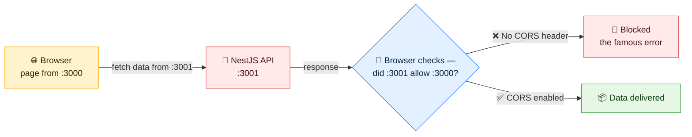
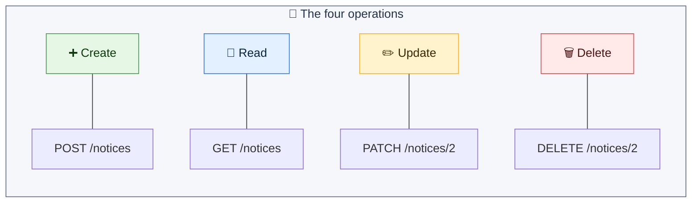
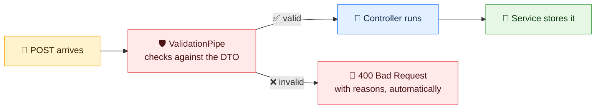
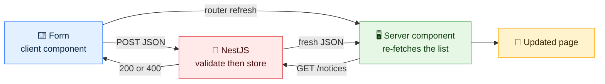
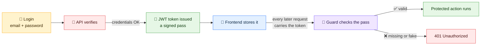
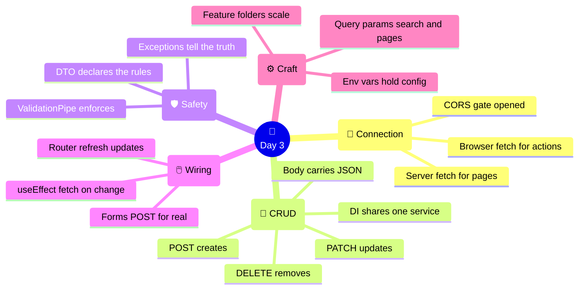

# 🔗 Day 3 — Full Stack Integration: Two Halves Become One

### CodeLucky Faculty Development Programme · Full Stack Web Development

> **📍 Where this day fits:** Day 2 ended on a deliberate cliffhanger — a Next.js site showing *hard-coded* notices on port 3000, and a NestJS API serving the *real* notices on port 3001, running side by side but never speaking. **Day 3 is the payoff.** The wall between them comes down in the first hour, and by evening the Notice Board is one genuine full stack application: reading, creating, deleting, validating, and searching real data across the wire.

---

## 🗺️ Today's Journey

```mermaid
flowchart LR
    D2["✅ Day 2<br/>Two separate apps"] --> A["🌉 The Connection<br/>CORS + first fetch"]
    A --> B["🔁 Full CRUD<br/>Create, update, delete"]
    B --> C["🛡️ Validation<br/>Trust nothing"]
    C --> D["🖱️ Frontend Wiring<br/>Forms that really POST"]
    D --> E["🔍 Search & Pages<br/>Query params"]
    E --> D4["🔜 Day 4<br/>Database + Auth"]
    style D2 fill:#e6f7e6,stroke:#43a047,color:#0d3b0d
    style A fill:#e3f0ff,stroke:#2f7bff,color:#0a2540
    style B fill:#fff3cd,stroke:#ffb020,color:#3a2600
    style C fill:#ffe9e9,stroke:#e5484d,color:#4a1414
    style D fill:#f0e6ff,stroke:#7c5cff,color:#2a1a4a
    style E fill:#e6fffb,stroke:#00b3a4,color:#003b36
    style D4 fill:#f5f7fb,stroke:#5b667a,color:#26324a
```



### ⏱️ Suggested 6-Hour Flow

| Part | Topic | Time |
|---|---|---|
| 1 | 🌉 The connection — CORS & the first cross-app fetch | 45 min |
| 2 | 🔁 Completing CRUD — POST, PATCH, DELETE (+ DI, properly) | 75 min |
| 3 | 🛡️ Validation & error handling | 60 min |
| 4 | 🖱️ Wiring the frontend — forms, deletes, live updates | 75 min |
| 5 | 🔍 Search, filtering & pagination | 45 min |
| 6 | ⚙️ Environment variables, auth preview & good structure | 30 min |
| — | 🧭 Recap & wrap-up | 30 min |

> 🧠 **Prerequisites running:** both Day 2 apps should be up before starting — `my-next-app` on **:3000** (`npm run dev`) and `my-api` on **:3001** (`npm run start:dev`). Every section today touches both.

---

# 🌉 PART 1 — The Connection

## 🚧 The Wall Between the Apps

The obvious first move: point the frontend's notices page at the real API. Replace the hard-coded array in `app/notices/page.js`:

```jsx
export default async function NoticesPage() {
  const res = await fetch("http://localhost:3001/notices", {
    cache: "no-store",   // always fetch fresh data
  });
  const notices = await res.json();

  return (
    <main className="max-w-2xl mx-auto p-8">
      <h1 className="text-3xl font-bold text-blue-950 mb-6">📋 Notices</h1>
      {/* the same .map() as before — data source is the only change */}
      <div className="flex flex-col gap-4">
        {notices.map((n) => (
          <div key={n.id} className="p-4 bg-white border rounded-lg">
            <span className="text-xs font-semibold text-teal-600 uppercase">{n.tag}</span>
            <h2 className="text-lg font-semibold text-gray-800">{n.title}</h2>
          </div>
        ))}
      </div>
    </main>
  );
}
```

This works — because a **server component** fetches server-to-server, and servers talk to each other freely.

But the moment a **browser** tries the same thing (which client components in Part 4 will), a famous error appears in the console:

```
Access to fetch at 'http://localhost:3001/notices' from origin
'http://localhost:3000' has been blocked by CORS policy
```

## 🛂 What Is CORS?

**CORS (Cross-Origin Resource Sharing)** is a browser security rule: a page from one origin (`localhost:3000`) may not read responses from another origin (`localhost:3001`) — *unless the second server explicitly allows it*.



> 💡 **Analogy:** CORS is like a visitor policy at a gated office 🏢. Anyone can *send* a letter in, but the browser (security guard) only hands the *reply* to visitors from addresses on the approved list. The API must publish that list.

## ✋ The One-Line Fix

The API opts in. In `my-api/src/main.ts`:

```ts
import { NestFactory } from '@nestjs/core';
import { AppModule } from './app.module';

async function bootstrap() {
  const app = await NestFactory.create(AppModule);
  app.enableCors();          // ← allow cross-origin requests (dev-friendly)
  await app.listen(3001);
}
bootstrap();
```

The dev server restarts automatically. From this moment, browser-side code can call the API too — the wall is down for good.

> 🔒 **Production note (for later):** `enableCors()` with no arguments allows *every* origin — perfect for the workshop, too generous for production. Day 5 tightens it to `app.enableCors({ origin: "https://the-real-site.com" })`.

---

<div align="center">

### ✅ Connection Checkpoint

Server components fetch freely · browsers enforce CORS · `app.enableCors()` opens the API · the frontend now displays **live API data**

</div>

---

# 🔁 PART 2 — Completing CRUD

The API currently only *serves* notices. Real apps need the full set — **CRUD**: Create, Read, Update, Delete. Each maps to an HTTP verb:



> 📢 **Key fact:** the URL stays the same (`/notices`); **the verb changes the meaning**. GET reads, POST creates, PATCH edits, DELETE removes. This verb-plus-URL grammar *is* REST — the style nearly every web API speaks.

## 🧠 First — Dependency Injection, Properly

Day 2 waved at this line; today it earns a full explanation:

```ts
constructor(private noticesService: NoticesService) {}
```

**Dependency Injection (DI)** means a class *declares what it needs* in its constructor, and NestJS *supplies it*. The controller never writes `new NoticesService()` — Nest creates one instance and hands it to every class that asks.

**Why it matters:**

- 🔁 **One shared instance** — every controller talking to `NoticesService` sees the *same* data. (With `new` in each file, each would get its own private copy — chaos.)
- 🧪 **Swappable parts** — in tests, a fake service can be injected without touching the controller.
- 🧹 **Zero wiring code** — the `@Injectable()` decorator + the constructor line is the entire setup.

> 💡 **Analogy:** DI is a well-run kitchen's ingredient system 🧑‍🍳. The chef doesn't grow tomatoes — the station *declares* "I need tomatoes," and the kitchen delivers the same shared stock everyone uses. Consistency guaranteed, no gardening in the middle of service.

## ✋ Hands-On: The Service Learns to Write

Extend `src/notices/notices.service.ts` with the three missing operations:

```ts
import { Injectable } from '@nestjs/common';

@Injectable()
export class NoticesService {
  private notices = [
    { id: 1, title: 'Mid-term exam schedule released', tag: 'Exams' },
    { id: 2, title: 'Hackathon registrations open', tag: 'Events' },
    { id: 3, title: 'Library timings updated', tag: 'Campus' },
  ];

  findAll() {
    return this.notices;
  }

  findOne(id: number) {
    return this.notices.find((n) => n.id === id);
  }

  create(data: { title: string; tag: string }) {
    const newNotice = { id: Date.now(), ...data };
    this.notices.push(newNotice);
    return newNotice;                       // return what was created
  }

  update(id: number, data: { title?: string; tag?: string }) {
    const notice = this.findOne(id);
    if (notice) Object.assign(notice, data); // copy new values over old
    return notice;
  }

  remove(id: number) {
    this.notices = this.notices.filter((n) => n.id !== id);
    return { deleted: true, id };
  }
}
```

*(Familiar tools throughout: spread `...data`, `.find()`, `.filter()` — Day 1's array methods running the backend.)*

## ✋ Hands-On: The Controller Opens the Doors

Extend `src/notices/notices.controller.ts`:

```ts
import {
  Controller, Get, Post, Patch, Delete, Param, Body,
} from '@nestjs/common';
import { NoticesService } from './notices.service';

@Controller('notices')
export class NoticesController {
  constructor(private noticesService: NoticesService) {}

  @Get()
  findAll() {
    return this.noticesService.findAll();
  }

  @Get(':id')
  findOne(@Param('id') id: string) {
    return this.noticesService.findOne(Number(id));
  }

  @Post()                                    // POST /notices
  create(@Body() body: { title: string; tag: string }) {
    return this.noticesService.create(body);
  }

  @Patch(':id')                              // PATCH /notices/2
  update(@Param('id') id: string, @Body() body: { title?: string; tag?: string }) {
    return this.noticesService.update(Number(id), body);
  }

  @Delete(':id')                             // DELETE /notices/2
  remove(@Param('id') id: string) {
    return this.noticesService.remove(Number(id));
  }
}
```

**One new decorator carries the day:** `@Body()` hands over the JSON sent *with* the request — the same way `@Param()` hands over URL values.

| Decorator | Where the data comes from | Example |
|---|---|---|
| `@Param('id')` | The URL path | `/notices/2` → `"2"` |
| `@Body()` | The request's JSON payload | `{ "title": "…", "tag": "…" }` |
| `@Query('search')` | After the `?` in the URL | `/notices?search=exam` → `"exam"` *(Part 5)* |

## 🧪 Test It — Beyond the Browser

Browsers only send GET from the address bar, so testing POST/PATCH/DELETE needs a proper client. In **Postman** (from the prerequisites) — or `curl`:

```bash
# CREATE — a new notice appears
curl -X POST http://localhost:3001/notices \
  -H "Content-Type: application/json" \
  -d '{"title": "FDP Day 3 in progress", "tag": "Events"}'

# READ — the list now has 4 items
curl http://localhost:3001/notices

# UPDATE — change notice 1's title
curl -X PATCH http://localhost:3001/notices/1 \
  -H "Content-Type: application/json" \
  -d '{"title": "Exam schedule POSTPONED"}'

# DELETE — remove notice 3
curl -X DELETE http://localhost:3001/notices/3
```

Refresh **localhost:3000/notices** after each command — the *website* reflects every change, because it reads from the same living API. The two halves are demonstrably one system now. 🎉

> ⚠️ **Data resets on restart** — the notices live in a JavaScript array, so restarting the API restores the original three. That's not a bug today; it's the *motivation* for Day 4, where a real database makes data survive.

---

<div align="center">

### ✅ CRUD Checkpoint

POST creates · PATCH updates · DELETE removes · `@Body()` receives JSON · DI shares one service instance · the frontend shows it all live

</div>

---

# 🛡️ PART 3 — Validation & Error Handling

## 😈 The Problem: APIs Get Lied To

Right now the API believes anything. Watch:

```bash
curl -X POST http://localhost:3001/notices \
  -H "Content-Type: application/json" \
  -d '{"banana": 42}'
```

Result: a "notice" with no title, no tag, and a stray `banana` field — happily stored. Day 2's rule returns with force: **the frontend's checks are a courtesy; the backend's checks are the law.** Anyone with `curl` can skip the form entirely.

## 📋 DTOs — Describing What's Allowed

A **DTO (Data Transfer Object)** is a class that declares exactly what an incoming request body must look like. Two small packages power the checking:

```bash
npm install class-validator class-transformer
```

Create `src/notices/dto/create-notice.dto.ts`:

```ts
import { IsString, IsNotEmpty, MaxLength, IsIn } from 'class-validator';

export class CreateNoticeDto {
  @IsString()
  @IsNotEmpty()
  @MaxLength(100)
  title: string;

  @IsString()
  @IsIn(['Exams', 'Events', 'Campus'])   // only these tags exist
  tag: string;
}
```

Each decorator is a rule, readable as English: *title is a non-empty string, at most 100 characters; tag is one of three known values.*

## 🔌 Switching Validation On

One line in `src/main.ts` activates checking for the whole API:

```ts
import { ValidationPipe } from '@nestjs/common';

async function bootstrap() {
  const app = await NestFactory.create(AppModule);
  app.enableCors();
  app.useGlobalPipes(new ValidationPipe({ whitelist: true }));  // ← the guard
  await app.listen(3001);
}
```

And the controller swaps its loose inline type for the DTO:

```ts
import { CreateNoticeDto } from './dto/create-notice.dto';

  @Post()
  create(@Body() body: CreateNoticeDto) {   // ← now checked automatically
    return this.noticesService.create(body);
  }
```



## 🧪 Test the Guard

The same dishonest request again:

```bash
curl -X POST http://localhost:3001/notices \
  -H "Content-Type: application/json" \
  -d '{"banana": 42}'
```

Now the reply is a firm, informative refusal:

```json
{
  "statusCode": 400,
  "message": [
    "title must be shorter than or equal to 100 characters",
    "title should not be empty",
    "title must be a string",
    "tag must be one of the following values: Exams, Events, Campus"
  ],
  "error": "Bad Request"
}
```

> 🔑 **Nothing was written by hand for this** — no `if` chains, no error formatting. Declare the rules on the DTO, switch on the pipe, and NestJS rejects bad input with a proper `400` and human-readable reasons. (`whitelist: true` adds a bonus: unknown fields like `banana` are silently stripped even from valid requests.)

## 🚨 Honest Errors — Exceptions

One more lie to fix: `GET /notices/999` currently returns *empty nothing* with a happy `200 OK`. The truthful answer is **404 Not Found**. NestJS ships ready-made exceptions:

```ts
// notices.service.ts
import { Injectable, NotFoundException } from '@nestjs/common';

  findOne(id: number) {
    const notice = this.notices.find((n) => n.id === id);
    if (!notice) {
      throw new NotFoundException(`Notice ${id} not found`);
    }
    return notice;
  }
```

```bash
curl http://localhost:3001/notices/999
# → { "statusCode": 404, "message": "Notice 999 not found", "error": "Not Found" }
```

| Exception | Status | Typical use |
|---|---|---|
| `NotFoundException` | 404 | The thing doesn't exist |
| `BadRequestException` | 400 | The request makes no sense |
| `UnauthorizedException` | 401 | No valid login *(Day 4's JWT)* |
| `ForbiddenException` | 403 | Logged in, but not allowed *(Day 4's roles)* |

> 🎯 **The principle:** an API's errors are part of its interface. Correct status codes + clear messages mean the frontend (and every future developer) can *react* to failures instead of guessing. Throwing the exception anywhere in a service is enough — NestJS formats the response.

---

<div align="center">

### ✅ Validation Checkpoint

Backend checks are the law · DTO = the rules, ValidationPipe = the guard · unknown fields stripped · wrong ids now honestly 404

</div>

---

# 🖱️ PART 4 — Wiring the Frontend

The API is complete and defended. Time for the website to *use* all of it — creating and deleting from the page itself, no `curl` required.

## ➕ A Form That Really POSTs

Day 2's `FeedbackForm` ended at a stub (`setSubmitted(true)` and nothing else). This is its graduation. Create `app/components/AddNoticeForm.js`:

```jsx
"use client";

import { useState } from "react";
import { useRouter } from "next/navigation";

export default function AddNoticeForm() {
  const [title, setTitle] = useState("");
  const [tag, setTag] = useState("Events");
  const [error, setError] = useState("");
  const router = useRouter();

  const handleSubmit = async () => {
    setError("");

    const res = await fetch("http://localhost:3001/notices", {
      method: "POST",
      headers: { "Content-Type": "application/json" },
      body: JSON.stringify({ title, tag }),
    });

    if (!res.ok) {
      const problem = await res.json();
      setError(problem.message.join(", "));   // show the API's reasons
      return;
    }

    setTitle("");           // clear the form…
    router.refresh();       // …and re-run the server component → fresh list!
  };

  return (
    <div className="flex flex-col gap-3 p-4 bg-blue-50 rounded-lg mb-6">
      <h2 className="font-semibold text-blue-950">➕ Post a Notice</h2>

      <input
        className="border rounded-lg p-2"
        value={title}
        onChange={(e) => setTitle(e.target.value)}
        placeholder="Notice title"
      />

      <select
        className="border rounded-lg p-2"
        value={tag}
        onChange={(e) => setTag(e.target.value)}
      >
        <option>Exams</option>
        <option>Events</option>
        <option>Campus</option>
      </select>

      {error && <p className="text-sm text-red-600">⚠️ {error}</p>}

      <button
        onClick={handleSubmit}
        className="bg-blue-900 text-white rounded-lg p-2 font-semibold"
      >
        📨 Publish
      </button>
    </div>
  );
}
```

**Three new moves, all built on old ones:**

1. 📤 **`fetch` with options** — Day 2's fetch, now with `method: "POST"`, a JSON header, and a `JSON.stringify`-ed body. Same function, fuller grammar.
2. 🩺 **`res.ok`** — checks the status code; a `400` from the ValidationPipe lands in the error state and shows *the API's own messages* under the form. Validation, visible end-to-end.
3. 🔄 **`router.refresh()`** — the subtle star. The notices list is a *server component*; `refresh()` politely re-runs it, so the new notice appears instantly without a full reload.

## 🗑️ A Delete Button

Create `app/components/DeleteButton.js` — small, and the same pattern:

```jsx
"use client";

import { useRouter } from "next/navigation";

export default function DeleteButton({ id }) {
  const router = useRouter();

  const handleDelete = async () => {
    await fetch(`http://localhost:3001/notices/${id}`, { method: "DELETE" });
    router.refresh();
  };

  return (
    <button onClick={handleDelete} className="text-red-500 hover:text-red-700">
      🗑️
    </button>
  );
}
```

*(Note the prop: the parent passes each notice's `id` down — Day 1's props, doing precision work.)*

## 🧩 Assembling the Page

`app/notices/page.js` becomes the full composition — server component for data, client islands for action:

```jsx
import AddNoticeForm from "../components/AddNoticeForm";
import DeleteButton from "../components/DeleteButton";

export default async function NoticesPage() {
  const res = await fetch("http://localhost:3001/notices", { cache: "no-store" });
  const notices = await res.json();

  return (
    <main className="max-w-2xl mx-auto p-8">
      <h1 className="text-3xl font-bold text-blue-950 mb-6">📋 Notices</h1>

      <AddNoticeForm />

      <div className="flex flex-col gap-4">
        {notices.map((n) => (
          <div key={n.id} className="p-4 bg-white border rounded-lg flex justify-between items-start">
            <div>
              <span className="text-xs font-semibold text-teal-600 uppercase">{n.tag}</span>
              <h2 className="text-lg font-semibold text-gray-800">{n.title}</h2>
            </div>
            <DeleteButton id={n.id} />
          </div>
        ))}
      </div>
    </main>
  );
}
```

**Try the full loop:** type a title → Publish → it appears. Click 🗑️ → it's gone. Try publishing an empty title → the API's validation message appears in red. Every keystroke of today's backend work is now driveable from the page.



> 🎯 **This diagram is the whole full stack pattern.** Client island sends a change → API validates and stores → server component re-reads → screen updates. Every feature for the rest of the workshop — auth, uploads, search — is a variation of this loop.

---

<div align="center">

### ✅ Integration Checkpoint

Forms POST with `fetch` options · `res.ok` surfaces API errors · `router.refresh()` re-runs server components · create + delete work from the page

</div>

---

# 🔍 PART 5 — Search, Filtering & Pagination

Three notices are manageable. Three *hundred* need search and pages. Both features ride on **query parameters** — the part of a URL after the `?`.

```
/notices?search=exam            → filter by text
/notices?page=2&limit=5         → the second page of five
/notices?search=exam&page=2     → both at once (& joins them)
```

## 🪺 Backend: `@Query()` Joins the Family

The third data decorator (after `@Param` and `@Body`) reads those values. Update the controller's `findAll`:

```ts
import { Controller, Get, Post, Patch, Delete, Param, Body, Query } from '@nestjs/common';

  @Get()                       // GET /notices?search=…&page=…
  findAll(@Query('search') search?: string, @Query('page') page?: string) {
    return this.noticesService.findAll(search, Number(page) || 1);
  }
```

And the service does the work — with Day 1's `filter` and a `slice`:

```ts
  findAll(search?: string, page = 1) {
    let result = this.notices;

    // 1) filter, if a search term arrived
    if (search) {
      result = result.filter((n) =>
        n.title.toLowerCase().includes(search.toLowerCase()),
      );
    }

    // 2) paginate: 5 per page
    const limit = 5;
    const start = (page - 1) * limit;

    return {
      total: result.length,
      page,
      pages: Math.ceil(result.length / limit),
      data: result.slice(start, start + limit),
    };
  }
```

> 🔑 **Note the response shape changed** — from a bare array to `{ total, page, pages, data }`. Real APIs return pagination *metadata* alongside the items, so frontends can render "Page 2 of 7" without guessing. (The frontend's `.map()` now reads `notices.data` — one small edit in `page.js`.)

```bash
curl "http://localhost:3001/notices?search=exam"
curl "http://localhost:3001/notices?page=1"
```

## ⚡ Frontend: Live Search — useEffect Keeps Its Promise

Day 1 introduced `useEffect` as "recognition only — it becomes central when the frontend fetches data." **That day is today.** A search box that fetches results as typing happens is `useEffect`'s natural habitat. Create `app/components/SearchBox.js`:

```jsx
"use client";

import { useState, useEffect } from "react";

export default function SearchBox() {
  const [query, setQuery] = useState("");
  const [results, setResults] = useState([]);

  useEffect(() => {
    // runs after every change to `query` (see the dependency array)
    const load = async () => {
      const res = await fetch(
        `http://localhost:3001/notices?search=${query}`,
      );
      const json = await res.json();
      setResults(json.data);
    };

    load();
  }, [query]);        // ← the dependency array: re-run when query changes

  return (
    <div className="p-4 bg-gray-50 rounded-lg mb-6">
      <input
        className="border rounded-lg p-2 w-full"
        value={query}
        onChange={(e) => setQuery(e.target.value)}
        placeholder="🔍 Search notices…"
      />

      <ul className="mt-3">
        {results.map((n) => (
          <li key={n.id} className="py-1 text-gray-700">
            {n.title}
          </li>
        ))}
      </ul>
    </div>
  );
}
```

Drop `<SearchBox />` above the form in `notices/page.js` and type — results narrow with every keystroke, live from the API.

**Reading the hook, now with full context:**

| Piece | Meaning |
|---|---|
| `useEffect(() => {...}, [query])` | "Run this code after render — and again whenever `query` changes" |
| `[query]` (the dependency array) | The watch-list. `[]` = run once *(Day 1's clock)*; `[query]` = run on each new search |
| `fetch` inside | The browser-side fetch — legal since Part 1's CORS fix |

> 💡 **Server fetch vs client fetch — when to use which:** initial page data → server component (`await fetch`, Part 1). Data that changes *from user interaction after the page loads* → client component + `useEffect`. The Notice Board now demonstrates both, side by side on one page.

> 🧪 **Polish idea for later:** real apps *debounce* — wait ~300ms after typing stops before fetching, to avoid a request per keystroke. A worthwhile extension exercise once the basics feel comfortable.

---

<div align="center">

### ✅ Search Checkpoint

`?key=value` carries options · `@Query()` reads them · responses grow metadata · `useEffect` + dependency array = fetch-on-change

</div>

---

# ⚙️ PART 6 — Environment Variables, Auth Preview & Clean Structure

## 🔧 The Hard-Coded URL Problem

`http://localhost:3001` is now written in **four** frontend files. On deployment day, the API will live at a real address — hunting down every copy is how bugs are born. **Environment variables** centralise configuration.

In the Next.js project root, create `.env.local`:

```bash
NEXT_PUBLIC_API_URL=http://localhost:3001
```

Every fetch then reads it from one source of truth:

```jsx
const res = await fetch(`${process.env.NEXT_PUBLIC_API_URL}/notices`, {
  cache: "no-store",
});
```

| Rule | Why |
|---|---|
| The `NEXT_PUBLIC_` prefix | Only prefixed variables reach browser code — everything else stays server-only (safe for future secrets) |
| Restart `npm run dev` after edits | Env files load at startup |
| `.env.local` never enters Git | It's ignored by default — config and secrets don't belong in repositories |

The API side works the same way with a `.env` file (`PORT=3001`) — NestJS's config module formalises it on Day 4, when database credentials make it essential.

## 🔐 Auth — The Preview

The Notice Board has one glaring gap: *anyone* can publish and delete. The fix is **authentication** (who are you?) and **authorization** (what may you do?) — Day 4's headline. The shape of the solution, ahead of time:



> 💡 **Analogy:** a conference wristband 🎟️. Show ID once at the entrance (login), receive a tamper-evident wristband (JWT), then every hall's guard checks the wristband — not the ID — for the rest of the event. Fast, stateless, and forgery-resistant.

Every piece needed already exists in today's toolkit: a login is a `@Post()` with a DTO; a guard is DI-injected; a rejection is `UnauthorizedException`. Day 4 assembles them — on top of a real database.

## 🗂️ The Shape of a Healthy Project

A glance at what three days of building produced — both trees follow their framework's conventions, which is exactly what makes them navigable:

```
my-next-app/                      my-api/
├── app/                          ├── src/
│   ├── layout.js    (shell)      │   ├── main.ts        (bootstrap)
│   ├── page.js      (home)       │   ├── app.module.ts  (root module)
│   ├── notices/     (feature)    │   └── notices/       (feature)
│   │   ├── page.js               │       ├── notices.module.ts
│   │   └── [id]/page.js          │       ├── notices.controller.ts
│   ├── components/  (islands)    │       ├── notices.service.ts
│   └── globals.css               │       └── dto/create-notice.dto.ts
└── .env.local       (config)     └── .env               (config)
```

**The pattern on both sides: group by feature.** Everything about notices lives in a `notices/` folder — frontend and backend alike. New features (users, auth, uploads) each get their own folder, and the project scales without turning into soup.

### 📏 Best Practices Collected Today

- ✅ **Validate on the backend, always** — frontend checks are UX; backend checks are security
- ✅ **Return honest status codes** — 400 for bad input, 404 for missing things, 200 only for truth
- ✅ **One source of configuration** — env files, never hard-coded URLs or secrets
- ✅ **Thin controllers, smart services** — traffic direction vs actual logic
- ✅ **Feature folders** — organise by *what it is about*, not by file type
- ✅ **Never trust the network silently** — check `res.ok`, show errors to users

---

# 🧭 Day 3 — The Complete Picture



## 📌 The Big Takeaways

1. 🌉 **CORS was the last wall** — one `enableCors()` and the browser may consume the API.
2. 🔁 **CRUD completes the API's grammar** — verbs change meaning; `@Body`, `@Param`, `@Query` deliver the data.
3. 🛡️ **DTO + ValidationPipe + exceptions = an API that defends itself and tells the truth.**
4. 🖱️ **The full stack loop** — client island mutates → API validates → server component re-reads → screen updates. Every future feature is this loop again.
5. ⚡ **`useEffect` found its purpose** — fetch-on-change, with the dependency array as the trigger list.
6. 🗂️ **Config in env files, code in feature folders** — the habits that keep growing projects sane.

## ➡️ What Comes Next in the Workshop

- 🗄️ **Day 4 — Persistence & identity:** a real database replaces the in-memory array (data that survives restarts), then JWT login, guards, and role-based access lock the Notice Board down properly
- 🐳 **Day 5 — DevOps & deployment:** Git workflow, Docker, CI/CD, and the app goes live on a public URL
- 🏁 **Day 6 — Production polish:** performance, security hardening, testing, and project demonstrations

> 🎓 **The turning point has passed.** Days 1–2 taught two separate crafts; Day 3 made them one system. From here, the workshop stops teaching *new worlds* and starts making this one **durable, secure, and live**.

---

## 📚 Quick Reference Card

```ts
// ── NESTJS: FULL CRUD CONTROLLER ────────────
@Controller('notices')
export class NoticesController {
  constructor(private svc: NoticesService) {}

  @Get()      findAll(@Query('search') s?: string) { return this.svc.findAll(s); }
  @Get(':id') findOne(@Param('id') id: string)     { return this.svc.findOne(+id); }
  @Post()     create(@Body() dto: CreateNoticeDto) { return this.svc.create(dto); }
  @Patch(':id') update(@Param('id') id: string, @Body() dto: UpdateDto) {
    return this.svc.update(+id, dto);
  }
  @Delete(':id') remove(@Param('id') id: string)   { return this.svc.remove(+id); }
}

// ── VALIDATION ──────────────────────────────
export class CreateNoticeDto {
  @IsString() @IsNotEmpty() @MaxLength(100)
  title: string;
}
// main.ts:
app.useGlobalPipes(new ValidationPipe({ whitelist: true }));
app.enableCors();

// ── HONEST ERRORS ───────────────────────────
throw new NotFoundException(`Notice ${id} not found`);
```

```jsx
// ── FRONTEND: POST WITH FETCH ───────────────
const res = await fetch(`${process.env.NEXT_PUBLIC_API_URL}/notices`, {
  method: "POST",
  headers: { "Content-Type": "application/json" },
  body: JSON.stringify({ title, tag }),
});
if (!res.ok) { /* show (await res.json()).message */ }
router.refresh();   // from useRouter() — re-runs server components

// ── FETCH-ON-CHANGE ─────────────────────────
useEffect(() => {
  const load = async () => { /* fetch with query */ };
  load();
}, [query]);        // re-runs whenever query changes
```

### 🖥️ Essential Commands

```bash
# test the API beyond GET
curl -X POST http://localhost:3001/notices \
  -H "Content-Type: application/json" -d '{"title":"…","tag":"Events"}'
curl -X PATCH  http://localhost:3001/notices/1 -H "Content-Type: application/json" -d '{"title":"…"}'
curl -X DELETE http://localhost:3001/notices/3

# validation toolkit
npm install class-validator class-transformer
```

---

<div align="center">

## 🎉 End of Day 3

**One application, at last — reading, writing, validating and searching across the full stack.**

*Day 4 gives it a memory that survives, and a lock on the door.*

---

🌐 **codelucky.com** · A CodeLucky Faculty Development Programme

</div>
