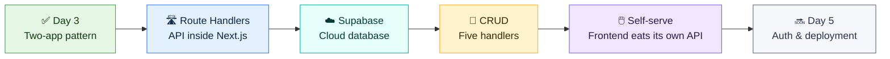
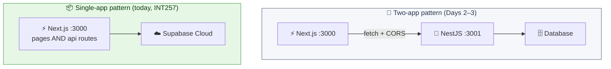
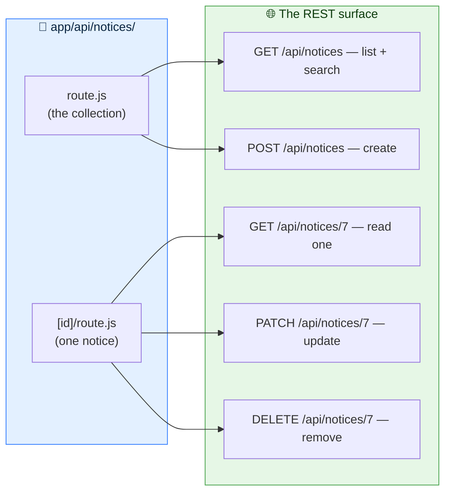
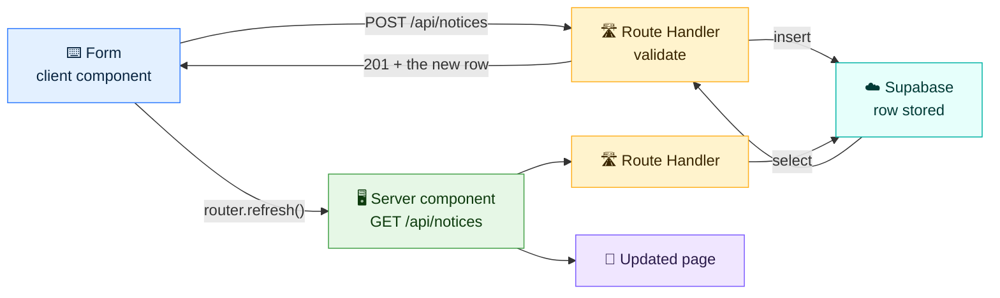
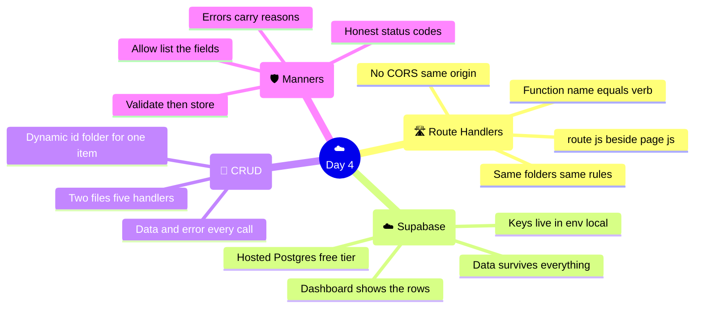

# ☁️ Day 4 — API Development & CRUD: Route Handlers + Supabase Cloud

### CodeLucky Faculty Development Programme · Full Stack Web Development

> **📍 Where this day fits:** Days 2–3 built the Notice Board as **two applications** — a Next.js frontend and a separate NestJS API. That's one honest industry pattern. Today teaches the other one, the pattern at the heart of **INT257**: the API lives *inside* the Next.js app itself (**Route Handlers**), and the data lives in a **cloud database (Supabase)** — nothing to install, visible in a browser dashboard. By evening, the Notice Board is a single deployable app with real cloud persistence.

## 🎓 Syllabus Alignment (for the classroom)

Today's material maps directly onto the university curriculum being taught:

| Today's Part | INT257 (Modern Web App Dev) | INT252 (React) |
|---|---|---|
| 1 · Route Handlers | **Unit III** — Route Handlers, REST APIs, HTTP Methods | — |
| 2 · Supabase Cloud | **Unit IV** — Database Connectivity, Environment Variables | — |
| 3 · CRUD handlers | **Unit III** — Dynamic Route Handlers, Request & Response Handling · **Unit IV** — CRUD Operations, Data Validation | — |
| 4 · Consuming the API | **Unit II** — Server/Client data fetching | **Unit V** — Fetch API, loading & error states |
| 5 · Validation & manners | **Unit IV** — Data Validation | **Unit IV** — Validation concepts |

*Course outcomes touched: INT257 CO3 ("full-stack features using APIs"), CO4 (database operations); INT252 CO5 (API-based data fetching).*

---

## 🗺️ Today's Journey



### ⏱️ Suggested 6-Hour Flow

| Part | Topic | Time |
|---|---|---|
| 1 | 🛣️ Route Handlers — an API inside Next.js | 60 min |
| 2 | ☁️ Supabase Cloud — a database in the browser | 60 min |
| 3 | 🔁 CRUD — building the five handlers | 90 min |
| 4 | 🖱️ The frontend consumes its own API | 75 min |
| 5 | 🛡️ Validation & good API manners | 45 min |
| — | 🧭 Recap & wrap-up | 30 min |

> 🧠 **Needed today:** the Day 2 Next.js app (`my-next-app`) and a free account at **supabase.com** (sign-up with GitHub or email takes a minute — done live in Part 2). The NestJS app can rest today; its concepts (REST verbs, DTO thinking, honest status codes) all reappear in their Next.js clothes.

---

# 🛣️ PART 1 — Route Handlers: An API Inside Next.js

## 🤔 Two Ways to Own an API

Days 2–3 used the **two-app pattern**: frontend on :3000, backend on :3001, CORS as the handshake. Next.js offers a second pattern — **the API lives inside the same app**, as files in the `app/` folder:



| | Two apps (NestJS) | One app (Route Handlers) |
|---|---|---|
| Deploys as | Two services | One service |
| CORS | Required | **Not needed** — same origin |
| Best for | Large teams, many clients, heavy backends | Full-stack products, fast iteration |
| Teaches | INT257's reference book pattern | **INT257 Unit III itself** |

> 📢 **Key fact:** neither pattern is "the right one" — Netflix runs separate backends; thousands of startups ship single Next.js apps. Knowing both, and *why* each exists, is exactly the judgement the syllabus builds toward.

## 🛣️ The Rule: `route.js` Is to APIs What `page.js` Is to Pages

Day 2's routing rule gets a sibling:

```
app/about/page.js           →  a PAGE at   /about        (returns HTML)
app/api/notices/route.js    →  an API at   /api/notices  (returns JSON)
```

Same file-based routing, same folders-are-URLs logic — one convention to learn, two kinds of output.

## ✋ Hands-On: The First Handler

Create `app/api/hello/route.js`:

```js
import { NextResponse } from "next/server";

export async function GET() {
  return NextResponse.json({
    message: "Hello from my own API! 👋",
    time: new Date().toISOString(),
  });
}
```

Visit **http://localhost:3000/api/hello** — JSON appears. No new server, no new port, no CORS: the app just grew an API.

**Reading the anatomy:**

| Piece | Meaning |
|---|---|
| `export async function GET()` | The function *name* is the HTTP verb it answers — `GET`, `POST`, `PATCH`, `DELETE` all work |
| `NextResponse.json(...)` | Builds a proper JSON response (headers included) |
| The file location | `app/api/hello/route.js` → the URL `/api/hello` |

> 🔑 **One folder cannot hold both** a `page.js` and a `route.js` — a URL either shows a page or serves data. Keeping all handlers under `app/api/` is the convention that keeps the two worlds tidy.

---

# ☁️ PART 2 — Supabase: A Database in the Browser

## 🤔 What Is Supabase?

**Supabase is a cloud service that hosts a real PostgreSQL database** — plus a friendly web dashboard to create tables, browse rows, and manage keys. The free tier is generous and perfect for teaching.

> 💡 **Analogy:** running a database yourself is owning a water well 🕳️ — powerful, but there's digging and maintenance. Supabase is city water supply 🚰 — turn the tap (an API key), and it flows. The water is the same: genuine PostgreSQL.

**Why it fits the classroom:** zero installation, visible data (students *see* rows appear in the dashboard), works identically on every laptop, and survives everything — it's in the cloud.

## ✋ Hands-On: Project + Table (10 minutes, once)

**1) Create the project** — at **supabase.com** → *New project*:

- Name: `noticeboard`
- Database password: choose one and note it (rarely needed again)
- Region: `Mumbai (ap-south-1)` — closest to Punjab, lowest latency

**2) Create the table** — left sidebar → *Table Editor* → *New table*:

- Name: `notices`
- ⚠️ **Untick "Enable Row Level Security (RLS)"** for today — RLS is Supabase's per-row permission system, brilliant *with* auth, friction *before* it. It returns when logins do (Day 5).
- Columns:

| Column | Type | Extras |
|---|---|---|
| `id` | `int8` | *(already there — identity, auto-increments)* |
| `created_at` | `timestamptz` | *(already there — defaults to now)* |
| `title` | `text` | — |
| `tag` | `text` | — |

**3) Seed a row or two** — still in Table Editor → *Insert row*: add a first notice by hand and watch it sit in the grid. A database with a visible face.

**4) Collect the keys** — *Project Settings → API*:

- **Project URL** — `https://abcdefgh.supabase.co`
- **anon public key** — a long `eyJ...` string

## 🔐 Wiring the App

Keys belong in environment variables (Day 3's habit). In `my-next-app/.env.local`:

```bash
NEXT_PUBLIC_SUPABASE_URL=https://abcdefgh.supabase.co
NEXT_PUBLIC_SUPABASE_ANON_KEY=eyJhbGciOiJIUzI1NiIs...
```

*(Restart `npm run dev` — env files load at startup.)*

Install the client library and create one shared helper — `lib/supabase.js` in the project root:

```bash
npm install @supabase/supabase-js
```

```js
// lib/supabase.js
import { createClient } from "@supabase/supabase-js";

export const supabase = createClient(
  process.env.NEXT_PUBLIC_SUPABASE_URL,
  process.env.NEXT_PUBLIC_SUPABASE_ANON_KEY,
);
```

> 🔑 **About that "anon" key:** it's designed to be public-facing (it's what browsers use), and with RLS off, anyone holding it can touch the table — acceptable for a workshop database holding practice notices, not for production. The production story — RLS policies + auth — is exactly where Day 5 picks up. Honest security, one layer at a time.

---

<div align="center">

### ✅ Setup Checkpoint

`route.js` = API sibling of `page.js` · Supabase = hosted Postgres with a dashboard · keys in `.env.local` · one shared client in `lib/supabase.js`

</div>

---

# 🔁 PART 3 — CRUD: Building the Five Handlers

The Notice Board API needs five operations, spread across **two files** — the collection and the single item:



*(The REST grammar from Day 3 — verbs change meaning, URLs name things — transfers wholesale. Only the house style is new.)*

## 📋 The Collection — `app/api/notices/route.js`

```js
import { NextResponse } from "next/server";
import { supabase } from "@/lib/supabase";

// GET /api/notices          → all notices, newest first
// GET /api/notices?search=exam  → filtered
export async function GET(request) {
  const { searchParams } = new URL(request.url);
  const search = searchParams.get("search");

  let query = supabase
    .from("notices")
    .select("*")
    .order("id", { ascending: false });

  if (search) {
    query = query.ilike("title", `%${search}%`);   // case-insensitive contains
  }

  const { data, error } = await query;

  if (error) {
    return NextResponse.json({ error: error.message }, { status: 500 });
  }
  return NextResponse.json(data);
}

// POST /api/notices         → create a notice
export async function POST(request) {
  const body = await request.json();

  // validation — the backend's checks are still the law (Day 3's rule)
  if (!body.title || body.title.trim() === "") {
    return NextResponse.json({ error: "Title is required" }, { status: 400 });
  }
  if (!["Exams", "Events", "Campus"].includes(body.tag)) {
    return NextResponse.json(
      { error: "Tag must be Exams, Events or Campus" },
      { status: 400 },
    );
  }

  const { data, error } = await supabase
    .from("notices")
    .insert({ title: body.title.trim(), tag: body.tag })
    .select()          // ask for the created row back…
    .single();         // …as an object, not an array

  if (error) {
    return NextResponse.json({ error: error.message }, { status: 500 });
  }
  return NextResponse.json(data, { status: 201 });   // 201 = Created
}
```

**The Supabase query style, decoded once:**

| Call | SQL it becomes |
|---|---|
| `.from("notices").select("*")` | `SELECT * FROM notices` |
| `.order("id", { ascending: false })` | `ORDER BY id DESC` |
| `.ilike("title", "%exam%")` | `WHERE title ILIKE '%exam%'` |
| `.insert({...}).select().single()` | `INSERT … RETURNING *` (one row) |
| `.eq("id", 7)` | `WHERE id = 7` |

Every call returns `{ data, error }` — check `error`, use `data`. One pattern, all operations.

> 🎯 **Notice what stayed from Day 3:** validation before storage, `400` for bad input, `500` for server trouble, `201` for creation. Status codes are the API's honesty policy, in any framework.

## 🎫 The Single Item — `app/api/notices/[id]/route.js`

Day 2's `[brackets]` folders work for APIs too — **Dynamic Route Handlers**, straight from INT257 Unit III:

```js
import { NextResponse } from "next/server";
import { supabase } from "@/lib/supabase";

// GET /api/notices/7
export async function GET(request, { params }) {
  const { id } = await params;

  const { data, error } = await supabase
    .from("notices")
    .select("*")
    .eq("id", id)
    .single();

  if (error || !data) {
    return NextResponse.json(
      { error: `Notice ${id} not found` },
      { status: 404 },
    );
  }
  return NextResponse.json(data);
}

// PATCH /api/notices/7
export async function PATCH(request, { params }) {
  const { id } = await params;
  const body = await request.json();

  const { data, error } = await supabase
    .from("notices")
    .update({ title: body.title, tag: body.tag })
    .eq("id", id)
    .select()
    .single();

  if (error || !data) {
    return NextResponse.json(
      { error: `Notice ${id} not found` },
      { status: 404 },
    );
  }
  return NextResponse.json(data);
}

// DELETE /api/notices/7
export async function DELETE(request, { params }) {
  const { id } = await params;

  const { error } = await supabase.from("notices").delete().eq("id", id);

  if (error) {
    return NextResponse.json({ error: error.message }, { status: 500 });
  }
  return NextResponse.json({ deleted: true, id: Number(id) });
}
```

*(The `await params` habit from Day 2's dynamic pages applies identically here — one convention, both worlds.)*

## 🧪 Test the Whole Surface

With `npm run dev` running — browser for GETs, `curl` (or Postman) for the rest:

```bash
# LIST + SEARCH (also try these two in the browser)
curl "http://localhost:3000/api/notices"
curl "http://localhost:3000/api/notices?search=exam"

# CREATE
curl -X POST http://localhost:3000/api/notices \
  -H "Content-Type: application/json" \
  -d '{"title": "FDP Day 4 — APIs in the cloud", "tag": "Events"}'

# READ ONE / UPDATE / DELETE
curl http://localhost:3000/api/notices/1
curl -X PATCH http://localhost:3000/api/notices/1 \
  -H "Content-Type: application/json" \
  -d '{"title": "Exam schedule POSTPONED", "tag": "Exams"}'
curl -X DELETE http://localhost:3000/api/notices/2

# VALIDATION — the guard rail answers
curl -X POST http://localhost:3000/api/notices \
  -H "Content-Type: application/json" -d '{"banana": 42}'
# → { "error": "Title is required" }   with status 400
```

**Now the classroom magic:** keep the **Supabase Table Editor open on the projector** while running these. Every `POST` makes a row *appear* in the cloud dashboard; every `DELETE` removes one. The abstract idea "the API writes to a database" becomes something the whole room watches happen. ☁️✨

> 💾 **And the persistence test needs no ceremony today:** the data isn't even on the laptop. Restart the dev server, restart the machine — the notices live in Mumbai, unbothered.

---

<div align="center">

### ✅ CRUD Checkpoint

Two files, five handlers · function name = HTTP verb · `{ data, error }` on every Supabase call · 201/400/404/500 tell the truth · rows visible live in the dashboard

</div>

---

# 🖱️ PART 4 — The Frontend Consumes Its Own API

The API is complete; time for the pages to switch over to it. The pleasant surprise of the single-app pattern: **the fetch URLs get shorter.**

## 📋 The List Page — Server-Side Fetch

`app/notices/page.js` — the data source changes, the JSX barely moves:

```jsx
import AddNoticeForm from "../components/AddNoticeForm";
import DeleteButton from "../components/DeleteButton";

export default async function NoticesPage() {
  // a server component needs the full address (it runs before the browser exists)
  const res = await fetch("http://localhost:3000/api/notices", {
    cache: "no-store",       // always fresh
  });
  const notices = await res.json();

  return (
    <main className="max-w-2xl mx-auto p-8">
      <h1 className="text-3xl font-bold text-blue-950 mb-6">📋 Notices</h1>

      <AddNoticeForm />

      <div className="flex flex-col gap-4">
        {notices.map((n) => (
          <div
            key={n.id}
            className="p-4 bg-white border rounded-lg flex justify-between items-start"
          >
            <div>
              <span className="text-xs font-semibold text-teal-600 uppercase">
                {n.tag}
              </span>
              <h2 className="text-lg font-semibold text-gray-800">{n.title}</h2>
            </div>
            <DeleteButton id={n.id} />
          </div>
        ))}
      </div>
    </main>
  );
}
```

> 💡 **A worthwhile aside for the curious:** a server component *could* skip its own API and call `supabase.from("notices")` directly — that's a legitimate pattern too. The API earns its keep the moment anything else needs the data: a mobile app, a second website, a colleague's `curl`. Building it now (as INT257 does) means the door is already open.

## ➕ The Form & the Delete Button — Relative URLs, No CORS

Client components get the biggest quality-of-life win. In `AddNoticeForm.js`, the fetch becomes:

```jsx
const res = await fetch("/api/notices", {          // relative — same origin!
  method: "POST",
  headers: { "Content-Type": "application/json" },
  body: JSON.stringify({ title, tag }),
});

if (!res.ok) {
  const problem = await res.json();
  setError(problem.error);          // the handler's message, shown to the user
  return;
}

setTitle("");
router.refresh();                    // re-run the server component → fresh list
```

And in `DeleteButton.js`:

```jsx
await fetch(`/api/notices/${id}`, { method: "DELETE" });
router.refresh();
```

**What quietly disappeared versus Day 3:** the `http://localhost:3001` prefix, the `enableCors()` requirement, the second terminal window. Same origin means the browser has nothing to object to.



> 🎯 **Day 3's full-stack loop, cloud edition:** client island mutates → handler validates → Supabase stores → server component re-reads → screen updates. The loop is the constant; the plumbing beneath it is what today upgraded.

## 🔍 The Search Box — One Line Changes

Day 3's `SearchBox` component needs only its URL trimmed:

```jsx
const res = await fetch(`/api/notices?search=${query}`);
const notices = await res.json();
setResults(notices);
```

*(The `useEffect` + dependency-array machinery is untouched — and since the handler returns a plain array, `setResults(notices)` uses it directly.)*

**Full loop test:** type in the search box → filtered results from the cloud. Publish → appears on the page *and* in the Supabase dashboard. Delete → gone from both. One app, one origin, real cloud data.

---

<div align="center">

### ✅ Integration Checkpoint

Client fetches use relative URLs · no CORS in the single-app pattern · `router.refresh()` still closes the loop · search rides the same handler

</div>

---

# 🛡️ PART 5 — Validation & Good API Manners

A short, sharpening part: the habits that separate a working API from a *good* one — INT257 Unit IV's "Data Validation" and Unit III's "Request and Response Handling", collected as rules.

## 📏 The Manners Checklist

**1) Validate before storing — always.** The handler already refuses empty titles and unknown tags. The pattern to internalise:

```js
// the shape of every write handler:
const body = await request.json();     // 1. read
// 2. validate  → early return with 400 + a clear message
// 3. store     → Supabase call
// 4. respond   → 201 with the created thing, or 500 with the error
```

**2) Status codes are the contract.** The frontend's `if (!res.ok)` logic works *because* the API is honest:

| Code | Means | Today's examples |
|---|---|---|
| `200` | Here's what was asked for | GET list, PATCH result |
| `201` | Created it | POST success |
| `400` | The request was faulty | Empty title, bad tag |
| `404` | No such thing | `/api/notices/999` |
| `500` | The server/database hiccuped | Supabase error surfaced |

**3) Error replies carry a reason.** `{ "error": "Title is required" }` lets the form show a human message. A bare status code makes users guess; a reason makes interfaces helpful.

**4) Trim and normalise input.** `body.title.trim()` before storing — tiny habit, prevents a database of `"  Exam  "` lookalikes.

**5) Never trust the client's list of fields.** The handler inserts *named* fields only (`{ title, tag }`) — a request smuggling `{"role": "admin"}` changes nothing, because nothing reads it. Allow-listing beats block-listing.

> 🧪 **Zod, previewed:** INT252 Unit IV teaches schema-based validation with **Zod** — declaring the shape once (`z.object({ title: z.string().min(1) })`) and letting the library produce the checks and messages. The hand-rolled `if`s above are the concept; Zod is the industrial tooling. A natural bridge for the classroom, and a clean self-study step after today.

---

# 🧭 Day 4 — The Complete Picture



## 📌 The Big Takeaways

1. 🛣️ **`route.js` is `page.js` for JSON** — file-based routing gained a second output type, and the app grew an API without a second server.
2. ☁️ **Supabase made the database visible** — real PostgreSQL, browser dashboard, zero installation, and rows the whole classroom watches appear.
3. 🔁 **CRUD is two files** — the collection and the `[id]` item, five exported verb-functions between them.
4. 🚫 **No CORS, shorter URLs** — the single-app pattern's everyday reward.
5. 🛡️ **Manners make the API** — validate first, answer honestly, explain failures, allow-list fields.
6. 🧭 **Two patterns, one judgement** — separate backend (Days 2–3) vs Route Handlers (today): the skill is knowing when each fits.

## ➡️ What Comes Next in the Workshop

- 🔐 **Day 5 — Identity & going live:** Supabase Auth brings logins and protected actions (and RLS switches on, as promised), then the app deploys to a public URL
- 🏁 **Day 6 — Production polish:** performance, image optimisation and metadata (INT257 Unit V), security review, and project demonstrations

> 🎓 **The stack just got production-shaped:** one Next.js app, one cloud database — the exact architecture thousands of real products ship with, and the one INT257 walks students through. Faculty teaching it have now built it.

---

## 📚 Quick Reference Card

```js
// ── ROUTE HANDLER SKELETON ─────────────────
// app/api/notices/route.js  →  /api/notices
import { NextResponse } from "next/server";
import { supabase } from "@/lib/supabase";

export async function GET(request) {
  const { searchParams } = new URL(request.url);   // ?search=…
  const { data, error } = await supabase.from("notices").select("*");
  if (error) return NextResponse.json({ error: error.message }, { status: 500 });
  return NextResponse.json(data);
}

export async function POST(request) {
  const body = await request.json();
  if (!body.title) return NextResponse.json({ error: "Title is required" }, { status: 400 });
  const { data } = await supabase.from("notices")
    .insert({ title: body.title }).select().single();
  return NextResponse.json(data, { status: 201 });
}

// ── DYNAMIC HANDLER ────────────────────────
// app/api/notices/[id]/route.js  →  /api/notices/7
export async function DELETE(request, { params }) {
  const { id } = await params;
  await supabase.from("notices").delete().eq("id", id);
  return NextResponse.json({ deleted: true });
}
```

```js
// ── SUPABASE PHRASEBOOK ────────────────────
supabase.from("notices").select("*")                    // read all
  .order("id", { ascending: false })                    // newest first
  .ilike("title", `%${q}%`)                             // search
supabase.from("notices").insert({...}).select().single() // create
supabase.from("notices").update({...}).eq("id", id)     // update
supabase.from("notices").delete().eq("id", id)          // remove
// every call → { data, error }

// ── CLIENT SETUP (lib/supabase.js) ─────────
export const supabase = createClient(
  process.env.NEXT_PUBLIC_SUPABASE_URL,
  process.env.NEXT_PUBLIC_SUPABASE_ANON_KEY,
);
```

```jsx
// ── FRONTEND, SAME-ORIGIN EDITION ──────────
await fetch("/api/notices", { method: "POST", ... })   // relative URL, no CORS
await fetch(`/api/notices/${id}`, { method: "DELETE" })
router.refresh();                                      // refresh server components
```

### 🖥️ Essential Setup (once)

```bash
npm install @supabase/supabase-js

# .env.local
NEXT_PUBLIC_SUPABASE_URL=https://YOUR-PROJECT.supabase.co
NEXT_PUBLIC_SUPABASE_ANON_KEY=eyJ...
```

---

<div align="center">

## 🎉 End of Day 4

**One app, five handlers, and a database in the cloud — the Notice Board went full stack the Next.js way.**

*Day 5 adds identity, and then the internet.*

---

🌐 **codelucky.com** · A CodeLucky Faculty Development Programme

</div>
