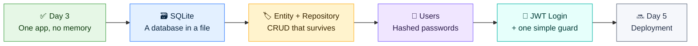
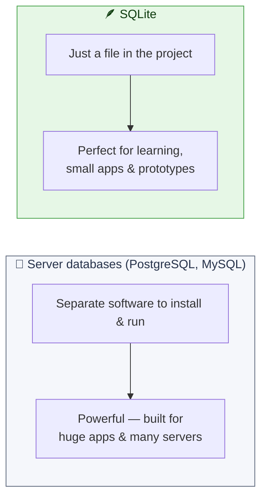
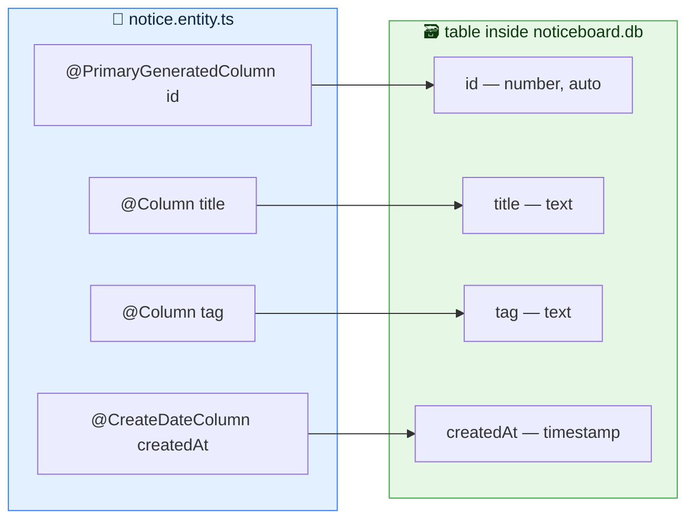
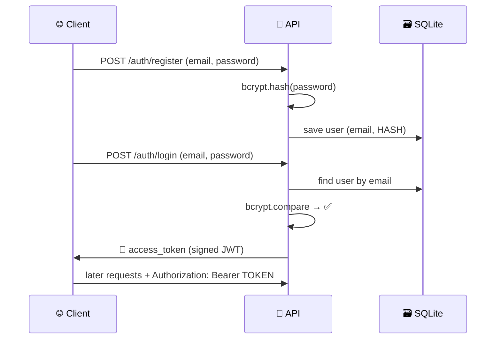
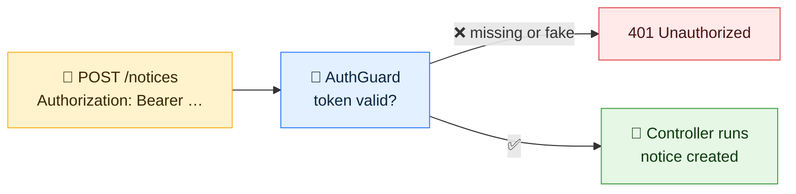
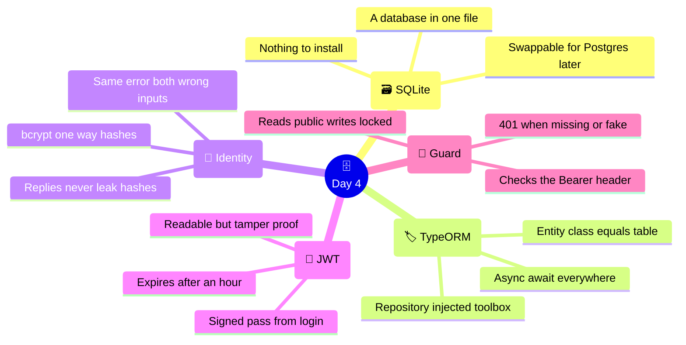

# 🗄️ Day 4 — Persistence & Identity: A Database and a Lock on the Door

### CodeLucky Faculty Development Programme · Full Stack Web Development

> **📍 Where this day fits:** Day 3 ended with one working full stack app — and two confessions. Every restart of the API **wipes the notices** (they live in a JavaScript array), and **anyone on the network can post or delete** (there are no users at all). Day 4 fixes both, gently: a **SQLite database** — a single file, nothing to install — gives the Notice Board a memory, and a **simple JWT login** decides who may write to it.

---

## 🗺️ Today's Journey



### ⏱️ Suggested 6-Hour Flow

| Part | Topic | Time |
|---|---|---|
| 1 | 🗃️ SQLite — a real database with zero setup | 45 min |
| 2 | 🏷️ Entities & repositories — CRUD that survives restarts | 75 min |
| 3 | 👤 Users & password hashing | 60 min |
| 4 | 🎫 JWT — logging in, receiving the token | 60 min |
| 5 | 🛂 One guard + the frontend login | 60 min |
| — | 🧭 Recap & wrap-up | 30 min |

> 🧠 **Running from Day 3:** `my-next-app` on **:3000** and `my-api` on **:3001**. Nothing new to install on the machine today — the database arrives through `npm` like any other package.

---

# 🗃️ PART 1 — SQLite: A Real Database with Zero Setup

## 🤔 Why the Array Must Go

Day 3's data lives here:

```ts
private notices = [ ... ];   // ← RAM. Gone on every restart.
```

A database fixes what an in-memory array never can:

- 💾 **Survival** — data lives on disk, through restarts and crashes
- 🔍 **Real querying** — search, sort and count efficiently at any size
- 🔗 **Structure** — tables with defined columns, ids that manage themselves

## 🪶 Why SQLite

**SQLite is a complete database engine that stores everything in one ordinary file.** No server to install, no service to run, no password to configure — the database is simply `noticeboard.db` sitting in the project folder.



> 💡 **Analogy:** a server database is a bank vault 🏦 — powerful, but there's paperwork before the first rupee goes in. SQLite is a quality notebook 📓 — open it and start writing, and it's surprisingly hard to lose.

> 📢 **Key fact:** SQLite is *not* a toy — it ships inside every Android and iPhone, most browsers, and countless apps. It's likely the most deployed database on Earth. And because the app will talk to it through an ORM (next part), **swapping to PostgreSQL later is a configuration change, not a rewrite** — the code stays the same.

## 🌉 The ORM — One Translator for Any Database

Databases speak **SQL** (`SELECT * FROM notice ...`); the app speaks TypeScript. An **ORM (Object-Relational Mapper)** translates between them. NestJS's first-class partner is **TypeORM** — and it treats SQLite, PostgreSQL and MySQL identically.

Install the day's toolkit (in `my-api`):

```bash
npm install @nestjs/typeorm typeorm better-sqlite3
```

## 🔌 Connecting — Four Lines of Config

In `src/app.module.ts`:

```ts
import { Module } from '@nestjs/common';
import { TypeOrmModule } from '@nestjs/typeorm';
import { NoticesModule } from './notices/notices.module';

@Module({
  imports: [
    TypeOrmModule.forRoot({
      type: 'better-sqlite3',
      database: 'noticeboard.db',   // ← the entire database, one file
      autoLoadEntities: true,       // find every entity automatically
      synchronize: true,            // auto-create tables from entities (dev only)
    }),
    NoticesModule,
  ],
})
export class AppModule {}
```

That's the whole connection. No host, no port, no credentials — the file appears in the project folder on first run.

> ⚠️ **Two honest footnotes:** `synchronize: true` reshapes tables to match the code — a superpower in development, replaced by *migrations* in production. And `noticeboard.db` belongs in `.gitignore` — data doesn't go into Git, code does.

---

# 🏷️ PART 2 — Entities & Repositories: CRUD That Survives

## 🏷️ The Entity — A Table Described as a Class

An **entity** is a class whose decorators describe a database table. The decorator story of Days 2–3 (`@Controller`, `@Get`, `@IsString`…) extends naturally to data. Create `src/notices/notice.entity.ts`:

```ts
import { Entity, PrimaryGeneratedColumn, Column, CreateDateColumn } from 'typeorm';

@Entity()
export class Notice {
  @PrimaryGeneratedColumn()      // auto-incrementing id — no more Date.now()!
  id: number;

  @Column()
  title: string;

  @Column()
  tag: string;

  @CreateDateColumn()            // timestamp, filled in automatically
  createdAt: Date;
}
```



Register it in `src/notices/notices.module.ts`:

```ts
import { Module } from '@nestjs/common';
import { TypeOrmModule } from '@nestjs/typeorm';
import { NoticesController } from './notices.controller';
import { NoticesService } from './notices.service';
import { Notice } from './notice.entity';

@Module({
  imports: [TypeOrmModule.forFeature([Notice])],   // ← unlocks the repository
  controllers: [NoticesController],
  providers: [NoticesService],
})
export class NoticesModule {}
```

Save — the dev server restarts, and **`noticeboard.db` appears in the project folder**, table included. A class was written; a database materialised.

## 🧰 The Repository — The Entity's Toolbox

For every registered entity, TypeORM provides a **repository** — an object with ready-made database methods (`find`, `save`, `delete`…). It arrives the Day 3 way: **dependency injection**.

The rewrite of `src/notices/notices.service.ts`, in full:

```ts
import { Injectable, NotFoundException } from '@nestjs/common';
import { InjectRepository } from '@nestjs/typeorm';
import { Repository, Like } from 'typeorm';
import { Notice } from './notice.entity';
import { CreateNoticeDto } from './dto/create-notice.dto';

@Injectable()
export class NoticesService {
  constructor(
    @InjectRepository(Notice)
    private repo: Repository<Notice>,     // the toolbox, injected
  ) {}

  async findAll(search?: string, page = 1) {
    const limit = 5;

    const [data, total] = await this.repo.findAndCount({
      where: search ? { title: Like(`%${search}%`) } : {},
      order: { id: 'DESC' },              // newest first
      take: limit,                        // page size
      skip: (page - 1) * limit,           // offset
    });

    return { total, page, pages: Math.ceil(total / limit), data };
  }

  async findOne(id: number) {
    const notice = await this.repo.findOneBy({ id });
    if (!notice) throw new NotFoundException(`Notice ${id} not found`);
    return notice;
  }

  async create(data: CreateNoticeDto) {
    const notice = this.repo.create(data);   // build the object…
    return this.repo.save(notice);           // …then INSERT it
  }

  async update(id: number, data: Partial<CreateNoticeDto>) {
    const notice = await this.findOne(id);   // 404s if missing
    Object.assign(notice, data);
    return this.repo.save(notice);           // UPDATE
  }

  async remove(id: number) {
    await this.findOne(id);                  // 404s if missing
    await this.repo.delete(id);
    return { deleted: true, id };
  }
}
```

## ⏳ Day 1's Sleeper Cell Activates: `async` / `await`

Day 1 introduced `async/await` with a promise: *"just recognise the shape — it returns in the backend sessions."* **This is the return.** A database call leaves the program, touches the disk, and comes back — it *takes time* — so every method is now `async` and every repository call gets an `await`.

| Old (array) | New (database) |
|---|---|
| `this.notices.find(...)` — instant | `await this.repo.findOneBy(...)` — a real trip to storage |
| `findAll() {` | `async findAll() {` |
| Search: `.filter()` + `.includes()` | `Like('%term%')` — the database searches for us |
| Pagination: `.slice()` | `take` + `skip` — only the needed rows are read |

> 🔑 **The controller doesn't change at all.** NestJS awaits returned promises automatically — the routes, decorators and DTO validation from Day 3 keep working untouched. That's the reward for the thin-controller / smart-service split: the storage engine was swapped *under* the API without the API noticing.

## 🧪 The Moment of Truth

1. Open **localhost:3000/notices** → the list is *empty* (the array's seed data is gone — the table is fresh).
2. Publish two notices through the form.
3. **Kill the API** (Ctrl+C) and restart: `npm run start:dev`.
4. Refresh the page…

**The notices are still there.** 🎉 For the first time in the workshop, the application has a memory. Restart the laptop — the data waits in `noticeboard.db`.

---

<div align="center">

### ✅ Persistence Checkpoint

SQLite = a database in one file · `@Entity()` class *is* the table · repository = injected toolbox · every DB call is `await`-ed · **data survives restarts**

</div>

---

# 👤 PART 3 — Users & Password Hashing

Identity starts with a place to keep people. Generate the feature the usual way:

```bash
nest generate module users
nest generate service users
```

## 🧑‍🤝‍🧑 The User Entity

Create `src/users/user.entity.ts` — the same pattern as `Notice`:

```ts
import { Entity, PrimaryGeneratedColumn, Column } from 'typeorm';

@Entity()
export class User {
  @PrimaryGeneratedColumn()
  id: number;

  @Column({ unique: true })      // no two accounts share an email
  email: string;

  @Column()
  password: string;              // will hold a HASH — never the real password
}
```

## 🚫 Rule Zero: Never Store Real Passwords

If a database ever leaks (it happens to giants), plaintext passwords become instant account takeovers — here *and* on every site where people reuse them. The answer is **hashing**: a one-way scramble.

```
"lpu@2025"  →  bcrypt  →  "$2b$10$X9f...52 more characters"
```

- ➡️ Same input → same hash (so logins can be checked)
- ⛔ Hash → input cannot be reversed (so leaks reveal nothing)
- 🧂 bcrypt adds a random *salt* per user — two people with the same password get **different** hashes

```bash
npm install bcrypt
```

## ✋ The Users Service

`src/users/users.service.ts`:

```ts
import { Injectable, BadRequestException } from '@nestjs/common';
import { InjectRepository } from '@nestjs/typeorm';
import { Repository } from 'typeorm';
import * as bcrypt from 'bcrypt';
import { User } from './user.entity';

@Injectable()
export class UsersService {
  constructor(
    @InjectRepository(User)
    private repo: Repository<User>,
  ) {}

  async create(email: string, password: string) {
    const exists = await this.repo.findOneBy({ email });
    if (exists) throw new BadRequestException('Email already registered');

    const hash = await bcrypt.hash(password, 10);
    const user = await this.repo.save(this.repo.create({ email, password: hash }));

    return { id: user.id, email: user.email };   // never return the hash
  }

  findByEmail(email: string) {
    return this.repo.findOneBy({ email });
  }
}
```

And `src/users/users.module.ts` registers + **exports** the service (the auth part will need it):

```ts
import { Module } from '@nestjs/common';
import { TypeOrmModule } from '@nestjs/typeorm';
import { UsersService } from './users.service';
import { User } from './user.entity';

@Module({
  imports: [TypeOrmModule.forFeature([User])],
  providers: [UsersService],
  exports: [UsersService],        // ← visible to other modules
})
export class UsersModule {}
```

> 🔑 **Two habits worth naming:** the reply contains only `id` and `email` — password material never travels back out, even scrambled. And the duplicate-email check throws Day 3's `BadRequestException` — the error vocabulary keeps paying rent.

---

<div align="center">

### ✅ Users Checkpoint

`User` entity with unique email · bcrypt hashes with per-user salt · replies never contain the hash · service exported for auth to use

</div>

---

# 🎫 PART 4 — JWT: Logging In

Day 3 previewed the wristband 🎟️; today it gets printed. A **JWT (JSON Web Token)** is a signed pass the API issues at login. Every later request carries it; the API verifies the signature instead of re-checking passwords.

```bash
npm install @nestjs/jwt
nest generate module auth
nest generate service auth
nest generate controller auth
```

## 🔏 The Auth Module — Signing Power

`src/auth/auth.module.ts`:

```ts
import { Module } from '@nestjs/common';
import { JwtModule } from '@nestjs/jwt';
import { AuthService } from './auth.service';
import { AuthController } from './auth.controller';
import { UsersModule } from '../users/users.module';

@Module({
  imports: [
    UsersModule,                              // borrow UsersService
    JwtModule.register({
      global: true,                           // JwtService available app-wide
      secret: 'fdp-dev-secret-change-me',     // signs every token (see note)
      signOptions: { expiresIn: '1h' },       // tokens self-destruct
    }),
  ],
  providers: [AuthService],
  controllers: [AuthController],
})
export class AuthModule {}
```

*(Add `AuthModule` and `UsersModule` to the `imports` array in `app.module.ts`.)*

> 🔑 **The secret is the whole ballgame.** The token's signature is computed with it — anyone holding the secret could forge passes. A hard-coded string is fine for the workshop; in a real deployment it moves to an environment variable (`.env`), exactly like Day 3's API URL.

## 🧠 The Auth Service — Register & Login

`src/auth/auth.service.ts`:

```ts
import { Injectable, UnauthorizedException } from '@nestjs/common';
import { JwtService } from '@nestjs/jwt';
import * as bcrypt from 'bcrypt';
import { UsersService } from '../users/users.service';

@Injectable()
export class AuthService {
  constructor(
    private usersService: UsersService,
    private jwtService: JwtService,
  ) {}

  register(email: string, password: string) {
    return this.usersService.create(email, password);
  }

  async login(email: string, password: string) {
    const user = await this.usersService.findByEmail(email);
    if (!user) throw new UnauthorizedException('Invalid credentials');

    const ok = await bcrypt.compare(password, user.password);
    if (!ok) throw new UnauthorizedException('Invalid credentials');

    const payload = { sub: user.id, email: user.email };
    return {
      access_token: await this.jwtService.signAsync(payload),
    };
  }
}
```

**Details that matter:**

- 🔍 `bcrypt.compare` hashes the attempt and compares hashes — the real password is never reconstructed.
- 🤫 Wrong email and wrong password return the **same** message. Saying "email not found" would let attackers fish for valid accounts.
- 🎒 The `payload` is what the token *carries* — the user's id (`sub` = subject, the JWT convention) and email.

## 🚪 The Auth Controller

A DTO first — Day 3's law (validate everything) covers auth too. `src/auth/dto/auth.dto.ts`:

```ts
import { IsEmail, IsString, MinLength } from 'class-validator';

export class AuthDto {
  @IsEmail()
  email: string;

  @IsString()
  @MinLength(6)
  password: string;
}
```

Then `src/auth/auth.controller.ts`:

```ts
import { Controller, Post, Body } from '@nestjs/common';
import { AuthService } from './auth.service';
import { AuthDto } from './dto/auth.dto';

@Controller('auth')
export class AuthController {
  constructor(private authService: AuthService) {}

  @Post('register')                      // POST /auth/register
  register(@Body() dto: AuthDto) {
    return this.authService.register(dto.email, dto.password);
  }

  @Post('login')                         // POST /auth/login
  login(@Body() dto: AuthDto) {
    return this.authService.login(dto.email, dto.password);
  }
}
```

## 🧪 Test the Whole Identity Flow

```bash
# 1) Register
curl -X POST http://localhost:3001/auth/register \
  -H "Content-Type: application/json" \
  -d '{"email": "prof.rao@lpu.in", "password": "lpu@2025"}'
# → { "id": 1, "email": "prof.rao@lpu.in" }        (no hash!)

# 2) Login
curl -X POST http://localhost:3001/auth/login \
  -H "Content-Type: application/json" \
  -d '{"email": "prof.rao@lpu.in", "password": "lpu@2025"}'
# → { "access_token": "eyJhbGciOiJIUzI1NiIs..." }

# 3) Wrong password → the guard-rail
curl -X POST http://localhost:3001/auth/login \
  -H "Content-Type: application/json" \
  -d '{"email": "prof.rao@lpu.in", "password": "wrong"}'
# → { "statusCode": 401, "message": "Invalid credentials", ... }
```

> 🔬 **Look inside the token** (it's readable — signed, not encrypted): paste it at **jwt.io** to see the payload — `sub`, `email`, plus issued/expiry timestamps. The signature at the end is what makes tampering detectable: change one character of the payload and verification fails.



---

<div align="center">

### ✅ JWT Checkpoint

Register hashes, login compares · same error for both wrong inputs · token carries the identity, expires in 1h · signature makes forgery detectable

</div>

---

# 🛂 PART 5 — One Guard & the Frontend Login

Tokens exist — now something must **check** them. In NestJS that's a **guard**: a small class that runs *before* a route and answers one question — *may this request proceed?* One guard is all today needs.

## 🛡️ The AuthGuard — "Show Me the Wristband"

Create `src/auth/auth.guard.ts`:

```ts
import {
  Injectable, CanActivate, ExecutionContext, UnauthorizedException,
} from '@nestjs/common';
import { JwtService } from '@nestjs/jwt';

@Injectable()
export class AuthGuard implements CanActivate {
  constructor(private jwtService: JwtService) {}

  async canActivate(context: ExecutionContext): Promise<boolean> {
    const request = context.switchToHttp().getRequest();

    // Expect:  Authorization: Bearer eyJhbG...
    const [type, token] = request.headers.authorization?.split(' ') ?? [];
    if (type !== 'Bearer' || !token) {
      throw new UnauthorizedException('Login required');
    }

    try {
      request.user = await this.jwtService.verifyAsync(token);
    } catch {
      throw new UnauthorizedException('Invalid or expired token');
    }

    return true;   // ✅ proceed to the controller
  }
}
```

## 🔒 Locking the Write Routes

The policy is simple: **reading is public; writing needs a login.** One decorator per protected route in `notices.controller.ts`:

```ts
import { Controller, Get, Post, Patch, Delete, Param, Body, Query, UseGuards } from '@nestjs/common';
import { AuthGuard } from '../auth/auth.guard';

@Controller('notices')
export class NoticesController {
  constructor(private noticesService: NoticesService) {}

  @Get()                       // 🌍 public
  findAll(@Query('search') search?: string, @Query('page') page?: string) {
    return this.noticesService.findAll(search, Number(page) || 1);
  }

  @Get(':id')                  // 🌍 public
  findOne(@Param('id') id: string) {
    return this.noticesService.findOne(Number(id));
  }

  @Post()                      // 🔑 login required
  @UseGuards(AuthGuard)
  create(@Body() body: CreateNoticeDto) {
    return this.noticesService.create(body);
  }

  @Patch(':id')                // 🔑 login required
  @UseGuards(AuthGuard)
  update(@Param('id') id: string, @Body() body: Partial<CreateNoticeDto>) {
    return this.noticesService.update(Number(id), body);
  }

  @Delete(':id')               // 🔑 login required
  @UseGuards(AuthGuard)
  remove(@Param('id') id: string) {
    return this.noticesService.remove(Number(id));
  }
}
```



> 🧪 **Prove it with curl:** a plain `POST /notices` now answers **401 Login required**. Add `-H "Authorization: Bearer <token>"` (the token from Part 4's login) and it works again. Day 3's exception table, now inhabited for real.

> 🎖️ **Going further (not today):** the same pattern extends to *roles* — an `admin` column on the user, carried in the token, checked by a second guard, so that (say) only admins may delete. The guards mechanism scales to that without new concepts; it's a natural self-study extension after the workshop.

## 🖥️ The Frontend Learns to Log In

Three small additions to `my-next-app` complete the day.

**1) A login page** — `app/login/page.js` (Day 1's controlled inputs, Day 3's POST — nothing new):

```jsx
"use client";

import { useState } from "react";
import { useRouter } from "next/navigation";

export default function LoginPage() {
  const [email, setEmail] = useState("");
  const [password, setPassword] = useState("");
  const [error, setError] = useState("");
  const router = useRouter();

  const handleLogin = async () => {
    setError("");
    const res = await fetch("http://localhost:3001/auth/login", {
      method: "POST",
      headers: { "Content-Type": "application/json" },
      body: JSON.stringify({ email, password }),
    });

    if (!res.ok) {
      setError("Invalid credentials");
      return;
    }

    const { access_token } = await res.json();
    localStorage.setItem("token", access_token);   // keep the wristband
    router.push("/notices");                       // off to the board
  };

  return (
    <main className="max-w-sm mx-auto p-8">
      <h1 className="text-3xl font-bold text-blue-950 mb-6">🔑 Login</h1>
      <div className="flex flex-col gap-3">
        <input
          className="border rounded-lg p-2"
          value={email}
          onChange={(e) => setEmail(e.target.value)}
          placeholder="Email"
        />
        <input
          className="border rounded-lg p-2"
          type="password"
          value={password}
          onChange={(e) => setPassword(e.target.value)}
          placeholder="Password"
        />
        {error && <p className="text-sm text-red-600">⚠️ {error}</p>}
        <button
          onClick={handleLogin}
          className="bg-blue-900 text-white rounded-lg p-2 font-semibold"
        >
          Sign in
        </button>
      </div>
    </main>
  );
}
```

**2) The form carries the token** — one header added to the fetch in `AddNoticeForm.js` (and the same in `DeleteButton.js`):

```jsx
const res = await fetch("http://localhost:3001/notices", {
  method: "POST",
  headers: {
    "Content-Type": "application/json",
    Authorization: `Bearer ${localStorage.getItem("token")}`,   // 🎫
  },
  body: JSON.stringify({ title, tag }),
});

if (res.status === 401) {
  setError("Please log in to post a notice");
  return;
}
```

**3) Try the full story:** post while logged out → the polite refusal appears. Register with curl, log in at `/login` → posting works, deleting works. **The Notice Board now has locks and keys.**

> ⚠️ **Honest footnote on `localStorage`:** it's the simplest place to keep a token and perfect for learning, but scripts on the page can read it. Production-grade apps prefer **httpOnly cookies**, which JavaScript cannot touch — a topic for the security discussion on Day 6.

---

<div align="center">

### ✅ Auth Checkpoint

One guard runs before write routes · 401 for missing or bad tokens · frontend stores the token and sends `Authorization: Bearer` · reads stay public

</div>

---

# 🧭 Day 4 — The Complete Picture



## 📌 The Big Takeaways

1. 🗃️ **SQLite made persistence effortless** — a real database, zero installation, one file (and a config-level swap to PostgreSQL whenever scale demands it).
2. 🏷️ **Entity → table, repository → queries** — the ORM translates, and Day 1's `async/await` finally earns its keep.
3. 🧱 **The layering paid off** — swapping arrays for a database touched *only* the service; controllers, DTOs and the frontend never noticed.
4. 🔐 **Passwords are hashed or they are leaked** — bcrypt with salt, identical errors, replies that never carry hashes.
5. 🎫 **JWT = a signed, expiring pass** — issued at login, carried in a header, verified by signature.
6. 🛂 **One guard, one policy** — public reads, authenticated writes, expressed in a single decorator per route.

## ➡️ What Comes Next in the Workshop

- 🚀 **Day 5 — DevOps & going live:** Git workflow, production builds, deployment of both apps to public URLs (with CORS tightened, as Day 3 promised)
- 🏁 **Day 6 — Production polish:** performance, security hardening (httpOnly cookies among them), testing, and project demonstrations

> 🎓 **The application is now real** — real storage, real identity, real permissions. What remains is the journey from *works on this laptop* to *lives on the internet*. That's Days 5 and 6.

---

## 📚 Quick Reference Card

```ts
// ── CONNECT (app.module.ts) ─────────────────
TypeOrmModule.forRoot({
  type: 'better-sqlite3',
  database: 'noticeboard.db',
  autoLoadEntities: true,
  synchronize: true,          // dev only
})

// ── ENTITY = TABLE ──────────────────────────
@Entity()
export class Notice {
  @PrimaryGeneratedColumn() id: number;
  @Column() title: string;
  @CreateDateColumn() createdAt: Date;
}

// ── REPOSITORY BASICS ───────────────────────
constructor(@InjectRepository(Notice) private repo: Repository<Notice>) {}
await this.repo.find();                       // all rows
await this.repo.findOneBy({ id });            // one row
await this.repo.save(this.repo.create(dto));  // insert
await this.repo.delete(id);                   // remove
await this.repo.findAndCount({ where: { title: Like(`%${q}%`) },
                               take: 5, skip: 0 });   // search + page

// ── HASH & VERIFY ───────────────────────────
const hash = await bcrypt.hash(password, 10);
const ok   = await bcrypt.compare(attempt, user.password);

// ── ISSUE & CHECK A JWT ─────────────────────
await this.jwtService.signAsync({ sub: user.id, email: user.email });
request.user = await this.jwtService.verifyAsync(token);   // in AuthGuard

// ── LOCK A ROUTE ────────────────────────────
@UseGuards(AuthGuard)      // one line = login required
```

```jsx
// ── FRONTEND: CARRY THE TOKEN ───────────────
localStorage.setItem("token", access_token);          // after login
headers: { Authorization: `Bearer ${localStorage.getItem("token")}` }
if (res.status === 401) { /* ask for login */ }
```

### 🖥️ Essential Commands

```bash
# the day's entire toolkit — three installs, no other setup
npm install @nestjs/typeorm typeorm better-sqlite3
npm install bcrypt
npm install @nestjs/jwt

# generate the new features
nest generate module users && nest generate service users
nest generate module auth && nest generate service auth && nest generate controller auth
```

---

<div align="center">

## 🎉 End of Day 4

**The Notice Board remembers — and it knows exactly who's asking.**

*Day 5 takes it out of the laptop and onto the internet.*

---

🌐 **codelucky.com** · A CodeLucky Faculty Development Programme

</div>
