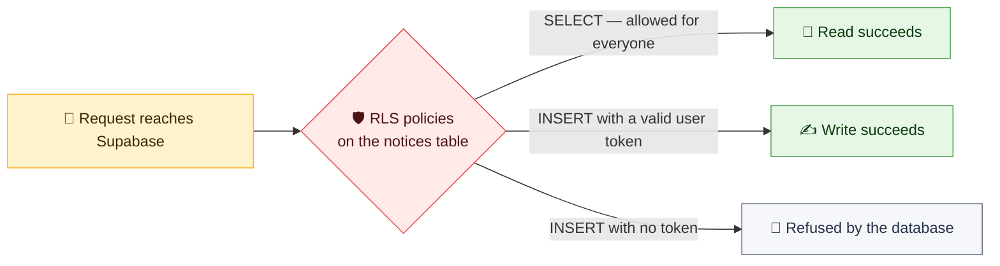
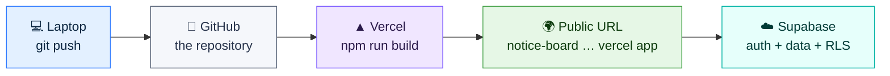
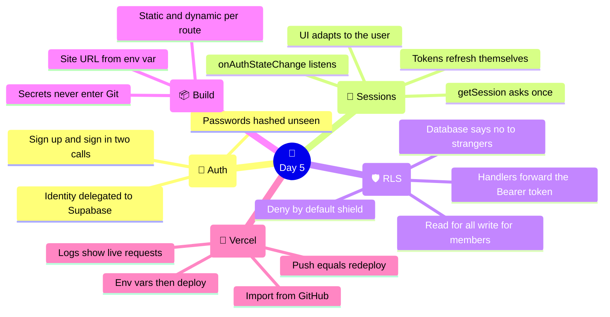

# 🔐 Day 5 — Identity & Going Live: Supabase Auth + Deployment

### CodeLucky Faculty Development Programme · Full Stack Web Development

> **📍 Where this day fits:** Day 4 left the Notice Board as one clean Next.js app on a cloud database — with two open items. Anyone can still write to it (**no identity**), and it lives on a single laptop (**no URL**). Today closes both: **Supabase Auth** brings sign-up, login and sessions; **Row Level Security** makes the *database itself* enforce who may write; and by evening the app is **deployed on Vercel** with a public link anyone can open — including on the phones of everyone in the room.

## 🎓 Syllabus Alignment (for the classroom)

| Today's Part | INT257 (Modern Web App Dev) | INT252 (React) |
|---|---|---|
| 1 · Supabase Auth | **Unit IV** — Authentication Concepts | — |
| 2 · Sessions in the UI | **Unit IV** — Session Management, Protected Routes | **Unit V** — Protected routes |
| 3 · Row Level Security | **Unit IV** — Authorization, Role-based Access Control | — |
| 4 · Production build & Git | **Unit V** — Production Build | **Unit VI** — Build optimization |
| 5 · Deploying on Vercel | **Unit V** — Environment Configuration, Deployment Platforms, Performance Monitoring, Error Logging | **Unit VI** — Deployment workflow |

*Course outcomes touched: INT257 CO4 (authentication & database operations), CO5 (deploy production-ready apps); INT252 CO5.*

---

## 🗺️ Today's Journey

```mermaid
flowchart LR
    D4["✅ Day 4<br/>API + cloud data"] --> A["🔐 Supabase Auth<br/>Sign up & log in"]
    A --> B["🪪 Sessions<br/>Who is here?"]
    B --> C["🛡️ RLS<br/>The database enforces"]
    C --> D["📦 Build & Git<br/>Production-ready"]
    D --> E["🚀 Vercel<br/>A public URL"]
    E --> D6["🔜 Day 6<br/>Polish & demos"]
    style D4 fill:#e6f7e6,stroke:#43a047,color:#0d3b0d
    style A fill:#e3f0ff,stroke:#2f7bff,color:#0a2540
    style B fill:#fff3cd,stroke:#ffb020,color:#3a2600
    style C fill:#ffe9e9,stroke:#e5484d,color:#4a1414
    style D fill:#f0e6ff,stroke:#7c5cff,color:#2a1a4a
    style E fill:#e6fffb,stroke:#00b3a4,color:#003b36
    style D6 fill:#f5f7fb,stroke:#5b667a,color:#26324a
```



### ⏱️ Suggested 6-Hour Flow

| Part | Topic | Time |
|---|---|---|
| 1 | 🔐 Authentication — concepts & the login page | 75 min |
| 2 | 🪪 Sessions in the UI — who's here, show/hide, logout | 60 min |
| 3 | 🛡️ Row Level Security — the database enforces the rules | 75 min |
| 4 | 📦 Production build & pushing to GitHub | 45 min |
| 5 | 🚀 Deploying on Vercel — env config, logs & a live URL | 60 min |
| — | 🧭 Recap & wrap-up | 45 min |

> 🧠 **Needed today:** the Day 4 app running, the Supabase dashboard open, and a free **github.com** account (from the prerequisites) — Vercel signs in with it.

---

# 🔐 PART 1 — Authentication: Concepts & the Login Page

## 🤔 The Two Questions Every App Asks

- **Authentication** — *who are you?* (proving identity: email + password)
- **Authorization** — *what may you do?* (permissions: who can post, who can delete)

Day 3 previewed the answer's shape with the wristband analogy 🎟️: prove identity once, receive a signed pass, show the pass thereafter. **Today the wristband becomes real** — and the pleasant surprise is how little must be built, because Supabase ships a complete auth system alongside the database.

## 🎁 What Supabase Auth Provides Out of the Box

- 👤 A managed `users` store (visible in the dashboard under *Authentication*)
- 🔑 Password hashing — bcrypt-grade, handled internally, never seen or stored by our code
- 🎫 **JWT session tokens** — signed passes, issued at login, refreshed automatically
- 📧 Email confirmation, password reset, OAuth (Google/GitHub) — available when wanted

> 📢 **Key fact:** "never build your own password storage" is genuine industry advice — one subtle mistake becomes a breach. Delegating identity to a hardened provider (Supabase Auth, Auth0, Firebase Auth, NextAuth) *is* the professional pattern, not a shortcut.

## ⚙️ One Dashboard Switch First

For a smooth workshop, skip email verification: **Dashboard → Authentication → Sign In / Providers → Email → turn OFF "Confirm email"** → Save.

*(In production it stays ON — unverified emails invite abuse. Today it would only mean everyone pausing to check inboxes.)*

## ✋ Hands-On: The Login Page

One page handles both sign-up and sign-in — Day 1's controlled inputs, plus two Supabase calls. Create `app/login/page.js`:

```jsx
"use client";

import { useState } from "react";
import { useRouter } from "next/navigation";
import { supabase } from "@/lib/supabase";

export default function LoginPage() {
  const [email, setEmail] = useState("");
  const [password, setPassword] = useState("");
  const [message, setMessage] = useState("");
  const router = useRouter();

  const handleSignUp = async () => {
    setMessage("");
    const { error } = await supabase.auth.signUp({ email, password });
    if (error) return setMessage(`⚠️ ${error.message}`);
    setMessage("✅ Account created — now sign in!");
  };

  const handleSignIn = async () => {
    setMessage("");
    const { error } = await supabase.auth.signInWithPassword({ email, password });
    if (error) return setMessage("⚠️ Invalid credentials");
    router.push("/notices");
  };

  return (
    <main className="max-w-sm mx-auto p-8">
      <h1 className="text-3xl font-bold text-blue-950 mb-6">🔑 Account</h1>

      <div className="flex flex-col gap-3">
        <input
          className="border rounded-lg p-2"
          value={email}
          onChange={(e) => setEmail(e.target.value)}
          placeholder="Email"
        />
        <input
          className="border rounded-lg p-2"
          type="password"
          value={password}
          onChange={(e) => setPassword(e.target.value)}
          placeholder="Password (min 6 characters)"
        />

        {message && <p className="text-sm">{message}</p>}

        <button
          onClick={handleSignIn}
          className="bg-blue-900 text-white rounded-lg p-2 font-semibold"
        >
          Sign in
        </button>
        <button
          onClick={handleSignUp}
          className="border border-blue-900 text-blue-900 rounded-lg p-2 font-semibold"
        >
          Create account
        </button>
      </div>
    </main>
  );
}
```

**What the two calls do:**

| Call | Behind the scenes |
|---|---|
| `supabase.auth.signUp({ email, password })` | Hashes the password, stores the user — **visible immediately** in Dashboard → Authentication → Users |
| `supabase.auth.signInWithPassword({...})` | Verifies, then issues a **session** — a JWT access token the browser keeps and refreshes automatically |

> 🧪 **Try it now:** create an account at `/login`, then open the Supabase dashboard → *Authentication* → the user is there, with a UID and a "Last sign in" timestamp — and no password in sight, only the fact that one exists. Rule Zero (never store real passwords), honored by the platform.

> 🤫 **Note the login error message:** "Invalid credentials" for *both* wrong email and wrong password — Supabase answers vaguely on purpose, so attackers can't fish for which emails have accounts. The same courtesy Day 3's preview described.

---

<div align="center">

### ✅ Auth Checkpoint

Authentication = who, authorization = what · identity delegated to a hardened provider · sign-up + sign-in = two calls · users visible in the dashboard, passwords never

</div>

---

# 🪪 PART 2 — Sessions in the UI

Logging in worked — but the site doesn't *show* it. **Session management** means the UI knows, at all times, whether someone is signed in, and adapts.

## 🧠 What a Session Is

After `signInWithPassword`, the Supabase client keeps a **session** in the browser: the user's details plus an **access token** (a JWT). Two client-side tools read it:

| Tool | Job |
|---|---|
| `supabase.auth.getSession()` | "Is anyone signed in *right now*?" — one-time check |
| `supabase.auth.onAuthStateChange(cb)` | "Tell me whenever that changes" — login, logout, auto-refresh |

> 🔬 **The Day 3 preview pays off:** grab `session.access_token` and paste it at **jwt.io** — inside sit the user's id (`sub`), email, and expiry. Supabase has been printing the exact wristband Day 3 described; it also *re-prints* it quietly before expiry, which is the "session management" chore handled for free.

## ✋ Hands-On: An Auth-Aware Header

Create `app/components/AuthStatus.js` — a small client island for the layout:

```jsx
"use client";

import { useState, useEffect } from "react";
import Link from "next/link";
import { supabase } from "@/lib/supabase";

export default function AuthStatus() {
  const [user, setUser] = useState(null);

  useEffect(() => {
    // 1) initial answer
    supabase.auth.getSession().then(({ data: { session } }) => {
      setUser(session?.user ?? null);
    });

    // 2) stay updated (login, logout, token refresh)
    const { data: listener } = supabase.auth.onAuthStateChange(
      (_event, session) => setUser(session?.user ?? null),
    );

    return () => listener.subscription.unsubscribe();   // cleanup (Day 1's clock!)
  }, []);

  if (!user) {
    return (
      <Link href="/login" className="text-sm font-semibold text-blue-900">
        🔑 Sign in
      </Link>
    );
  }

  return (
    <span className="text-sm text-gray-700">
      👋 {user.email}{"  "}
      <button
        onClick={() => supabase.auth.signOut()}
        className="ml-2 text-red-600 font-semibold"
      >
        Sign out
      </button>
    </span>
  );
}
```

Slot it into the navbar in `app/layout.js`:

```jsx
import AuthStatus from "./components/AuthStatus";
// … inside the <nav>, after the links:
<span className="float-right"><AuthStatus /></span>
```

*(Every hook in that component is a Day 1–3 veteran: `useState`, `useEffect` with `[]`, and a cleanup function — the same shape as Day 1's ticking clock.)*

## 🚪 A Protected Piece of UI

The posting form should greet visitors differently than members. In `app/components/AddNoticeForm.js`, track the session the same way, and branch:

```jsx
// inside AddNoticeForm — same session tracking as AuthStatus, then:

if (!user) {
  return (
    <p className="p-4 bg-blue-50 rounded-lg mb-6 text-blue-900">
      🔒 <Link href="/login" className="font-semibold underline">Sign in</Link> to post a notice.
    </p>
  );
}

return (
  /* …the existing form JSX, unchanged… */
);
```

This is the **protected route/UI pattern** at its simplest: *render based on session*. Sign out → the form folds into a sign-in prompt; sign in → it returns.

> ⚠️ **The honest limit of hiding UI:** it's politeness, not security. The form is gone, but `curl` still reaches `POST /api/notices` happily — the API remains wide open. Anything truly protective must live **server-side**. That is exactly Part 3's job, and it's why "protected routes" and "authorization" are different syllabus lines: one shapes the experience, the other enforces the rules.

---

<div align="center">

### ✅ Session Checkpoint

`getSession` asks, `onAuthStateChange` listens · tokens auto-refresh · header + form adapt to the user · hiding UI ≠ enforcing rules

</div>

---

# 🛡️ PART 3 — Row Level Security: The Database Enforces

Day 4 created the `notices` table with RLS **off**, promising it would return with auth. The promise comes due.

## 🧱 What RLS Is

**Row Level Security** turns permission rules into part of the table itself. Policies — small allow-rules — decide, per operation, which requests succeed:



> 💡 **Why this beats guard-code:** the rule lives *with the data*. Every path to the table — the route handlers, the dashboard's API, a future mobile app, a stray `curl` — meets the same policies. There is no route to forget to protect.

## ✋ Hands-On: Switch It On, Add Two Policies

In the dashboard → *Table Editor* → `notices`:

**1) Enable RLS** (the table's shield toggle). The instant it's on, *everything* is refused — RLS is deny-by-default. Refresh the site: the notices list is suddenly empty. Good — that's the shield working. Now allow what should be allowed:

**2) Policy one — public reading.** *Authentication → Policies → notices → New policy* → template **"Enable read access for all users"**:

- Operation: `SELECT` · Applies to: `anon, authenticated` · Rule: `true`

**3) Policy two — members write.** Template **"Enable insert for authenticated users only"**, then extend the same idea to changes and deletions (three quick policies, or one per operation):

- Operation: `INSERT` (and `UPDATE`, `DELETE`) · Applies to: `authenticated` · Rule: `true`

Refresh the site: reading works again. Posting? **Still fails** — with a policy error. One piece is missing, and it's the day's best lesson.

## 🎫 Carrying the Wristband to the API

The route handlers talk to Supabase with the shared client from `lib/supabase.js` — the plain **anon** key, no user attached. As far as the database can tell, the API itself is an anonymous stranger. The fix: **the browser passes the user's token to the handler; the handler presents it to Supabase.**

**1) A per-request client** — `lib/supabaseServer.js`:

```js
import { createClient } from "@supabase/supabase-js";

// builds a Supabase client that carries the caller's Authorization header
export function supabaseFor(request) {
  const authHeader = request.headers.get("authorization") ?? "";

  return createClient(
    process.env.NEXT_PUBLIC_SUPABASE_URL,
    process.env.NEXT_PUBLIC_SUPABASE_ANON_KEY,
    { global: { headers: { Authorization: authHeader } } },
  );
}
```

**2) Write handlers use it** — in `app/api/notices/route.js` (POST) and `[id]/route.js` (PATCH, DELETE), swap the import and first line:

```js
import { supabaseFor } from "@/lib/supabaseServer";

export async function POST(request) {
  const supabase = supabaseFor(request);        // ← carries the caller's token
  // …everything below is unchanged…
}
```

*(GET handlers keep the shared client — public reading needs no identity.)*

**3) The frontend attaches the token** — in `AddNoticeForm.js` and `DeleteButton.js`, the fetch gains one header:

```jsx
const { data: { session } } = await supabase.auth.getSession();

const res = await fetch("/api/notices", {
  method: "POST",
  headers: {
    "Content-Type": "application/json",
    Authorization: `Bearer ${session?.access_token}`,   // 🎫 the wristband
  },
  body: JSON.stringify({ title, tag }),
});
```

## 🧪 The Proof, Three Ways

1. **Signed in, via the site** → posting works, deleting works. ✅
2. **Signed out, via `curl`** (no token) →

```bash
curl -X POST http://localhost:3000/api/notices \
  -H "Content-Type: application/json" \
  -d '{"title": "Sneaky anonymous post", "tag": "Events"}'
# → { "error": "new row violates row-level security policy …" }
```

The handler ran, the validation passed — and **the database itself said no**. 🛡️

3. **The dashboard tells the story:** *Authentication → Users* shows who exists; the policy list shows the law; the table shows only legal rows arriving.

> 🎖️ **Role-based access, in one paragraph (syllabus: RBAC):** policies can read the token's contents. Add a `user_id` column to notices (filled from the token on insert), and a policy like `auth.uid() = user_id` on DELETE means *only the author* may remove a notice — per-row, per-person rules with no new machinery. Admin roles work the same way via token claims. A perfect classroom extension once today's pattern is comfortable.

---

<div align="center">

### ✅ RLS Checkpoint

RLS = rules living with the data, deny-by-default · read policy for all, write policies for `authenticated` · handlers forward the Bearer token · `curl` without a wristband is refused **by the database**

</div>

---

# 📦 PART 4 — Production Build & Pushing to GitHub

The app is feature-complete and defended. Two preparations stand between it and the internet: proving it **builds for production**, and putting the code somewhere a deployment platform can reach — **GitHub**.

## 🏗️ The Production Build

Development mode (`npm run dev`) favours the developer: instant reloads, readable errors, no compression. Production mode favours the *user*. One command produces it:

```bash
npm run build
```

The output is worth reading aloud in class:

```
Route (app)                              Size
┌ ○ /                                    …
├ ○ /login                               …
├ ƒ /notices                             …
├ ƒ /api/notices                         …
└ ƒ /api/notices/[id]                    …

○  (Static)   prerendered as static content
ƒ  (Dynamic)  server-rendered on demand
```

- **○ Static** — pages with nothing personal or changing (home, login) are pre-rendered *once at build time* and served instantly
- **ƒ Dynamic** — the notices page and every API route run per-request, because their answers change

*(That little legend is INT257's Unit II — rendering strategies — visible in the wild: the framework chose SSG or SSR per route based on how each was written.)*

```bash
npm start     # serve the production build locally — a dress rehearsal
```

> 🧹 **If the build fails, fix it now** — unused imports, typos in dynamic pages. Vercel runs exactly this command; a build that passes locally deploys cleanly.

## 🧯 One Fix Before the Code Leaves the Laptop

`app/notices/page.js` still fetches `http://localhost:3000/api/notices` — an address that means nothing once deployed. Day 3's env-var habit retires it. In `.env.local`:

```bash
NEXT_PUBLIC_SITE_URL=http://localhost:3000
```

And in the page:

```jsx
const res = await fetch(`${process.env.NEXT_PUBLIC_SITE_URL}/api/notices`, {
  cache: "no-store",
});
```

*(On Vercel, the same variable will hold the real URL — Part 5 sets it. One name, two environments, zero code changes between them: that is "Environment Configuration" as the syllabus means it.)*

## 🐙 Pushing to GitHub

Vercel deploys straight from a Git repository. From the `my-next-app` folder:

```bash
git init
git add .
git commit -m "Notice Board — full stack with Supabase"
```

> 🔒 **Check before pushing:** `git status` must NOT list `.env.local` — Next.js's default `.gitignore` excludes it, which is exactly right. Secrets travel to the platform through its dashboard (Part 5), never through Git.

On **github.com** → *New repository* → name it `notice-board`, keep it public or private, **no** README (the project exists already) → then connect and push:

```bash
git remote add origin https://github.com/YOUR-USERNAME/notice-board.git
git branch -M main
git push -u origin main
```

Refresh GitHub — the code is in the cloud, versioned, shareable, deployable.

---

<div align="center">

### ✅ Build Checkpoint

`npm run build` = the production dress rehearsal · ○ static vs ƒ dynamic, chosen per route · site URL now an env var · code on GitHub, secrets not

</div>

---

# 🚀 PART 5 — Deploying on Vercel

**Vercel** is the company behind Next.js, and its hosting platform deploys Next.js apps with essentially zero configuration. The free Hobby tier fits classroom and prototype work perfectly.

## ✋ Hands-On: Import, Configure, Deploy

**1) Sign in** at **vercel.com** → *Continue with GitHub* (one click — accounts link).

**2) Import** → *Add New… → Project* → the `notice-board` repository → *Import*. Vercel detects Next.js by itself; build settings stay untouched.

**3) Environment variables** — the deployed app needs what `.env.local` held. In the import screen's *Environment Variables* section, add all three:

| Name | Value |
|---|---|
| `NEXT_PUBLIC_SUPABASE_URL` | `https://YOUR-PROJECT.supabase.co` |
| `NEXT_PUBLIC_SUPABASE_ANON_KEY` | `eyJ…` (from the Supabase dashboard) |
| `NEXT_PUBLIC_SITE_URL` | leave for step 5 — set after the URL exists |

**4) Deploy.** Vercel clones the repo, runs `npm run build` (the very command rehearsed in Part 4), and in about a minute presents confetti and a URL:

```
🎉  https://notice-board-YOUR-NAME.vercel.app
```

**5) Close the loop:** *Project → Settings → Environment Variables* → set `NEXT_PUBLIC_SITE_URL` to that new URL → *Deployments → Redeploy*. (Env values are baked in at build time, hence the quick redeploy.)

## 📱 The Moment

Open the URL — on the laptop, then on phones around the room. Sign up, sign in, post a notice from one phone and refresh on another: **the same cloud data, the same rules, from anywhere.** The application that began as `console.log("Hello from Node.js!")` on Day 1 is now a deployed, authenticated, database-backed product with a shareable link.



> 🔁 **The bonus that becomes a habit:** the pipeline is now permanent. Any `git push` to `main` triggers a fresh build and deployment automatically — continuous deployment, configured by accident, kept forever.

## 📊 Monitoring & Error Logging — The Overview

The syllabus asks for awareness here, and Vercel's dashboard delivers it without setup:

| Where | What it shows |
|---|---|
| *Deployments* | Every build — status, duration, full build logs (the first place to look when a deploy fails) |
| *Logs* | **Live output from the route handlers** — every request, every `console.log`, every error with its stack trace |
| *Analytics / Speed Insights* | Traffic and real-user performance metrics (enable per project) |

**A worthwhile two-minute demo:** open *Logs*, post a notice on the live site, and watch the `POST /api/notices` line appear in real time. Server logs stop being an abstraction the moment one scrolls past.

> 🎯 **Production error habit:** user reports a problem → *Logs* → find the request → read the error → fix → `git push` → auto-redeploy. The full professional loop, on the free tier.

---

<div align="center">

### ✅ Deployment Checkpoint

GitHub → Vercel → URL, in minutes · env vars entered on the platform, then redeploy · every push auto-deploys · logs show the handlers living

</div>

---

# 🧭 Day 5 — The Complete Picture



## 📌 The Big Takeaways

1. 🔐 **Identity is delegated, not hand-built** — sign-up and sign-in were two function calls; hashing, sessions and refresh came managed.
2. 🪪 **Session state drives the UI** — one listener, and every component can know who's here; hiding UI is courtesy, not security.
3. 🛡️ **RLS moves the law into the database** — deny-by-default, policies per operation, and no forgotten route can leak past it.
4. 🎫 **The wristband completed its journey** — previewed Day 3, printed by Supabase, carried in a Bearer header, checked by the data itself.
5. 📦 **The build output teaches rendering** — ○ static and ƒ dynamic, chosen per route by how each was written.
6. 🚀 **Deployment is a pipeline, not an event** — GitHub → Vercel → URL, and every future push ships itself.

## ➡️ What Comes Next in the Workshop

- 🏁 **Day 6 — Production polish & demos:** performance and image optimisation, the Metadata API and SEO (INT257 Unit V), security review and industry practices (Unit VI), a testing overview — and participant project demonstrations to close the programme

> 🎓 **The journey in one line:** Day 1 ran a language, Days 2–3 built two halves and joined them, Day 4 moved the data to the cloud, and today the whole thing gained identity and an address on the internet. What remains is making it *excellent* — that's Day 6.

---

## 📚 Quick Reference Card

```jsx
// ── AUTH IN THREE CALLS ─────────────────────
await supabase.auth.signUp({ email, password });
await supabase.auth.signInWithPassword({ email, password });
await supabase.auth.signOut();

// ── SESSION AWARENESS ───────────────────────
const { data: { session } } = await supabase.auth.getSession();
supabase.auth.onAuthStateChange((_e, session) => setUser(session?.user ?? null));
// token for API calls:
session?.access_token          // a JWT — inspect at jwt.io

// ── SEND THE WRISTBAND ──────────────────────
headers: { Authorization: `Bearer ${session?.access_token}` }
```

```js
// ── PER-REQUEST CLIENT (lib/supabaseServer.js) ──
export function supabaseFor(request) {
  return createClient(URL, ANON_KEY, {
    global: { headers: { Authorization: request.headers.get("authorization") ?? "" } },
  });
}
// in write handlers:
const supabase = supabaseFor(request);
```

```
── RLS POLICIES (dashboard) ──
SELECT  →  anon, authenticated  →  true      (public reading)
INSERT  →  authenticated        →  true      (members write)
UPDATE  →  authenticated        →  true
DELETE  →  authenticated        →  true
RLS is deny-by-default: no policy = no access
```

### 🖥️ Essential Commands

```bash
# production rehearsal
npm run build && npm start

# ship the code
git init && git add . && git commit -m "Notice Board"
git remote add origin https://github.com/YOU/notice-board.git
git push -u origin main

# thereafter: every push deploys
git add . && git commit -m "fix" && git push
```

---

<div align="center">

## 🎉 End of Day 5

**The Notice Board knows its users, guards its data — and lives at a URL anyone can visit.**

*Day 6 makes it fast, polished, and demo-ready.*

---

🌐 **codelucky.com** · A CodeLucky Faculty Development Programme

</div>
