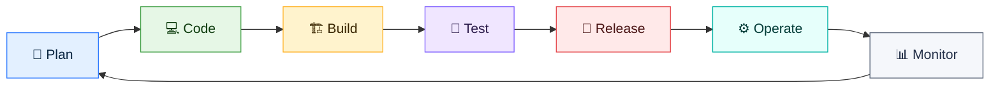
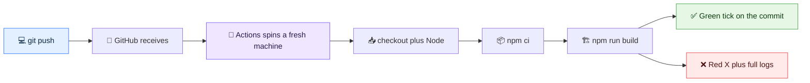
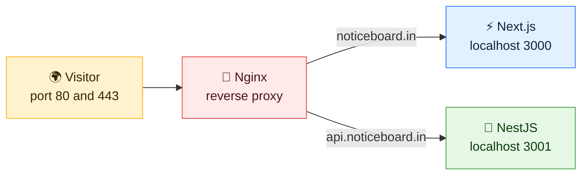
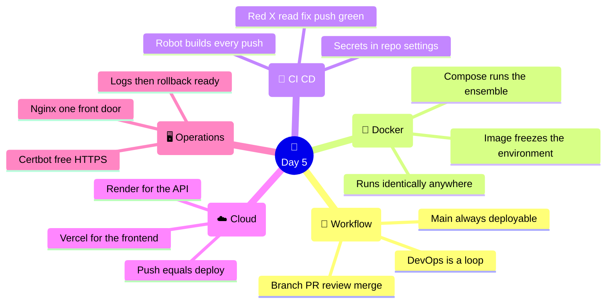

# 🚢 Day 5 — DevOps, Containerisation & Deployment

### CodeLucky Faculty Development Programme · Full Stack Web Development

> **📍 Where this day fits:** the Notice Board works — pages, API, cloud data. But it lives on one laptop, ships by hope, and has never met a server. Today compresses the entire **DevOps → Deployment** journey into one intensive day: professional Git workflow, Docker containers, an automated CI/CD pipeline, and then the app going **live** — cloud platforms first, with the VPS + Nginx + HTTPS world mapped clearly enough to teach. Minimal depth, full coverage: every topic gets its concept, its one honest snippet, and its *why*.

---

## 🗺️ Today's Journey

```mermaid
flowchart LR
    D4["✅ Day 4<br/>Working full stack app"] --> A["🔀 Git Workflow<br/>Branches & PRs"]
    A --> B["🐳 Docker<br/>Containerise it"]
    B --> C["🤖 CI CD<br/>GitHub Actions"]
    C --> D["☁️ Cloud Deploy<br/>Vercel and Render"]
    D --> E["🖥️ VPS and Nginx<br/>Domains and HTTPS"]
    E --> D6["🔜 Day 6<br/>Optimise and master"]
    style D4 fill:#e6f7e6,stroke:#43a047,color:#0d3b0d
    style A fill:#e3f0ff,stroke:#2f7bff,color:#0a2540
    style B fill:#e6fffb,stroke:#00b3a4,color:#003b36
    style C fill:#f0e6ff,stroke:#7c5cff,color:#2a1a4a
    style D fill:#fff3cd,stroke:#ffb020,color:#3a2600
    style E fill:#ffe9e9,stroke:#e5484d,color:#4a1414
    style D6 fill:#f5f7fb,stroke:#5b667a,color:#26324a
```



### ⏱️ Suggested 6-Hour Flow

| Part | Topic | Time |
|---|---|---|
| 1 | 🔄 DevOps culture & the Git/GitHub workflow | 60 min |
| 2 | 🐳 Docker & Docker Compose — containerising the stack | 75 min |
| 3 | 🤖 CI/CD with GitHub Actions — builds that run themselves | 60 min |
| 4 | ☁️ Cloud deployment — Vercel, Render & Railway | 60 min |
| 5 | 🖥️ VPS, Nginx, domains, HTTPS & safe operations | 60 min |
| — | 🧭 Recap & wrap-up | 45 min |

> 🧠 **Needed today:** the project code, a **github.com** account, and **Docker Desktop** (from the prerequisites). Cloud sign-ups (Vercel, Render) happen live — both are free-tier and log in with GitHub.

---

# 🔄 PART 1 — DevOps Culture & the Git/GitHub Workflow

## 🤔 What DevOps Actually Means

**DevOps is the practice of shortening the distance between *writing* code and *running* it for users** — by automating the path and making every step repeatable. It's a loop, not a line:



Everything today automates a segment of that loop: Git guards **Code**, Docker standardises **Build**, GitHub Actions runs **Build + Test** on every push, deployment platforms handle **Release**, and logs close the loop at **Monitor**.

## 🔀 The Professional Git Workflow — Branches & Pull Requests

Solo habits (`git add . && git commit && git push` to main) don't survive teams. Industry works on **branches** merged through **Pull Requests**:

```mermaid
flowchart LR
    M1["main<br/>always deployable"] --> B1["🌿 branch<br/>feature search-box"]
    B1 --> W["💻 commits on the branch"]
    W --> PR["🔍 Pull Request<br/>diff plus discussion"]
    PR --> RV["👀 Review and approve"]
    RV --> MG["🔀 Merge to main"]
    MG --> M2["main<br/>updated and still deployable"]
    style M1 fill:#e6f7e6,stroke:#43a047,color:#0d3b0d
    style B1 fill:#e3f0ff,stroke:#2f7bff,color:#0a2540
    style PR fill:#fff3cd,stroke:#ffb020,color:#3a2600
    style MG fill:#f0e6ff,stroke:#7c5cff,color:#2a1a4a
    style M2 fill:#e6f7e6,stroke:#43a047,color:#0d3b0d
```



The whole ceremony in six steps:

```bash
git checkout -b feature/search-box    # 1. branch off main
# …edit code…
git add . && git commit -m "Add live search box"   # 2. commit on the branch
git push -u origin feature/search-box              # 3. push the branch
# 4. GitHub shows a "Compare & pull request" button → open the PR
# 5. a colleague reviews the diff, comments, approves
# 6. "Merge pull request" → the feature lands on main
```

**Why the detour is worth it:**

- 🛡️ `main` stays **always deployable** — broken experiments live on branches
- 👀 Every change gets **a second pair of eyes** before it counts (the PR diff *is* the review)
- 📜 The PR history becomes documentation: *what* changed, *why*, and *who agreed*

> 🎓 **DevOps for teaching (the syllabus's closing topic, planted early):** this exact workflow transforms student group projects — each member on a branch, merges via reviewed PRs, no more "who overwrote my file". Faculty running capstones can adopt it verbatim; it is also precisely what placement interviews probe.

---

<div align="center">

### ✅ Workflow Checkpoint

DevOps = the loop, automated · branch → commit → push → PR → review → merge · `main` is sacred and always deployable

</div>

---

# 🐳 PART 2 — Docker & Docker Compose

## 📦 The Problem Docker Solves

"Works on my machine" is the oldest bug in software. Node versions differ, OS paths differ, a teammate misses one install step — and the same code behaves differently on every laptop. **Docker packages the app *with its entire environment* into an image; running that image gives an identical container anywhere** — a colleague's Mac, a student's Windows laptop, a cloud server.

| Term | Meaning |
|---|---|
| **Image** | The frozen recipe + ingredients — app code, Node.js, dependencies, OS layer |
| **Container** | A running instance of an image (one image → many containers) |
| **Dockerfile** | The text file that describes how to build the image |

> 💡 **Analogy:** a Dockerfile is a packed tiffin recipe 🍱 — not just the dish, but the box, the spoon, and the heating instructions. Whoever receives it eats *exactly* the same meal, on any table.

## ✋ Hands-On: Containerising the Next.js App

Create `Dockerfile` in the project root:

```dockerfile
FROM node:20-alpine          # start from a slim Linux + Node 20 base
WORKDIR /app                 # work inside /app in the container

COPY package*.json ./        # copy dependency lists first…
RUN npm install              # …so this layer caches until they change

COPY . .                     # now the source code
RUN npm run build            # the production build (Day 4's rehearsal!)

EXPOSE 3000                  # document the port
CMD ["npm", "start"]         # what runs when the container starts
```

And `.dockerignore` beside it (what must *not* enter the image):

```
node_modules
.next
.env.local
.git
```

Build and run:

```bash
docker build -t notice-board .
docker run -p 3000:3000 \
  -e NEXT_PUBLIC_SUPABASE_URL=https://YOUR-PROJECT.supabase.co \
  -e NEXT_PUBLIC_SUPABASE_ANON_KEY=eyJ... \
  -e NEXT_PUBLIC_SITE_URL=http://localhost:3000 \
  notice-board
```

**localhost:3000** now serves the app **from inside a container** — the laptop is just the host. This identical image would run identically on any machine on Earth with Docker installed. That sentence is the whole point.

> 🔑 **Note the env vars enter at `docker run`** — never baked into the image. An image may be shared publicly; secrets ride in from outside. (Same principle as Day 4's `.env.local` staying out of Git.)

## 🎼 Docker Compose — Orchestration Basics

Real systems are several containers — a frontend, an API, a database. **Compose describes the whole ensemble in one file** and starts it with one command. For the two-app pattern from Days 2–3 (Next.js + the NestJS API):

```yaml
# docker-compose.yml
services:
  web:
    build: ./my-next-app
    ports: ["3000:3000"]
    environment:
      - NEXT_PUBLIC_API_URL=http://api:3001   # ← service name = hostname!
    depends_on: [api]

  api:
    build: ./my-api
    ports: ["3001:3001"]
```

```bash
docker compose up      # builds & starts the whole stack
docker compose down    # stops & removes it
```

**The two ideas Compose adds:**

- 🕸️ **A private network** — services reach each other *by name* (`http://api:3001`), no IP hunting
- 📋 **One file = the whole system** — a new teammate runs `docker compose up` and has everything; the file doubles as architecture documentation

> 🧭 **Orchestration in perspective:** Compose orchestrates on one machine. The industry's next rung — Kubernetes — orchestrates across many. Same concepts (services, networks, declared desired state), bigger stage; knowing Compose is the honest on-ramp.

---

<div align="center">

### ✅ Container Checkpoint

Image = frozen environment, container = it running · Dockerfile layers cache top-down · secrets enter at run-time · Compose = many containers, one file, one command

</div>

---

# 🤖 PART 3 — CI/CD with GitHub Actions

## 🤔 The Idea: Builds That Run Themselves

**CI (Continuous Integration):** every push automatically gets built and tested by a robot — broken code is caught in minutes, not on demo day.
**CD (Continuous Delivery/Deployment):** code that passes flows onward to release automatically.

**GitHub Actions** is the robot built into GitHub: a YAML file in the repo describes the steps; GitHub runs them on a fresh cloud machine on every push.

## ✋ Hands-On: The Pipeline File

Create `.github/workflows/ci.yml`:

```yaml
name: CI

on:
  push:                       # run on every push…
  pull_request:               # …and on every PR (guarding main!)

jobs:
  build:
    runs-on: ubuntu-latest    # a fresh Linux machine, every time

    steps:
      - uses: actions/checkout@v4        # 1. get the code

      - uses: actions/setup-node@v4      # 2. install Node 20
        with:
          node-version: 20

      - run: npm ci                      # 3. clean, exact install
      - run: npm run build               # 4. the same build as Day 4
        env:
          NEXT_PUBLIC_SUPABASE_URL: ${{ secrets.NEXT_PUBLIC_SUPABASE_URL }}
          NEXT_PUBLIC_SUPABASE_ANON_KEY: ${{ secrets.NEXT_PUBLIC_SUPABASE_ANON_KEY }}
          NEXT_PUBLIC_SITE_URL: http://localhost:3000
```

**Secrets configuration** (the "Environment Configuration & secrets" of the syllabus): repo → *Settings → Secrets and variables → Actions → New repository secret* — add the two Supabase values there. The workflow reads them via `${{ secrets.… }}`; they never appear in the YAML, the logs, or the code.

Commit, push, and open the repo's **Actions tab**: the pipeline appears, runs each step live, and lands on a green ✅ — or a red ❌.



## 🧯 Pipeline Debugging & Recovery — The Real Lesson

Break it on purpose (a deliberate typo in a component), push, and watch the ❌ arrive. Then the professional recovery loop:

1. **Click the red X** → the failing step's log opens — the same error `npm run build` would print locally
2. **Reproduce locally** (`npm run build`) → fix → commit → push
3. The pipeline re-runs by itself → green returns ✅

> 🎯 **This is where DevOps learning actually happens** — a build breaks and gets fixed *with evidence*, not guesswork. Combined with PRs, the payoff compounds: a red X **on a pull request** blocks bad code *before* it ever reaches `main`. The robot becomes the first reviewer.

---

<div align="center">

### ✅ Pipeline Checkpoint

Workflow YAML = the robot's script · runs on push & PR · secrets live in repo settings, read via `${{ secrets }}` · red X → read log → fix → push → green

</div>

---

# ☁️ PART 4 — Cloud Deployment: Vercel, Render & Railway

Cloud platforms deploy straight from GitHub — no servers to rent, no Linux to administer. One platform per half of the stack:

| Platform | Best at | Free tier |
|---|---|---|
| **▲ Vercel** | Next.js (its maker) — zero-config | ✅ generous |
| **Render** | Backends & APIs (NestJS), databases, cron | ✅ (sleeps when idle) |
| **Railway** | Same space as Render — projects, databases, one-click templates | ✅ trial credit |

## ✋ Hands-On A: The Next.js App on Vercel

1. **vercel.com** → *Continue with GitHub* → *Add New → Project* → import the `notice-board` repo (Vercel auto-detects Next.js)
2. **Environment variables** — add the three: `NEXT_PUBLIC_SUPABASE_URL`, `NEXT_PUBLIC_SUPABASE_ANON_KEY`, `NEXT_PUBLIC_SITE_URL` (placeholder for now)
3. **Deploy** → about a minute → 🎉 `https://notice-board-YOU.vercel.app`
4. Update `NEXT_PUBLIC_SITE_URL` to that real URL (*Settings → Environment Variables*) → *Redeploy* — env values bake in at build time
5. **Open it on phones around the room** — same cloud data, everywhere

> 🔁 **Continuous Deployment, acquired by accident:** from now on, every `git push` to `main` → Vercel rebuilds → the live site updates. The CI from Part 3 guards the door; Vercel ships what passes. The full pipeline exists.

## ✋ Hands-On B: The NestJS API on Render (production env config in action)

The Days 2–3 API deserves an address too — and it demonstrates **Production Environment Configuration** perfectly:

1. Push `my-api` to its own GitHub repo → **render.com** → *New → Web Service* → connect the repo
2. Build command `npm install && npm run build` · Start command `npm run start:prod`
3. Environment variables: Render provides `PORT` — so the code must *listen on it*:

```ts
// src/main.ts — the one-line production adjustment
await app.listen(process.env.PORT ?? 3001);
```

4. Deploy → `https://my-api-XXXX.onrender.com/notices` serves live JSON 🎉

> 🔑 **The pattern to name for the classroom:** *platforms inject configuration; apps read `process.env`*. Port from the platform, URLs and keys from dashboard settings, secrets never in Git — one habit, every host. (Railway: the same flow with a different dashboard — mention, don't repeat.)

---

<div align="center">

### ✅ Cloud Checkpoint

Vercel = Next.js home turf, Render/Railway = backend homes · env vars on the platform, then (re)deploy · every push ships itself · `process.env.PORT` = the production handshake

</div>

---

# 🖥️ PART 5 — VPS, Nginx, Domains, HTTPS & Safe Operations

Cloud platforms hide the machinery. A **VPS (Virtual Private Server)** — a rented Linux machine from DigitalOcean, AWS Lightsail, Hetzner and the like — exposes all of it, for more control at the cost of more responsibility. This part maps that world *minimally but completely*: enough to run one, enough to teach it.

## 🖥️ VPS Fundamentals — The Shape of Self-Hosting

```bash
ssh root@203.0.113.10        # 1. log into the rented machine
apt update && apt install docker.io docker-compose-v2 nginx
git clone https://github.com/YOU/notice-board.git
cd notice-board && docker compose up -d      # 2. Part 2's file, reused verbatim
```

That's the honest core: **a VPS is just a computer that's always on** — and because the app was containerised, "install my entire stack" is the Compose command from Part 2. Docker's promise, cashed on a real server.

## 🚪 Nginx — The Reverse Proxy at the Front Door

Apps listen on high ports (3000, 3001); the internet knocks on 80 (HTTP) and 443 (HTTPS). **Nginx** stands at the door and forwards each request to the right app:



The minimal config — `/etc/nginx/sites-available/noticeboard`:

```nginx
server {
    listen 80;
    server_name noticeboard.in;

    location / {
        proxy_pass http://localhost:3000;    # hand requests to Next.js
        proxy_set_header Host $host;
    }
}
```

```bash
ln -s /etc/nginx/sites-available/noticeboard /etc/nginx/sites-enabled/
nginx -t && systemctl reload nginx     # test config, then apply
```

*(A second `server` block with `server_name api.noticeboard.in` → `proxy_pass http://localhost:3001` puts the API on its own subdomain — same trick twice.)*

**Why a proxy at all:** one machine, many apps, one front door; a natural place for HTTPS (next), compression, and rate limits — and the apps behind it never face the internet directly.

## 🌐 Domains & HTTPS/SSL — The Last Mile

**Domain:** buy the name (GoDaddy, Namecheap, Hostinger — ~₹800/yr) → in its DNS panel add an **A record** pointing `@` (and `api`) to the VPS's IP → propagation in minutes to hours.

**HTTPS:** padlock, encryption, and non-negotiable for anything with logins. **Let's Encrypt** issues free certificates; **Certbot** automates the whole ceremony *including editing the Nginx config*:

```bash
apt install certbot python3-certbot-nginx
certbot --nginx -d noticeboard.in -d api.noticeboard.in
# answers two prompts → certificates issued, Nginx rewritten for 443,
# HTTP→HTTPS redirect added, auto-renewal scheduled. Done.
```

> 📢 **Key fact worth teaching:** HTTPS went from "paid and painful" to *free and one command* — there is no longer any excuse for an HTTP login page, student project or otherwise.

## 📊 Monitoring, Logging, Rollbacks — Operating Like a Professional

**Monitoring & logging** — know what's happening before users report it:

| Where | Command / place |
|---|---|
| Container logs | `docker compose logs -f web` (every request, every error, live) |
| Nginx traffic | `/var/log/nginx/access.log` and `error.log` |
| Cloud platforms | Vercel *Logs* tab, Render *Logs* tab — same idea, zero setup |
| Uptime | A free pinger (UptimeRobot) emails when the site stops answering |

**Rollbacks & safe releases** — because some deploys go wrong:

- ☁️ **Vercel:** *Deployments → previous build → Promote to Production* — instant rollback, one click (every build is kept)
- 🖥️ **VPS:** `git log` → `git checkout <last-good-commit>` → `docker compose up -d --build` — rebuild yesterday's truth
- 🛡️ **Safe-release habits:** deploy small changes often (small blast radius) · never deploy what CI hasn't greened · keep the previous version startable · release early in the day, not at 6 pm

**Production best-practices checklist** (the day's collected wisdom, one screen):

- ✅ `main` deployable, changes via PR, CI green before merge
- ✅ Secrets in platform/env settings — never in Git, never in images
- ✅ Containerised = reproducible; Compose file = system documentation
- ✅ HTTPS everywhere, apps behind a proxy, ports 3000/3001 not public
- ✅ Logs watched, uptime pinged, rollback path rehearsed *before* it's needed

---

<div align="center">

### ✅ Operations Checkpoint

VPS = an always-on computer, tamed by the same Compose file · Nginx = one front door, many apps · Certbot = free HTTPS in one command · logs watched, rollback one click away

</div>

---

# 🧭 Day 5 — The Complete Picture



## 📌 The Big Takeaways

1. 🔄 **DevOps is the loop, automated** — every tool today shortened code-to-users and made it repeatable.
2. 🔀 **Branches + PRs keep `main` sacred** — and give student teams (and interviews) the workflow industry expects.
3. 🐳 **A container is the environment, frozen** — "works on my machine" becomes "works on every machine," and Compose runs the whole system from one file.
4. 🤖 **CI turns pushes into verdicts** — green or red with logs, before bad code lands.
5. ☁️ **Platforms made deployment a formality** — GitHub in, URL out, every push shipping itself; `process.env` is the handshake.
6. 🖥️ **The VPS world is mapped** — proxy at the door, free HTTPS, logs watched, and a rollback rehearsed.

## ➡️ What Comes Next

- 🏁 **Day 6 — Optimisation, Security, Testing & Mastery:** performance and SEO, caching, API security, testing both halves, structured code review, project demonstrations — from *it works* to *production-grade*, and the programme's close.

---

## 📚 Quick Reference Card

```bash
# ── GIT WORKFLOW ────────────────────────────
git checkout -b feature/name       # branch
git add . && git commit -m "…"     # commit
git push -u origin feature/name    # push → open PR on GitHub → merge

# ── DOCKER ──────────────────────────────────
docker build -t app .              # image from Dockerfile
docker run -p 3000:3000 -e KEY=val app
docker compose up -d               # the whole stack
docker compose logs -f web         # live logs
docker compose down

# ── VPS + NGINX + HTTPS ─────────────────────
ssh root@SERVER-IP
nginx -t && systemctl reload nginx
certbot --nginx -d yourdomain.in   # free SSL + auto-renew
```

```yaml
# ── CI PIPELINE (.github/workflows/ci.yml) ──
on: [push, pull_request]
jobs:
  build:
    runs-on: ubuntu-latest
    steps:
      - uses: actions/checkout@v4
      - uses: actions/setup-node@v4
        with: { node-version: 20 }
      - run: npm ci
      - run: npm run build
        env:
          KEY: ${{ secrets.KEY }}   # from repo Settings → Secrets
```

```nginx
# ── REVERSE PROXY (one server block) ────────
server {
  listen 80;
  server_name yourdomain.in;
  location / { proxy_pass http://localhost:3000; }
}
```

---

<div align="center">

## 🎉 End of Day 5

**Branched, containerised, pipelined — and live on the internet with a padlock.**

*Day 6 turns "it works" into production-grade — and hands the stage to the faculty.*

---

🌐 **codelucky.com** · A CodeLucky Faculty Development Programme

</div>
