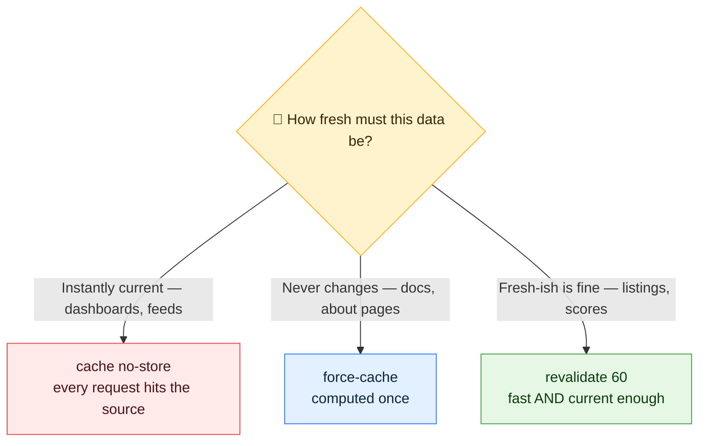
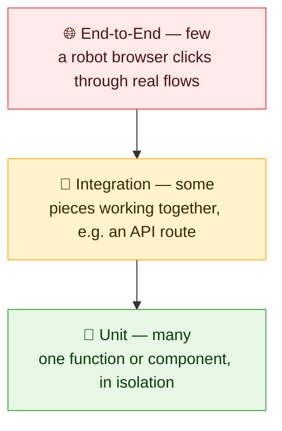
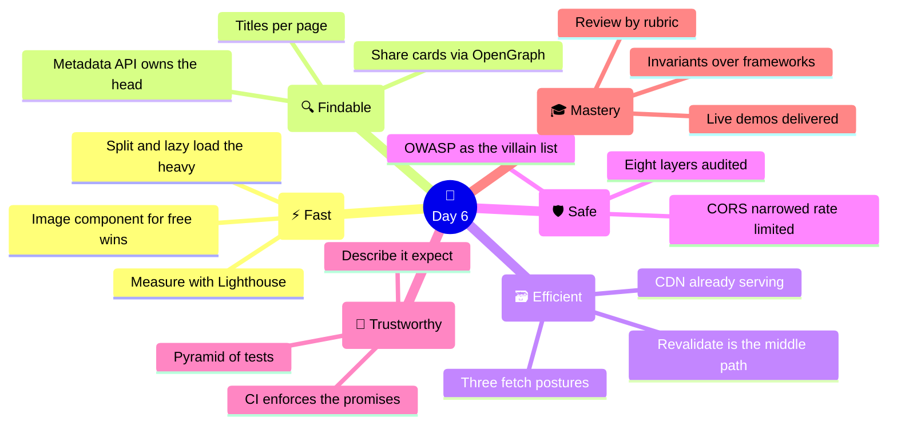

# 🏁 Day 6 — Optimisation, Security, Testing & Mastery

### CodeLucky Faculty Development Programme · Full Stack Web Development

> **📍 Where this day fits:** the Notice Board is live, containerised, and ships itself on every push. Day 6 is the difference between *it works* and *production-grade*: making it **fast** (performance, caching), **findable** (SEO), **safe** (API security), and **trustworthy** (testing) — then closing the programme the right way: each participant **demonstrates their live application**, receives a **structured code review**, and leaves with the industry's map of what comes next.

---

## 🗺️ Today's Journey


### ⏱️ Suggested 6-Hour Flow

| Part | Topic | Time |
|---|---|---|
| 1 | ⚡ Performance optimisation — images, splitting, measuring | 75 min |
| 2 | 🔍 SEO in Next.js — the Metadata API | 45 min |
| 3 | 🗃️ Caching strategies — fetch cache, revalidation, CDNs | 45 min |
| 4 | 🛡️ API security best practices | 60 min |
| 5 | 🧪 Testing frontend & backend | 60 min |
| 6 | 🎓 Mastery — refinement, demos, code review, trends | 45 min |
| — | 🧭 Recap & programme close | 30 min |

---

# ⚡ PART 1 — Performance Optimisation

## 📏 Rule One: Measure Before Touching

Chrome DevTools → **Lighthouse** tab → *Analyze page load* on the **live** URL. Four scores appear (Performance, Accessibility, Best Practices, SEO) with a ranked list of what to fix. Every optimisation today re-runs this — improvement should be *visible in the number*, not assumed.

## 🖼️ Images — The Heaviest Thing on Any Page

Images routinely outweigh all code combined. Next.js's `<Image>` component fixes the usual sins automatically:

```jsx
import Image from "next/image";

// instead of  
<Image
  src="/campus.jpg"
  alt="Campus main building"
  width={800}
  height={450}
  priority          // only for above-the-fold hero images
/>
```

**What it does unasked:** serves modern formats (WebP/AVIF), resizes per device (a phone never downloads the desktop file), **lazy-loads** below-the-fold images, and reserves space so the page doesn't jump while loading.

## ✂️ Code Splitting & Lazy Loading

Day 4's build output showed it: Next.js already splits code **per route** — visiting `/login` never downloads the notices page. For heavy components *within* a page, `dynamic()` extends the idea:

```jsx
import dynamic from "next/dynamic";

// loaded only when it actually renders — not in the initial bundle
const HeavyChart = dynamic(() => import("./components/HeavyChart"), {
  loading: () => <p>📊 Loading chart…</p>,
});
```

**When it matters:** charts, editors, maps, anything admin-only — big code that most visitors never need. The initial page stays light; the weight arrives on demand.

## 🧠 Render Awareness — The React Side

From the INT252 toolkit, the three memo tools in one honest paragraph: **`React.memo`** (skip re-rendering a component whose props didn't change), **`useMemo`** (cache an expensive calculation), **`useCallback`** (keep a function's identity stable between renders). The rule that keeps them healthy: *measure first, memoise what's provably hot* — sprinkled everywhere "just in case," they add complexity and save nothing.

---

<div align="center">

### ✅ Performance Checkpoint

Lighthouse before and after · `<Image>` = formats, sizing, lazy-load for free · route splitting is automatic, `dynamic()` for heavy pieces · memoise by evidence, not habit

</div>

---

# 🔍 PART 2 — SEO in Next.js: The Metadata API

## 🤔 Why Server Rendering Already Won Half the Battle

Search engines read HTML. Day 2's core fact — Next.js sends **finished HTML**, not an empty shell — means crawlers see real content immediately. What remains is *describing* each page properly.

## 🏷️ The Metadata API

In any `layout.js` or `page.js`, export a `metadata` object — Next.js turns it into the `<head>` tags:

```jsx
// app/layout.js — site-wide defaults
export const metadata = {
  title: {
    default: "FDP Notice Board",
    template: "%s · FDP Notice Board",   // pages fill the %s
  },
  description: "Live notices for exams, events and campus updates.",
  openGraph: {
    title: "FDP Notice Board",
    description: "Live notices for exams, events and campus updates.",
    type: "website",
  },
};
```

```jsx
// app/notices/page.js — per-page override
export const metadata = {
  title: "Notices",        // becomes "Notices · FDP Notice Board"
  description: "Browse and search all current notices.",
};
```

**The result, verifiable:** view-source on the live site → real `<title>`, `<meta name="description">`, and OpenGraph tags (the card WhatsApp/LinkedIn show when the URL is shared). Different title per page — exactly what search results display.

**SEO fundamentals beyond tags, as a checklist:** one `<h1>` per page with real hierarchy below · semantic elements (`<main>`, `<nav>`, `<article>`) · descriptive link text (never "click here") · `alt` on every image (accessibility and SEO, same job) · fast pages rank better — Part 1 *was* SEO work too.

---

<div align="center">

### ✅ SEO Checkpoint

SSR = crawlers see content · `metadata` export = the head, managed · title template + per-page overrides · share-cards via OpenGraph · speed is ranking fuel

</div>

---

# 🗃️ PART 3 — Caching Strategies

## 🤔 The One-Sentence Idea

**Caching = keeping a ready answer instead of recomputing it** — the single biggest performance lever in web systems, applied at several layers.

## ⚙️ The Layer in Our Hands: `fetch` Caching in Next.js

Every server-side `fetch` in Next.js declares its freshness policy — three postures:

```jsx
// 1) ALWAYS FRESH — never cached (today's choice for notices)
fetch(url, { cache: "no-store" });

// 2) CACHED FOREVER — static content (build-time snapshot)
fetch(url, { cache: "force-cache" });

// 3) THE MIDDLE PATH — cached, refreshed every 60 seconds
fetch(url, { next: { revalidate: 60 } });
```



> 🧪 **Worth a two-minute experiment:** switch the notices page to `{ next: { revalidate: 30 } }`, post a notice, and watch it appear within half a minute rather than instantly. *Feeling* the trade-off (speed ↔ freshness) teaches more than any definition — then switch back.

## 🌍 The Other Layers, Mapped

| Layer | What's kept | Who runs it |
|---|---|---|
| Browser cache | Images, CSS, JS on the visitor's disk | Automatic via headers |
| **CDN** | Copies of pages/assets in cities worldwide — a Ludhiana visitor served from Delhi, not Virginia | Vercel's edge network, already on |
| Server cache | The `fetch` policies above | Our code |
| Database cache | Hot query results (Redis is the famous tool) | Backend teams, at scale |

*(React Query — INT252 Unit V — is this same thinking applied to client-side data: cached server state, background refresh. Same concept, browser edition.)*

---

<div align="center">

### ✅ Caching Checkpoint

Cache = ready answers · three fetch postures: no-store / force-cache / revalidate N · the CDN layer is already working · freshness is a *decision*, made per data

</div>

---

# 🛡️ PART 4 — API Security Best Practices

Security is layers, not a feature. The good news: the programme has been *building* the layers all week — today names them as a discipline and adds the missing ones.

## 🧱 The Layers, Audited Against Our App

| # | Practice | Status in the Notice Board |
|---|---|---|
| 1 | **Validate every input, server-side** | ✅ Day 3–4 — DTOs / handler checks; client checks are UX, server checks are law |
| 2 | **Authenticate & authorise** | ✅ JWT flow (Day 3 preview → wristband pattern); reads public, writes gated |
| 3 | **Hash passwords, always** | ✅ bcrypt-with-salt principle — plaintext is a breach-in-waiting |
| 4 | **Secrets out of code** | ✅ env vars locally, platform settings in prod, CI secrets in repo settings |
| 5 | **HTTPS everywhere** | ✅ Day 5 — Certbot made it free; no HTTP login pages, ever |
| 6 | **Tighten CORS for production** | 🔧 the Day 3 promise, honoured below |
| 7 | **Rate limiting** | 🆕 below |
| 8 | **Security headers** | 🆕 below |

## 🔧 The Additions

**CORS, tightened** (Day 3 left it wide open for development):

```ts
// NestJS main.ts — production posture
app.enableCors({ origin: "https://noticeboard.in" });   // that site only
```

**Rate limiting** — the same caller shouldn't get 10,000 tries a minute (brute-force logins, scraping, accidental loops). One line of concept, one snippet of practice:

```nginx
# Nginx — 10 requests/second per IP on the API, small bursts allowed
limit_req_zone $binary_remote_addr zone=api:10m rate=10r/s;
server {
  location /api/ { limit_req zone=api burst=20; proxy_pass http://localhost:3000; }
}
```

*(Framework-level equivalents exist — `@nestjs/throttler`, Vercel/Upstash rate-limit — same idea, different door.)*

**Security headers** — one-line browser instructions that block whole attack classes: `X-Frame-Options: DENY` (no embedding the site in a hostile iframe → stops clickjacking), `X-Content-Type-Options: nosniff`, `Strict-Transport-Security` (HTTPS only, remembered). Set once in Nginx or `next.config.mjs` headers; verify at **securityheaders.com**.

## 🧭 The Attacker's-Eye Habit

**OWASP Top 10** — the industry's ranked list of real-world web vulnerabilities (injection, broken auth, misconfiguration…) — is the recommended classroom companion: each item names an attack, and nearly every defence is already in the table above. Teaching security as *"here's the attack, here's our layer"* lands far better than rules without villains.

---

<div align="center">

### ✅ Security Checkpoint

Eight layers, most already built · CORS narrowed to the real origin · rate limits at the door · headers block whole attack classes · OWASP = the villain catalogue for class

</div>

---

# 🧪 PART 5 — Testing Frontend & Backend

## 🔺 The Testing Pyramid — Where Effort Goes



Many fast unit tests at the base, fewer integration tests, a handful of slow end-to-end journeys on top. Today writes one of each of the first two — enough to make the pyramid concrete and teachable.

## 🧩 A Unit Test — Vitest

```bash
npm install -D vitest
```

Extract something testable — `lib/format.js`:

```js
export function formatTag(tag) {
  const known = ["Exams", "Events", "Campus"];
  return known.includes(tag) ? tag.toUpperCase() : "GENERAL";
}
```

Its test — `lib/format.test.js` (tests live beside the code they check):

```js
import { describe, it, expect } from "vitest";
import { formatTag } from "./format";

describe("formatTag", () => {
  it("uppercases a known tag", () => {
    expect(formatTag("Exams")).toBe("EXAMS");
  });

  it("falls back to GENERAL for unknown tags", () => {
    expect(formatTag("banana")).toBe("GENERAL");
  });
});
```

```bash
npx vitest run
# ✓ lib/format.test.js (2 tests) — Test Files 1 passed
```

**The grammar to name:** *describe* the unit → *it* states an expectation in English → `expect(actual).toBe(expected)` checks it. Every testing library on Earth is a dialect of this sentence. (Component testing — rendering a React component and asserting on its output with React Testing Library — is the same grammar pointed at JSX; a natural next lab for INT252.)

## 🔗 An Integration Test — the API Route

The same tool can call the running API and judge the contract (start `npm run dev` first):

```js
// tests/api.test.js
import { describe, it, expect } from "vitest";

describe("GET /api/notices", () => {
  it("returns a list", async () => {
    const res = await fetch("http://localhost:3000/api/notices");
    expect(res.status).toBe(200);

    const data = await res.json();
    expect(Array.isArray(data)).toBe(true);
  });

  it("refuses an invalid create", async () => {
    const res = await fetch("http://localhost:3000/api/notices", {
      method: "POST",
      headers: { "Content-Type": "application/json" },
      body: JSON.stringify({ banana: 42 }),
    });
    expect(res.status).toBe(400);     // Day 4's validation, now guaranteed
  });
});
```

That second test is worth pausing on: **the validation rule is now a promise the pipeline enforces** — if anyone ever weakens it, a red X appears.

## 🤖 Wiring Tests into CI — the Payoff

One line in Day 5's workflow, and the robot runs the suite on every push:

```yaml
      - run: npx vitest run        # add before the build step
```

**End-to-end, mapped:** Playwright (or Cypress) drives a real browser — *open the site, sign in, post a notice, see it appear* — as code. Slow but priceless for the golden paths; the honest tier-3 to mention, demo if time allows, and assign as faculty self-study.

---

<div align="center">

### ✅ Testing Checkpoint

Pyramid: many unit, some integration, few E2E · describe/it/expect = the universal grammar · API contracts as enforced promises · tests in CI = trust on every push

</div>

---

# 🎓 PART 6 — Mastery: Refinement, Demos, Code Review & the Road Ahead

## 🧹 End-to-End Refinement — The Pre-Demo Sweep

Thirty focused minutes, one checklist, own project:

- ✅ Every page has a real `metadata` title & description (Part 2)
- ✅ Images through `<Image>`, no console errors, no dead links
- ✅ Loading and error states honest (no infinite spinners, no silent failures)
- ✅ Lighthouse re-run — number moved since morning
- ✅ `README.md` in the repo: what it is, stack, how to run, live URL — *the repo is the résumé*

## 🎤 Project Demonstrations — The Capstone Moment

Each participant presents their **live application** (5 minutes: the URL on screen, one full user journey, one thing they're proud of, one thing they'd do next). This is the artefact the programme promised — an app on the internet, built end to end by its presenter — and the exact demo format that works for student vivas and external reviews.

## 👀 Structured Code Review — Kindness with a Checklist

Reviews (live, and as PR practice from Day 5) follow a rubric, not vibes:

| Lens | The question |
|---|---|
| 🔎 Correctness | Does it do what it claims? Edge cases? |
| 📖 Readability | Would a stranger follow the names and structure? |
| 🛡️ Security | Inputs validated? Secrets absent? Errors honest? |
| ♻️ Simplicity | Anything here that could be deleted? |
| 🧪 Confidence | What guarantees it keeps working — tests? types? |

**The etiquette that makes it teachable:** comment on the *code*, never the coder · prefer questions ("what happens if the list is empty?") over verdicts · every review names one thing done *well*. A rubric plus etiquette turns review from confrontation into the fastest teaching instrument in engineering.

## 🏭 Industry Best Practices — The Compact List

The week's habits, restated as the professional baseline: small PRs reviewed and CI-greened before merge · env-config for everything, secrets never in Git · thin controllers/handlers, logic in services, feature folders · honest status codes and error messages · measure before optimising · deploy small and often, rollback rehearsed · README + meaningful commit history as living documentation.

## 🔭 Future Trends — What to Watch (and Tell Students)

- 🤖 **AI-assisted development** — Copilot/Claude-style pair programming is now standard tooling; the skill shifts toward *specifying, reviewing and verifying* generated code
- 🧠 **Server-first React** — Server Components & Server Actions (the direction this very stack leans) keep moving work off the browser
- ⚡ **Edge computing** — code running in the CDN cities of Part 3, latency approaching zero
- 🔷 **TypeScript as default** — the industry has voted; the NestJS exposure this week is the on-ramp
- 🧩 **The unbundling continues** — managed services (Supabase-style auth/data/storage) let small teams ship what once took platoons

> 🎓 **The closing frame:** frameworks will churn; the *invariants* taught this week — components, HTTP contracts, validation, identity, pipelines, measurement — are the durable curriculum. Faculty who own the invariants can absorb any framework season.

---

# 🧭 Day 6 — The Complete Picture



## 📌 The Big Takeaways

1. ⚡ **Optimisation starts with a number** — Lighthouse before, Lighthouse after; `<Image>` and `dynamic()` are the highest-yield moves.
2. 🔍 **SEO is mostly done by architecture** — SSR delivers content to crawlers; the Metadata API finishes the description.
3. 🗃️ **Caching is a freshness decision** — no-store, force-cache, or revalidate-N, chosen per data, felt in the demo.
4. 🛡️ **Security is layers already built** — the week's habits *were* the defences; CORS, rate limits and headers complete the set.
5. 🧪 **Tests turn behaviour into promises** — and CI makes the promises self-enforcing on every push.
6. 🎓 **Mastery is demonstrable** — a live URL, a reviewed repo, a rubric to teach with, and the invariants that outlast frameworks.

## 🏆 The Programme, In One Breath

**Day 1** ran JavaScript and built components → **Day 2** grew pages and met the backend → **Day 3** joined the halves into one app → **Day 4** gave it cloud data and a real API → **Day 5** containerised, pipelined and shipped it → **Day 6** made it fast, safe, tested — and put each participant on stage with a live URL of their own.

> 🎓 Every faculty member leaves with: a deployed application, its GitHub repository with CI, six days of reusable teaching material, and the confidence to mentor capstones, hackathons and placement preparation. **That was the promise; the demos are the proof.**

---

## 📚 Quick Reference Card

```jsx
// ── PERFORMANCE ─────────────────────────────
import Image from "next/image";
<Image src="/pic.jpg" alt="…" width={800} height={450} />

const Heavy = dynamic(() => import("./Heavy"), { loading: () => <p>…</p> });

// ── SEO ─────────────────────────────────────
export const metadata = {
  title: "Notices",                    // + template in layout.js
  description: "Browse all notices.",
};

// ── CACHING POSTURES ────────────────────────
fetch(url, { cache: "no-store" });            // always fresh
fetch(url, { cache: "force-cache" });         // static
fetch(url, { next: { revalidate: 60 } });     // fresh every 60s
```

```js
// ── A TEST, THE UNIVERSAL SHAPE ─────────────
import { describe, it, expect } from "vitest";

describe("thing", () => {
  it("behaves", () => {
    expect(actual).toBe(expected);
  });
});
// run: npx vitest run     · in CI: add before the build step
```

```
── SECURITY QUICK-AUDIT ──
validate server-side ✓   auth + hashing ✓   secrets in env ✓
HTTPS ✓   CORS narrowed ✓   rate limit ✓   headers ✓  (securityheaders.com)

── CODE REVIEW LENSES ──
correct · readable · secure · simple · confident
(critique code, ask questions, praise one thing)
```

---

<div align="center">

## 🎉 End of Day 6 — Programme Complete

**Fast, findable, safe, tested — and demonstrated live by the person who built it.**

*Six days ago: `console.log("Hello from Node.js!")`. Today: a production-grade application on the internet.*

---

🌐 **codelucky.com** · A CodeLucky Faculty Development Programme · Certificate of Completion provided

</div>
