# 📘 INT257 — Modern Web Application Development
# Unit III: API Development & Forms with Server Actions

> **Course:** INT257 | **Session:** 2026-27 | **Target:** B.Tech 2nd Year
> **Coverage:** 5 Lectures × 50 minutes
> **CO Mapping:** CO3 — *Apply full-stack features using APIs and Server Actions in Next.js*

---

## 🗺️ Unit Roadmap (5 Lectures)

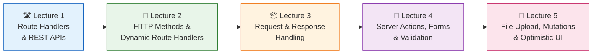

| # | Lecture | Topics | Outcome |
|---|---------|--------|---------|
| 1 | Route Handlers & REST APIs | `route.ts`, REST principles, first API | Build a working API endpoint |
| 2 | HTTP Methods & Dynamic Route Handlers | GET/POST/PUT/PATCH/DELETE, `[id]` handlers | Full CRUD API |
| 3 | Request & Response Handling | Headers, cookies, query params, status codes, errors | Production-grade request processing |
| 4 | Server Actions, Forms & Validation | `'use server'`, `<form action>`, Zod validation | Forms without APIs |
| 5 | File Upload, Data Mutations & Optimistic UI | `FormData` files, `revalidatePath`, `useOptimistic` | Instant-feel full-stack apps |

> ⚙️ **Setup used throughout this unit** (do once before Lecture 1):
> ```bash
> npx create-next-app@latest unit3-api-demo --ts --app --no-tailwind
> cd unit3-api-demo && npm run dev
> ```

---
---

# 🛣️ LECTURE 1 — Route Handlers & REST APIs

> ⏱️ 50 min | 🎯 By the end: students can explain REST and build a working API endpoint inside a Next.js app — **no Express needed**.

## 1.1 🤔 What: The Problem We're Solving

So far our Next.js app only *serves pages*. But real apps also need to *serve data* — to mobile apps, to JavaScript running in the browser, to other servers.

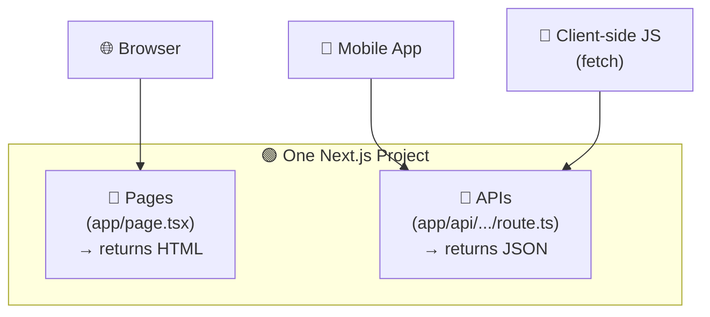

💡 **Key idea:** In Next.js, the frontend *and* the backend live in the **same project**. A **Route Handler** is Next.js's way of writing backend endpoints.

## 1.2 🌐 REST APIs — The 3-Minute Theory

**REST** (REpresentational State Transfer) is a *convention* for designing APIs around **resources** (nouns) and **HTTP methods** (verbs).

| 🧱 Concept | Meaning | Example |
|-----------|---------|---------|
| **Resource** | A "thing" your app manages | `students`, `courses` |
| **Endpoint** | URL identifying the resource | `/api/students`, `/api/students/42` |
| **Method** | What you want to do with it | `GET` (read), `POST` (create)… |
| **Representation** | The data format exchanged | JSON: `{ "id": 42, "name": "Aman" }` |
| **Stateless** | Each request is self-contained; server stores no session between calls | Auth token sent with *every* request |

✅ **RESTful URL design — the golden rules:**

```
✅ GET  /api/students        → list students        (noun, plural)
✅ GET  /api/students/42     → one student           (noun + id)
✅ POST /api/students        → create a student
❌ GET  /api/getAllStudents  → verb in URL = NOT REST
❌ POST /api/student/delete/42 → method mismatch
```

## 1.3 🛠️ Know-How: Your First Route Handler

**Rule:** A Route Handler is a file named exactly **`route.ts`** (or `route.js`) inside the `app/` directory. The folder path = the URL path.

```
app/
 └── api/
      └── hello/
           └── route.ts     👉  URL:  /api/hello
```

```ts
// 📄 app/api/hello/route.ts
import { NextResponse } from "next/server";

// Export a function named after the HTTP method (UPPERCASE!)
export async function GET() {
  return NextResponse.json({ message: "Hello from Next.js API! 👋" });
}
```

▶️ **Run & test:** open `http://localhost:3000/api/hello` in the browser →

```json
{ "message": "Hello from Next.js API! 👋" }
```

🎉 That's it — a backend endpoint in 5 lines. No Express, no separate server.

### ⚠️ Two rules students always forget

1. 🚫 A folder **cannot** contain both `page.tsx` and `route.ts` — a URL is either a page *or* an API, never both.
2. 🔤 Function names must be **UPPERCASE** HTTP methods: `GET`, `POST`, `PUT`, `PATCH`, `DELETE` (a lowercase `get` is silently ignored → 405 error).

## 1.4 🔄 How a Request Flows

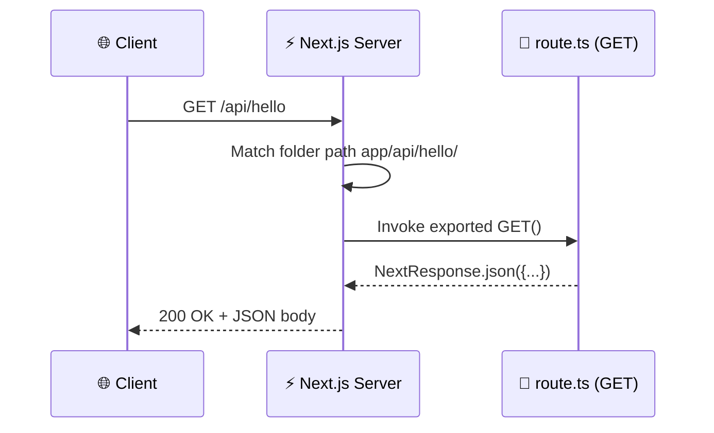

## 1.5 🧪 A Realistic Endpoint (In-Memory Data)

For this whole unit we'll use a tiny in-memory "database" so we can focus on API concepts (real DBs come in Unit IV).

```ts
// 📄 lib/db.ts  — our fake database (shared by all examples)
export type Student = { id: number; name: string; branch: string };

export const students: Student[] = [
  { id: 1, name: "Aman",  branch: "CSE" },
  { id: 2, name: "Simran", branch: "ECE" },
];
```

```ts
// 📄 app/api/students/route.ts
import { NextResponse } from "next/server";
import { students } from "@/lib/db";

export async function GET() {
  return NextResponse.json(students);   // 200 OK by default
}
```

🔎 Test: `http://localhost:3000/api/students` → JSON array of students.

## 1.6 📋 Lecture 1 — Checkpoint ✅

- [ ] I can explain **REST**: resources, endpoints, methods, statelessness
- [ ] I know the file convention: `app/api/<path>/route.ts`
- [ ] I can write a `GET` handler returning `NextResponse.json(...)`
- [ ] I know a folder can't hold both `page.tsx` and `route.ts`
- [ ] 🏠 **Homework:** create `/api/courses` returning 3 course objects

❓ **Quick quiz (5 min):**
1. Why is `GET /api/deleteUser` bad REST design?
2. What URL does `app/api/library/books/route.ts` map to?
3. What happens if you export `get()` instead of `GET()`?

---
---

# 🔀 LECTURE 2 — HTTP Methods & Dynamic Route Handlers

> ⏱️ 50 min | 🎯 By the end: students can build a **complete CRUD API** with dynamic `[id]` routes.

## 2.1 🎭 HTTP Methods = Verbs of the Web

| Method | CRUD | Meaning | Has body? | Idempotent?* |
|--------|------|---------|-----------|--------------|
| 🟢 `GET` | **R**ead | Fetch data | ❌ | ✅ |
| 🟡 `POST` | **C**reate | Add new resource | ✅ | ❌ |
| 🔵 `PUT` | **U**pdate | Replace *entire* resource | ✅ | ✅ |
| 🟣 `PATCH` | **U**pdate | Modify *part* of resource | ✅ | ❌ (usually) |
| 🔴 `DELETE` | **D**elete | Remove resource | ❌ (usually) | ✅ |

> \* **Idempotent** = calling it 1 time or 10 times gives the same result. `DELETE /students/5` twice → student 5 is still just… gone. But `POST /students` twice → two new students! 💥

💡 **PUT vs PATCH analogy:** PUT = handing in a *rewritten answer sheet*; PATCH = using a *correction pen* on one answer.

## 2.2 🛠️ Multiple Methods in One File

One `route.ts` can export several method functions — Next.js dispatches automatically:

```ts
// 📄 app/api/students/route.ts
import { NextRequest, NextResponse } from "next/server";
import { students } from "@/lib/db";

// 🟢 READ ALL → GET /api/students
export async function GET() {
  return NextResponse.json(students);
}

// 🟡 CREATE → POST /api/students
export async function POST(request: NextRequest) {
  const body = await request.json();          // 1️⃣ read JSON body

  if (!body.name || !body.branch) {           // 2️⃣ minimal validation
    return NextResponse.json(
      { error: "name and branch are required" },
      { status: 400 }                          // ❌ Bad Request
    );
  }

  const newStudent = { id: Date.now(), ...body };
  students.push(newStudent);                  // 3️⃣ "save"

  return NextResponse.json(newStudent, { status: 201 }); // ✅ Created
}
```

🧪 **Test POST without a browser form** (browsers only send GET from the address bar):

```bash
curl -X POST http://localhost:3000/api/students \
  -H "Content-Type: application/json" \
  -d '{"name":"Harleen","branch":"IT"}'
```

(Or use **Postman / Thunder Client** — demo this live in class 🎥)

## 2.3 🎯 Dynamic Route Handlers — `[id]`

Just like dynamic *pages* (`app/blog/[slug]/page.tsx` from Unit I), APIs use **square-bracket folders**:

```
app/api/students/
 ├── route.ts              👉 /api/students        (collection)
 └── [id]/
      └── route.ts         👉 /api/students/42     (single item)
```

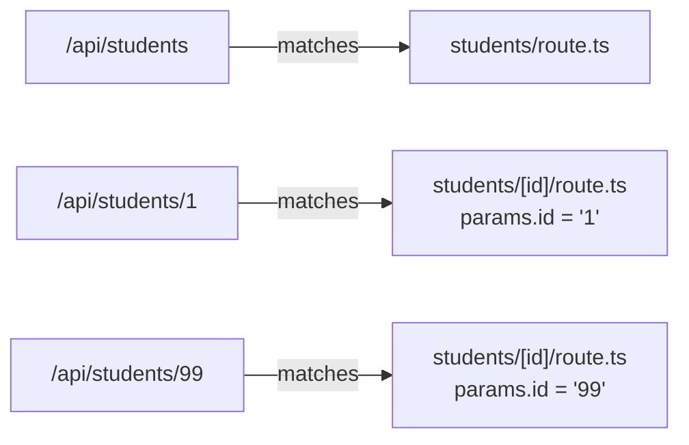

```ts
// 📄 app/api/students/[id]/route.ts
import { NextRequest, NextResponse } from "next/server";
import { students } from "@/lib/db";

type Params = { params: Promise<{ id: string }> };   // ⚠️ params is a Promise in modern Next.js

// 🟢 GET /api/students/:id
export async function GET(request: NextRequest, { params }: Params) {
  const { id } = await params;                       // must await!
  const student = students.find(s => s.id === Number(id));

  if (!student) {
    return NextResponse.json({ error: "Student not found" }, { status: 404 });
  }
  return NextResponse.json(student);
}

// 🔵 PUT /api/students/:id — replace
export async function PUT(request: NextRequest, { params }: Params) {
  const { id } = await params;
  const body = await request.json();
  const index = students.findIndex(s => s.id === Number(id));

  if (index === -1) {
    return NextResponse.json({ error: "Student not found" }, { status: 404 });
  }
  students[index] = { id: Number(id), ...body };     // full replacement
  return NextResponse.json(students[index]);
}

// 🔴 DELETE /api/students/:id
export async function DELETE(request: NextRequest, { params }: Params) {
  const { id } = await params;
  const index = students.findIndex(s => s.id === Number(id));

  if (index === -1) {
    return NextResponse.json({ error: "Student not found" }, { status: 404 });
  }
  const [removed] = students.splice(index, 1);
  return NextResponse.json({ deleted: removed });
}
```

⚠️ **Common bug:** `params.id` is a **string** — always convert with `Number(id)` before comparing with numeric IDs.

## 2.4 🗺️ The Complete CRUD Map

| Action | Method + URL | File | Success status |
|--------|--------------|------|----------------|
| List all | `GET /api/students` | `students/route.ts` | 200 |
| Create | `POST /api/students` | `students/route.ts` | **201** |
| Read one | `GET /api/students/1` | `students/[id]/route.ts` | 200 |
| Replace | `PUT /api/students/1` | `students/[id]/route.ts` | 200 |
| Partial edit | `PATCH /api/students/1` | `students/[id]/route.ts` | 200 |
| Remove | `DELETE /api/students/1` | `students/[id]/route.ts` | 200 / 204 |

## 2.5 📋 Lecture 2 — Checkpoint ✅

- [ ] I can map CRUD ↔ HTTP methods and explain **idempotency**
- [ ] I can export multiple method functions from one `route.ts`
- [ ] I can create `[id]/route.ts` and read `await params`
- [ ] I can test POST/PUT/DELETE with curl/Postman
- [ ] 🏠 **Homework:** add `PATCH` to `[id]/route.ts` that updates only provided fields (hint: spread `{ ...old, ...body }`)

❓ **Quick quiz:** Why does POST return **201** but GET returns **200**? Is `PATCH` idempotent — why/why not?

---
---

# 📦 LECTURE 3 — Request & Response Handling

> ⏱️ 50 min | 🎯 By the end: students can read *anything* from a request (query, headers, cookies, body) and craft *precise* responses (status, headers, redirects, errors).

## 3.1 🧬 Anatomy of Request & Response

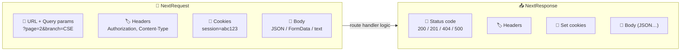

## 3.2 🔗 Reading Query Parameters

`/api/students?branch=CSE&page=2`

```ts
// 📄 app/api/students/route.ts (GET, upgraded)
import { NextRequest, NextResponse } from "next/server";
import { students } from "@/lib/db";

export async function GET(request: NextRequest) {
  const searchParams = request.nextUrl.searchParams;  // ✨ nextUrl helper
  const branch = searchParams.get("branch");          // "CSE" or null
  const page   = Number(searchParams.get("page") ?? 1);

  let result = branch
    ? students.filter(s => s.branch === branch)
    : students;

  const pageSize = 10;
  result = result.slice((page - 1) * pageSize, page * pageSize);

  return NextResponse.json({ page, count: result.length, data: result });
}
```

💡 `searchParams.get()` returns `string | null` — always handle the `null` case.

## 3.3 🏷️ Headers — Reading & Writing

```ts
// 📄 app/api/secure-data/route.ts
import { NextRequest, NextResponse } from "next/server";

export async function GET(request: NextRequest) {
  // 📥 READ a request header
  const auth = request.headers.get("authorization");

  if (auth !== "Bearer my-secret-token") {
    return NextResponse.json({ error: "Unauthorized" }, { status: 401 });
  }

  // 📤 WRITE response headers
  return NextResponse.json(
    { secret: "Marks are out! 🎓" },
    {
      status: 200,
      headers: {
        "Cache-Control": "no-store",       // don't cache sensitive data
        "X-Powered-By": "INT257-Unit3",    // custom header
      },
    }
  );
}
```

🧪 `curl -H "Authorization: Bearer my-secret-token" http://localhost:3000/api/secure-data`

## 3.4 🍪 Cookies

```ts
// 📄 app/api/theme/route.ts
import { NextRequest, NextResponse } from "next/server";

export async function GET(request: NextRequest) {
  // 📥 read
  const theme = request.cookies.get("theme")?.value ?? "light";
  return NextResponse.json({ theme });
}

export async function POST(request: NextRequest) {
  const { theme } = await request.json();

  // 📤 set
  const response = NextResponse.json({ saved: theme });
  response.cookies.set("theme", theme, {
    httpOnly: true,          // 🔒 JS on client can't read it
    maxAge: 60 * 60 * 24,    // 1 day
    path: "/",
  });
  return response;
}
```

## 3.5 📄 Reading Different Body Types

| Body type | Read with | Typical `Content-Type` |
|-----------|-----------|------------------------|
| JSON | `await request.json()` | `application/json` |
| Form data | `await request.formData()` | `multipart/form-data` |
| Plain text | `await request.text()` | `text/plain` |

⚠️ The body is a **stream** — it can be read **only once**. Reading `request.json()` twice throws an error.

## 3.6 🔢 Status Codes — The Language of APIs

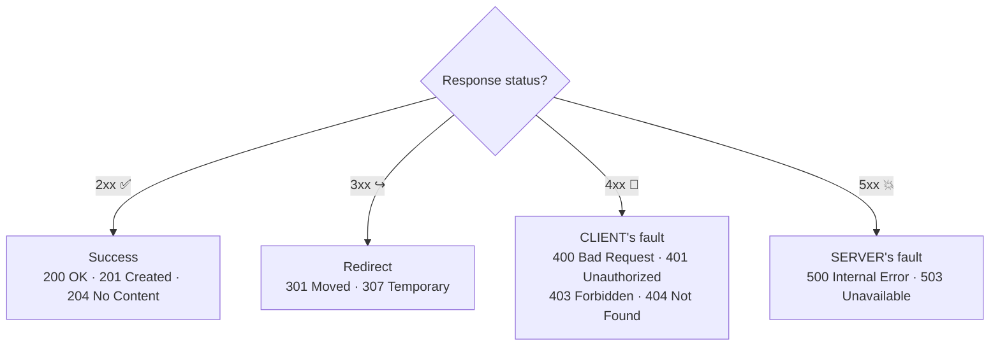

😄 **Memory trick:** *4xx = "**YOU** messed up" (client), 5xx = "**I** messed up" (server).*

## 3.7 🛡️ Robust Error Handling Pattern

Every production handler should follow this template:

```ts
// 📄 app/api/students/route.ts — production-grade POST
export async function POST(request: NextRequest) {
  try {
    const body = await request.json();      // may throw on invalid JSON!

    if (!body.name?.trim()) {
      return NextResponse.json({ error: "name is required" }, { status: 400 });
    }

    const newStudent = { id: Date.now(), name: body.name, branch: body.branch ?? "N/A" };
    students.push(newStudent);

    return NextResponse.json(newStudent, { status: 201 });

  } catch (err) {
    console.error("POST /api/students failed:", err);   // log for developers
    return NextResponse.json(                            // safe message for clients
      { error: "Invalid request or server error" },
      { status: 500 }
    );
  }
}
```

🔑 **Pattern:** `try` → parse → validate (400) → act → success (200/201) → `catch` (500). Never leak stack traces to the client.

## 3.8 ↪️ Bonus: Redirects from Handlers

```ts
import { redirect } from "next/navigation";

export async function GET() {
  redirect("/api/students");   // 307 redirect
}
```

## 3.9 📋 Lecture 3 — Checkpoint ✅

- [ ] I can read query params via `request.nextUrl.searchParams`
- [ ] I can read/write headers and cookies
- [ ] I know `request.json()` can be called only once
- [ ] I can choose correct status codes (200/201/400/401/404/500)
- [ ] I always wrap handlers in `try/catch`
- [ ] 🏠 **Homework:** add `?sort=name` support to `GET /api/students` + return `X-Total-Count` header

❓ **Quick quiz:** Client sends malformed JSON — which status code? Difference between **401** and **403**?

---
---

# 📝 LECTURE 4 — Server Actions, Form Handling & Validation

> ⏱️ 50 min | 🎯 By the end: students can process forms **without writing any API endpoint or fetch()** — using Server Actions with proper validation and error display.

## 4.1 🤯 What: The Big Idea

**Old way (Lecture 1-3 style):** Form → client JS → `fetch('/api/...')` → Route Handler → DB.
**New way:** Form → **Server Action** (a server function called directly from the form) → DB. ✂️ *The middle layer disappears.*

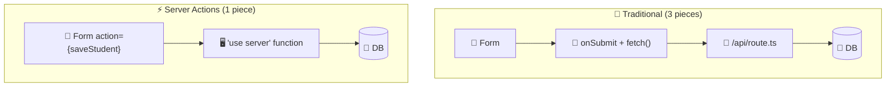

**Server Action** = an async function marked `'use server'` that *runs only on the server* but can be *invoked from a form or component* as if it were local. Under the hood Next.js creates a hidden POST endpoint for you.

✨ **Superpower:** works **even with JavaScript disabled** (progressive enhancement) — the browser just submits the form normally.

## 4.2 🛠️ Know-How: First Server Action

```ts
// 📄 app/actions/student-actions.ts
"use server";                          // 1️⃣ marks EVERY export as a Server Action

import { students } from "@/lib/db";

export async function addStudent(formData: FormData) {   // 2️⃣ receives FormData
  const name   = formData.get("name") as string;         // 3️⃣ read by input's name=""
  const branch = formData.get("branch") as string;

  students.push({ id: Date.now(), name, branch });
  console.log("✅ Saved on the SERVER:", name);          // appears in terminal, not browser!
}
```

```tsx
// 📄 app/add-student/page.tsx  — a SERVER component, zero client JS!
import { addStudent } from "@/app/actions/student-actions";

export default function AddStudentPage() {
  return (
    <form action={addStudent}>   {/* 4️⃣ function, not URL! */}
      <input name="name"   placeholder="Student name" />
      <input name="branch" placeholder="Branch" />
      <button type="submit">➕ Add Student</button>
    </form>
  );
}
```

🔑 **The 3 must-remembers:**
1. `'use server'` at the **top of the file** (or first line inside the function).
2. Inputs need **`name="..."`** — that's the `formData.get()` key.
3. `<form action={fn}>` takes the **function itself**, not a URL string.

## 4.3 ✅ Form Validation with Zod + `useActionState`

Real forms must validate and *show errors to the user*. The modern pattern: the action **returns state**, and the hook **`useActionState`** delivers it back to the form.

```bash
npm install zod
```

```ts
// 📄 app/actions/student-actions.ts
"use server";
import { z } from "zod";
import { students } from "@/lib/db";

// 1️⃣ Define the schema — validation rules as data
const StudentSchema = z.object({
  name:   z.string().min(2,  "Name must be at least 2 characters"),
  email:  z.string().email("Enter a valid email"),
  branch: z.enum(["CSE", "ECE", "IT", "ME"], { message: "Pick a valid branch" }),
});

// 2️⃣ Shape of what the action reports back to the UI
export type FormState = {
  success: boolean;
  errors?: Record<string, string[]>;
  message?: string;
};

// 3️⃣ Signature for useActionState: (prevState, formData) => newState
export async function addStudent(
  prevState: FormState,
  formData: FormData
): Promise<FormState> {

  const parsed = StudentSchema.safeParse({        // ✅ never throws
    name:   formData.get("name"),
    email:  formData.get("email"),
    branch: formData.get("branch"),
  });

  if (!parsed.success) {
    return {
      success: false,
      errors: parsed.error.flatten().fieldErrors,  // { name: ["..."], email: ["..."] }
    };
  }

  students.push({ id: Date.now(), name: parsed.data.name, branch: parsed.data.branch });
  return { success: true, message: `🎉 ${parsed.data.name} added!` };
}
```

```tsx
// 📄 app/add-student/page.tsx
"use client";                                    // hooks ⇒ Client Component

import { useActionState } from "react";
import { addStudent, type FormState } from "@/app/actions/student-actions";

const initialState: FormState = { success: false };

export default function AddStudentPage() {
  //            state returned by action ⬇        ⬇ pass this to <form>
  const [state, formAction, isPending] = useActionState(addStudent, initialState);

  return (
    <form action={formAction}>
      <input name="name" placeholder="Name" />
      {state.errors?.name && <p style={{ color: "red" }}>⚠️ {state.errors.name[0]}</p>}

      <input name="email" placeholder="Email" />
      {state.errors?.email && <p style={{ color: "red" }}>⚠️ {state.errors.email[0]}</p>}

      <select name="branch" defaultValue="">
        <option value="" disabled>-- Branch --</option>
        <option>CSE</option><option>ECE</option><option>IT</option><option>ME</option>
      </select>
      {state.errors?.branch && <p style={{ color: "red" }}>⚠️ {state.errors.branch[0]}</p>}

      <button disabled={isPending}>
        {isPending ? "⏳ Saving..." : "➕ Add Student"}
      </button>

      {state.success && <p style={{ color: "green" }}>{state.message}</p>}
    </form>
  );
}
```

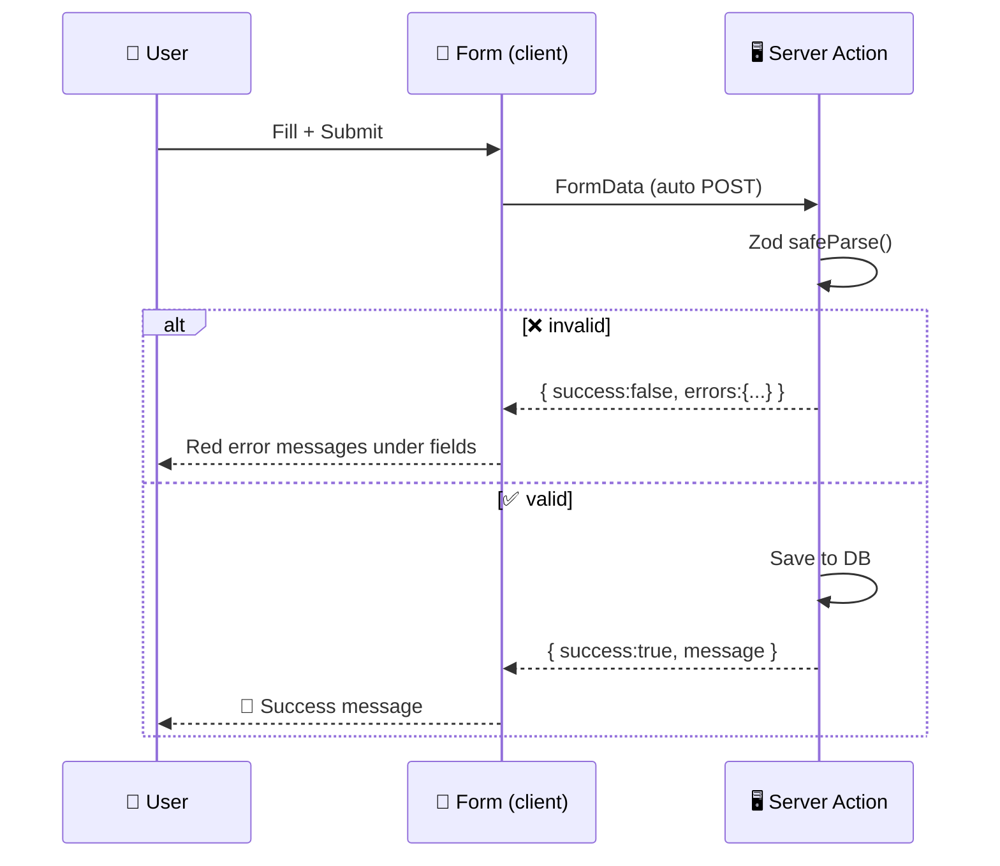

🛡️ **Golden rule:** *client-side validation (e.g. `required`, `minLength` attributes) is UX; **server-side validation is security.*** Users can bypass the browser — they cannot bypass your Server Action.

## 4.4 📋 Lecture 4 — Checkpoint ✅

- [ ] I can explain Server Actions vs API-route + fetch
- [ ] I can write a `'use server'` file and wire `<form action={fn}>`
- [ ] I can read fields with `formData.get("name")`
- [ ] I can validate with Zod `safeParse` and return `fieldErrors`
- [ ] I can display errors + pending state via `useActionState`
- [ ] 🏠 **Homework:** build a "Course Feedback" form (rating 1–5, comment ≥ 10 chars) with full validation

❓ **Quick quiz:** Why does server-side validation matter even if the browser has `required`? What does `useActionState` return (all 3 values)?

---
---

# 🚀 LECTURE 5 — File Upload, Data Mutations & Optimistic UI

> ⏱️ 50 min | 🎯 By the end: students can upload files via Server Actions, refresh cached data after mutations, and make the UI feel **instant** with `useOptimistic`.

## 5.1 📎 File Upload with Server Actions

Files travel inside the same `FormData` — just add `<input type="file">` and the right `enctype` (Next.js sets it automatically for action forms).

```tsx
// 📄 app/upload/page.tsx
import { uploadAssignment } from "@/app/actions/upload-actions";

export default function UploadPage() {
  return (
    <form action={uploadAssignment}>
      <input type="text" name="rollNo" placeholder="Roll No" />
      <input type="file" name="assignment" accept=".pdf" />  {/* 📎 */}
      <button>⬆️ Upload PDF</button>
    </form>
  );
}
```

```ts
// 📄 app/actions/upload-actions.ts
"use server";
import { writeFile, mkdir } from "fs/promises";
import path from "path";

export async function uploadAssignment(formData: FormData) {
  const rollNo = formData.get("rollNo") as string;
  const file   = formData.get("assignment") as File;   // 1️⃣ it's a real File object!

  // 2️⃣ Always validate files on the server 🛡️
  if (!file || file.size === 0)            throw new Error("No file selected");
  if (file.size > 5 * 1024 * 1024)         throw new Error("Max size is 5 MB");
  if (file.type !== "application/pdf")     throw new Error("Only PDF allowed");

  // 3️⃣ File → Buffer → disk
  const bytes  = await file.arrayBuffer();
  const buffer = Buffer.from(bytes);

  const uploadDir = path.join(process.cwd(), "uploads");
  await mkdir(uploadDir, { recursive: true });
  await writeFile(path.join(uploadDir, `${rollNo}-${file.name}`), buffer);

  console.log(`✅ Saved ${file.name} (${(file.size / 1024).toFixed(1)} KB)`);
}
```

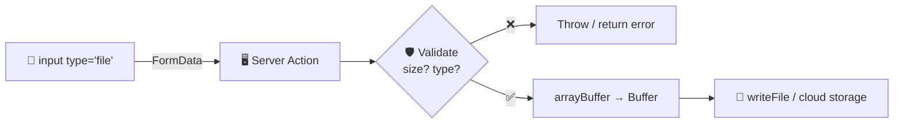

☁️ **Industry note:** in production, files go to **cloud storage** (AWS S3, Cloudinary, Vercel Blob) — not the server's disk. Same action pattern, different destination.

## 5.2 🔄 Data Mutations & Cache Revalidation

**The bug every student will hit:** action saves the data 🎉 … but the page still shows the **old list** 😱. Why? Next.js **caches** rendered pages (Unit II!). After *mutating* data you must tell Next.js: *"this page is stale — rebuild it."*

| API | What it does | Use when |
|-----|--------------|----------|
| 🔁 `revalidatePath("/students")` | Purge cache for one path | You know which page shows this data |
| 🏷️ `revalidateTag("students")` | Purge all fetches tagged `"students"` | Data appears on many pages |
| ↪️ `redirect("/students")` | Jump to another page after action | After create → go to list |

```ts
// 📄 app/actions/student-actions.ts (final form)
"use server";
import { revalidatePath } from "next/cache";
import { redirect } from "next/navigation";
import { students } from "@/lib/db";

export async function addStudent(formData: FormData) {
  students.push({
    id: Date.now(),
    name: formData.get("name") as string,
    branch: formData.get("branch") as string,
  });

  revalidatePath("/students");   // 1️⃣ 🔁 refresh the list page's cache
  redirect("/students");         // 2️⃣ ↪️ take the user there (must be OUTSIDE try/catch!)
}

export async function deleteStudent(id: number) {     // actions aren't only for forms!
  const i = students.findIndex(s => s.id === id);
  if (i !== -1) students.splice(i, 1);
  revalidatePath("/students");
}
```

```tsx
// 📄 app/students/page.tsx — Server Component listing + delete buttons
import { students } from "@/lib/db";
import { deleteStudent } from "@/app/actions/student-actions";

export default function StudentsPage() {
  return (
    <ul>
      {students.map(s => (
        <li key={s.id}>
          🎓 {s.name} ({s.branch})
          {/* bind() pre-fills the id argument of the action */}
          <form action={deleteStudent.bind(null, s.id)} style={{ display: "inline" }}>
            <button>🗑️</button>
          </form>
        </li>
      ))}
    </ul>
  );
}
```

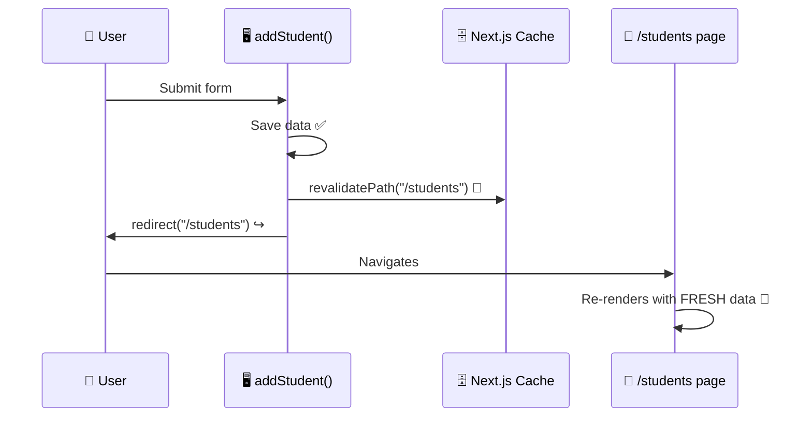

⚠️ **Gotcha:** `redirect()` works by *throwing* a special error internally — if you call it inside `try { }`, your own `catch` will swallow it! Keep `redirect()` after/outside try-catch.

## 5.3 ⚡ Optimistic UI Updates — `useOptimistic`

**Problem:** Server round-trip takes 300–1000 ms. The user clicks "Like ❤️"… and waits. 🐢
**Optimistic idea:** *assume success*, update the UI **instantly**, and let the server catch up. If the server fails, React automatically rolls the UI back. 🪄

> 🌍 Real-world examples: WhatsApp shows your message immediately (single tick pending), Instagram likes turn red instantly.

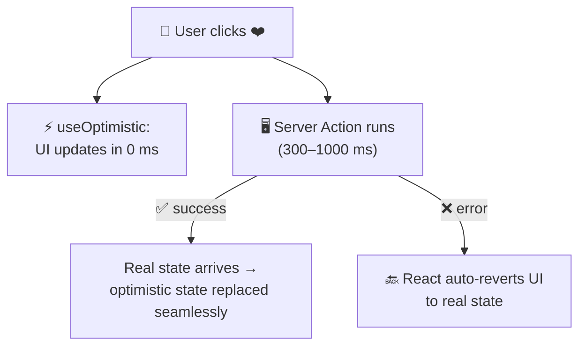

```tsx
// 📄 app/likes/like-button.tsx
"use client";
import { useOptimistic, useTransition } from "react";
import { likePost } from "@/app/actions/like-actions";

export function LikeButton({ postId, likes }: { postId: number; likes: number }) {
  const [isPending, startTransition] = useTransition();

  // 1️⃣ (realValue, updateFn) → [valueToShow, triggerFn]
  const [optimisticLikes, addOptimisticLike] = useOptimistic(
    likes,
    (current, inc: number) => current + inc
  );

  return (
    <button
      onClick={() =>
        startTransition(async () => {
          addOptimisticLike(1);        // 2️⃣ ⚡ instant: UI shows likes+1 NOW
          await likePost(postId);      // 3️⃣ 🖥️ real work happens in background
        })
      }
    >
      ❤️ {optimisticLikes} {isPending && "…"}
    </button>
  );
}
```

```ts
// 📄 app/actions/like-actions.ts
"use server";
import { revalidatePath } from "next/cache";

const likeCounts = new Map<number, number>();

export async function likePost(postId: number) {
  await new Promise(r => setTimeout(r, 800));         // simulate slow network 🐢
  likeCounts.set(postId, (likeCounts.get(postId) ?? 0) + 1);
  revalidatePath("/likes");                            // real value flows back down
}
```

🔑 **Mental model:** `useOptimistic` shows a *temporary prediction*; the *real* prop value (refreshed by `revalidatePath`) always wins in the end.

## 5.4 🧩 The Full Unit III Picture

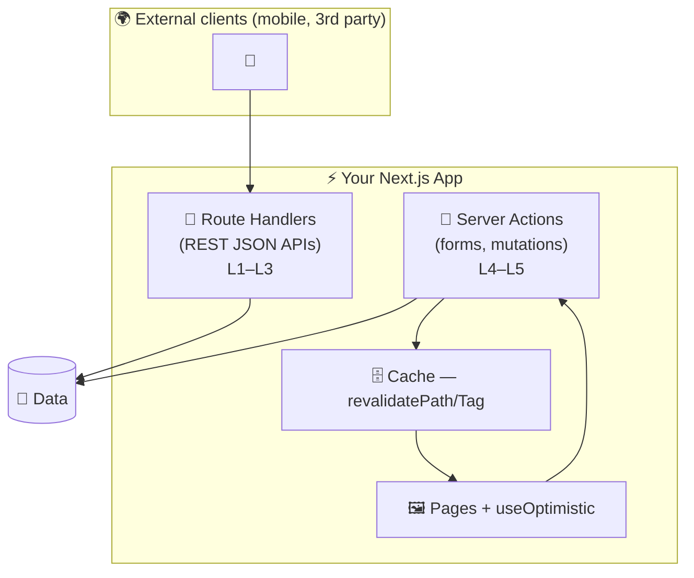

🧭 **When to use which?**

| Need | Use |
|------|-----|
| Your own app's forms & mutations | ✅ Server Actions |
| API consumed by mobile app / other services | ✅ Route Handlers |
| Webhooks (payment gateway callbacks) | ✅ Route Handlers |
| Instant-feel interactions | ✅ Server Actions + `useOptimistic` |

## 5.5 📋 Lecture 5 — Checkpoint ✅

- [ ] I can upload & validate files (`File` → `arrayBuffer` → `Buffer` → save)
- [ ] I can explain *why* pages show stale data after mutations
- [ ] I can use `revalidatePath` / `revalidateTag` / `redirect` correctly
- [ ] I can call an action from a button with `.bind(null, id)`
- [ ] I can implement `useOptimistic` for instant UI
- [ ] 🏠 **Homework (mini-project):** "Class Notice Board" — add notice (validated form), attach PDF, list notices, delete with optimistic removal

❓ **Quick quiz:** Why must `redirect()` stay outside `try/catch`? What happens to optimistic state if the action throws?

---
---

# 🏁 Unit III Wrap-Up

## 🧠 One-Screen Revision Map

```mermaid
mindmap
  root((Unit III))
    🔌 API Development
      Route Handlers — route.ts
      REST — resources + verbs
      HTTP Methods — GET POST PUT PATCH DELETE
      Dynamic — [id]/route.ts, await params
      Req/Res — query, headers, cookies, status, try/catch
    📝 Forms & Server Actions
      'use server'
      form action={fn} + FormData
      Validation — Zod + useActionState
      File Upload — File → Buffer
      Mutations — revalidatePath, redirect
      Optimistic UI — useOptimistic
```

## 📊 Status Codes Cheat Sheet

`200` OK · `201` Created · `204` No Content · `301/307` Redirect · `400` Bad Request · `401` Unauthorized · `403` Forbidden · `404` Not Found · `405` Method Not Allowed · `500` Server Error

## 🎓 Likely Exam Questions

1. Differentiate Route Handlers and Server Actions with one use case each. *(CO3)*
2. Design a RESTful API for a Library (books resource) — list all endpoints with methods, status codes, and file structure.
3. Explain idempotency; classify all five HTTP methods.
4. Write a Server Action that validates a registration form using Zod and returns field errors.
5. What is optimistic UI? Explain `useOptimistic` flow including the failure case.
6. Why is server-side validation mandatory even when client-side validation exists?

## 🔗 Bridge to Unit IV ➡️

Our "database" was an array 😅 — it resets on every server restart. **Unit IV** replaces it with a *real* database via an ORM (Prisma), and secures our routes and actions with **authentication & RBAC** — the `401`/`403` codes you learned will finally guard real logins!

---
*📘 INT257 · Unit III Study Material · Session 2026-27*
